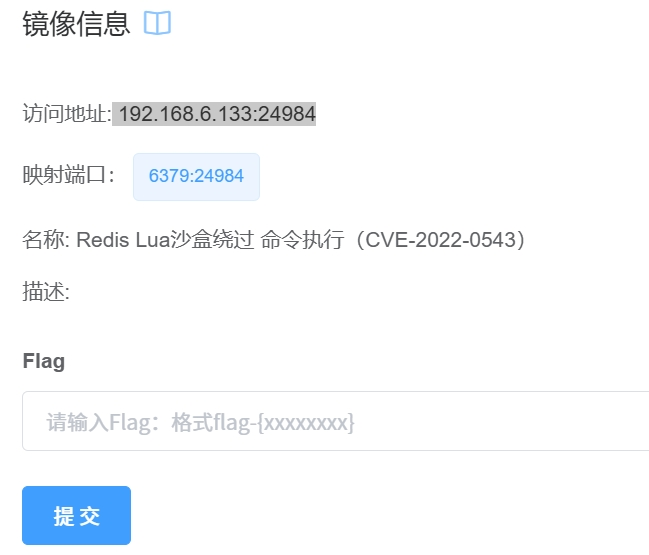
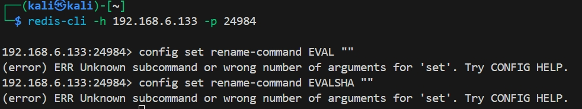
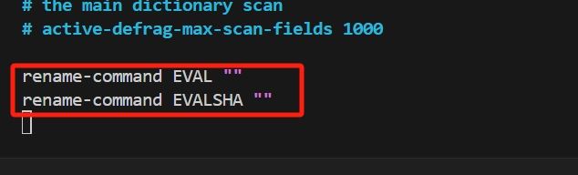
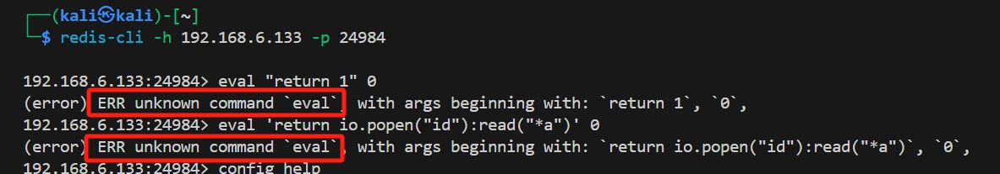

# DMZ实验：Redis Lua沙盒绕过 命令执行

## 环境

* kali
* vulfocus
* Redis Lua沙盒绕过 命令执行（CVE-2022-0543）
  ip 192.168.6.133:24984

## 实验

### 首先安装镜像



### 工具验证

针对redis这个工具，我们需要用到redis-cli这个包，通过验证是否存在


### 连接环境并且开始尝试

__首先要连接环境__


__第一次尝试__

由于在上帝视角下，我们知道这个漏洞是lua脚本执行的漏洞，我们首先尝试直接使用命令来把脚本执行直接禁用
<br>
我们发现这个命令被拒绝了，这有可能是因为vulfocus为了增加一定的难度，所以我们尝试一下是否是config命令被完全禁用
<br>
我们可见：
```bash
192.168.6.133:24984> config help
1) CONFIG <subcommand> arg arg ... arg. Subcommands are:
2) GET <pattern> -- Return parameters matching the glob-like <pattern> and their values.
3) SET <parameter> <value> -- Set parameter to value.
4) RESETSTAT -- Reset statistics reported by INFO.
5) REWRITE -- Rewrite the configuration file.
```
所以我们知道config命令还可以使用，可能只有一部分config命令被禁用。

__第二次尝试__

所以，我们选择进入容器内进行操作，尝试更改docker的配置文件进行更改

<br>
由于redis容器比较简陋，没有编辑工具，我们安装vim这个工具<br>
<br>
接下来我们查看并且修改配置文件，添加以下两行
```bash
rename-command EVAL ""
rename-command EVALSHA ""
```

其后，由于我们需要启用配置文件，重启容器进行尝试，为了防止重启之后配置文件回退，我们备份一份<br>
在重启文件之后我们再查看一次文件，没有被回退，直接进入下一part

__漏洞验证__

现在，我们使用主机连接redis容器，尝试进行脚本执行
<br>
在图中，我们首先使用了以下命令
```bash
eval "return 1" 0
```
这是一个eval脚本执行的最简单的命令尝试，回显中无法执行eval命令，说明漏洞已经修复<br>
其次，我们尝试一下漏洞利用常见的POC
```
eval 'return io.popen("id"):read("*a")' 0
```
上图中可以看到也不可以执行，说明漏洞利用完全封堵

## 漏洞利用检测

