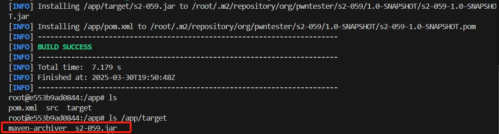
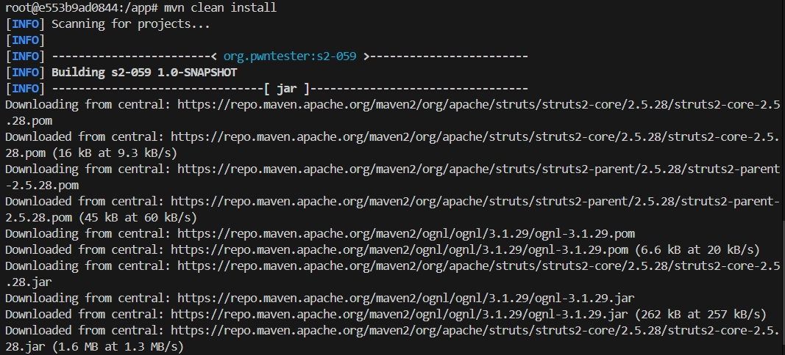
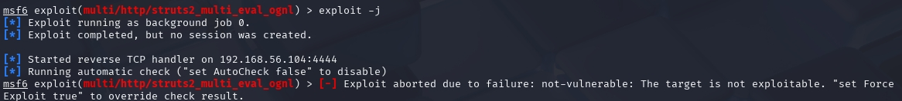
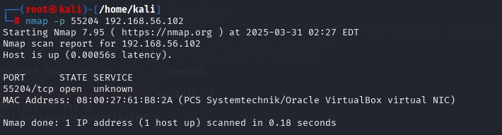
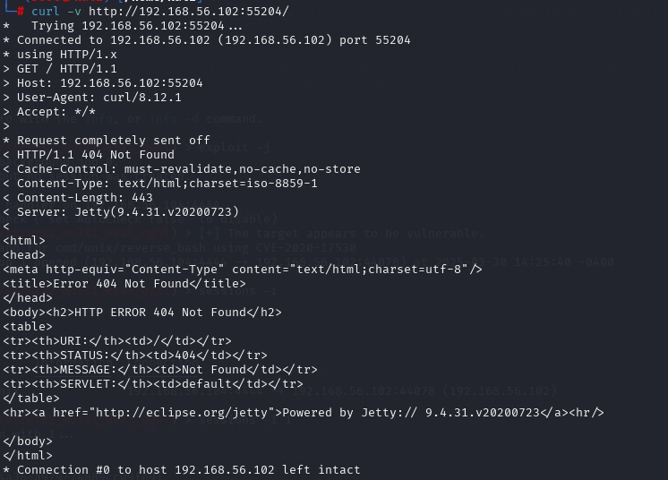
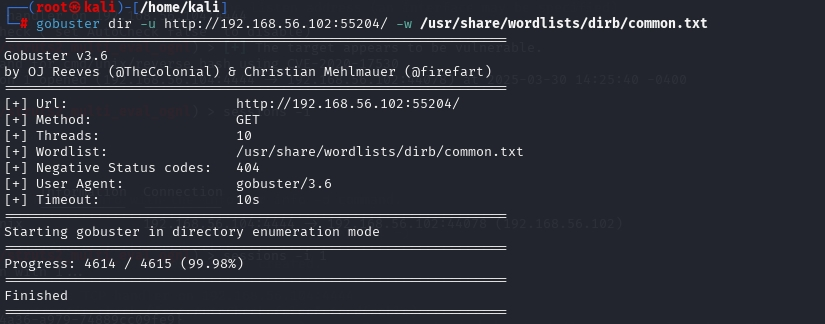

# DMZ入口靶标的漏洞修复及修复效果验证

# 实验准备：

1、准备两个kali虚拟机，一个作为靶机（kali-2024），另一个作为攻击者主机（kali-2025）

2、搭建vulfocus靶场

3、获取第一个靶标

详情见：

# 实验步骤：

## 1、漏洞分析和确认
靶标的漏洞是 CVE-2020-17530，这个漏洞涉及 Struts 2 的 OGNL 表达式注入，允许攻击者通过构造恶意请求执行任意代码。

## 2、漏洞修复：

查询得知，修复漏洞可以尝试以下几种方法：
1.更新 Struts 2 版本
2.配置安全防护
3.应用临时补丁

### 对第二种方法进行尝试：配置安全防护

1. 禁用 OGNL 表达式执行

OGNL（Object Graph Navigation Language）是 Struts 2 的核心功能之一，但也是许多漏洞的根源。禁用或限制 OGNL 表达式的执行可以有效防止此类攻击。

>1.1：进入 Docker 容器
终端运行`docker ps -a`查看struts2-cve容器id
运行`docker exec -it <CONTAINER ID> bash` 进入容器

>1.2 在 Struts 2 的配置文件 struts.xml 中禁用 OGNL 表达式执行。可以通过设置一些常量来限制 OGNL 的使用
使用`find / -name "struts.xml"` 查看 struts.xml 文件位置

会看到以下输出
`/usr/src/target/classes/struts.xml`  
`/usr/src/src/main/resources/struts.xml`

发现有存在两个 struts.xml 文件， 查询GPT得知：

/usr/src/target/classes/struts.xml：这个文件应该是构建应用时，Maven 或其他构建工具将资源文件编译或复制到目标目录后生成的文件。这通常是在构建阶段生成的文件，意味着它已经被编译或打包。

/usr/src/src/main/resources/struts.xml：这个文件是源代码中的文件，应该是应用在构建过程中读取的原始文件。一般来说，应该修改源代码中的 struts.xml，然后重新构建应用。

>1.3 查看 struts.xml 文件内容
这里我第一次打开 /usr/src/src/main/resources/struts.xml 显示为空文件，选择对 /usr/src/target/classes/struts.xml 进行修改（此处是错误操作，第一次我使用了vim 路径错误也会创建一个文件，导致我以为是空文件）
使用`cat /usr/src/target/classes/struts.xml` 查看该文件

要禁用 OGNL 表达式执行，只需要在 <struts> 标签内添加一个常量配置项 struts.ognl.allowStaticMethodAccess，其值设置为 false。
 `<constant name="struts.ognl.allowStaticMethodAccess" value="false"/>` 
插入后如图所示

保存后退出

>1.4 重新构建和部署应用
运行构建命令 `mvn clean install` 次命令需要在 /usr/src 中运行，次目录下有所需文件pom.xml

重构有如下类似输出即为成功

重构完成后重启容器

>1.5 返回攻击者主机（kali-2025）再次尝试标靶获取检测漏洞修复是否成功

发现依然能获取到flag，漏洞并没有被修复，以为是用的之前获取flag的终端再次攻击保留了一些之前的数据，尝试打开新终端进行攻击，发现也能获取flag

查找原因发现前面是对 /usr/src/target/classes/struts.xml 进行了修改，`mvn clean install` 重构后会用 /usr/src/src/main/resources/struts.xml 文件覆盖前者，导致规则根本没被写入。

>1.6 对/usr/src/src/main/resources/struts.xml进行同样的修改并重复上述操作
对 /usr/src/src/main/resources/struts.xml 做出修改

再次重构

这次修改后再次进行靶标获取发现依然能得到，继续分析：
docker restart 会重新启动一个已经运行的容器，但它不会重新构建容器镜像或加载新的配置。具体来说，docker restart 会：
停止当前运行的容器。
使用相同的镜像和配置重新启动容器，并不会重新加载任何新的配置或更新。
或许是因为 docker restart 时并没有将修改的规则成功导入，依然是使用旧的规则

>1.7 修改规则后尝试创建一个新容器来确保规则的写入
运行 `docker commit <CONTAINER ID> my_fixed_struts` ，保持原容器 ID 使用 docker commit 将容器的当前状态保存为一个新镜像。

运行复制后的容器 `docker run -d -p 9215:8080 my_fixed_struts`

进入该容器查看规则是否被正确写入

完成上述步骤后再次尝试攻击，发现依然可以获取靶标，或许攻击面未完全修复 OGNL 漏洞：即使在 struts.xml 中禁用了 struts.ognl.allowStaticMethodAccess，仍然可能有其他 OGNL 漏洞路径存在。攻击者可能通过其他方式触发漏洞。

## 更换修复方式，更新struts2版本

>2.1 已知CVE-2020-17530 这个漏洞已经在 Struts 更高一些的版本中被修复。所以，最直接的修复方式是更新 Struts 至更高版本。

>2.2 查看struts2当前版本 
进入容器后运行`ls`查看当前目录文件，应有'pom.xml'文件

`cat pom.xml`查看版本，能看见图片中蓝框所示部分，其中红色方框全出部分为当前版（这张图片也是后面截的，原版应为2.5.25）

>2.3 修改 struts2-core 的依赖项，将前一步中的2.5.25更改为2.5.28。

保存后使用 `mvn clean install` 更新依赖并重新构建项目，Maven 会自动下载并更新到最新的 Struts2 版本。升级成功后再app/target目录中会多出 's2-059.jar' 和 'maven-archiver' 类似文件

>2.4 编译项目： 
使用以下命令在项目根目录下编译该项目
`mvn clean install`

>2.5 回到攻击者主机再次尝试攻击

发现这次攻击被阻挡，证明升级后的struts2确实修复了CVE-2020-17530这个漏洞

## 3、修复检测与绕过测试

>3.1对更新后的Struts2容器进行nmap扫描
`nmap -p 55204 192.168.56.102`

Nmap 扫描结果显示 55204 端口是开放的，但其服务被标记为 unknown，说明 Nmap 无法自动识别它的服务类型。这可能意味着：
Struts2 服务运行在该端口，但路径不清楚。
端口可能是 Docker 容器映射的端口，需要检查 Struts2 具体运行在哪个路径。
该端口可能运行了一个代理或中间层（如 WAF），导致直接访问 Struts2 失败。

>3.2使用curl手动扫描
`curl -v http://192.168.56.102:55204/`

curl 访问 http://192.168.56.102:55204/ 返回 404 Not Found，说明该端口的 Web 服务器 Jetty 是正常运行的，但没有正确的路径映射到 .action 处理逻辑。

>3.3
目标是找到 正确的 .action 入口点，然后测试漏洞利用。
使用较为强力的gobuster进行扫描
`gobuster dir -u http://192.168.56.102:55204/ -w /usr/share/wordlists/dirb/common.txt`

gobuster 目录扫描 没有发现有效的路径，这说明：
目标服务器可能没有直接暴露 Web 目录（所有访问 /xxxx 的请求都返回 404）。
Struts2 入口点可能不是常见路径（如 /index.action、/login.action）。
服务器可能配置了 URL 重写或 WAF，阻止了扫描器的正常工作。