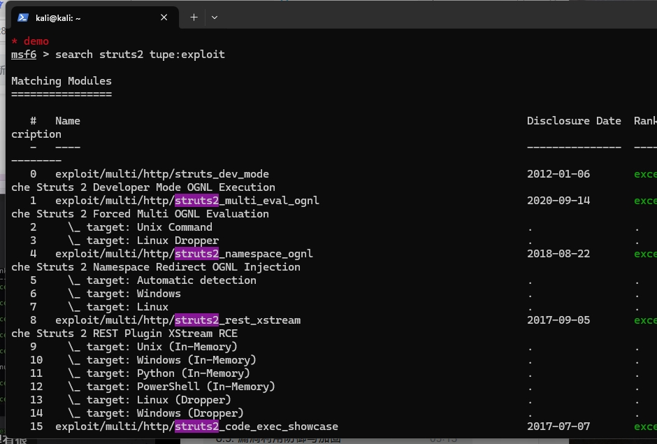
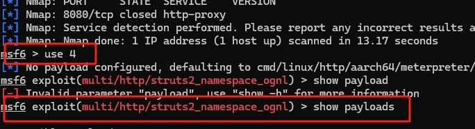
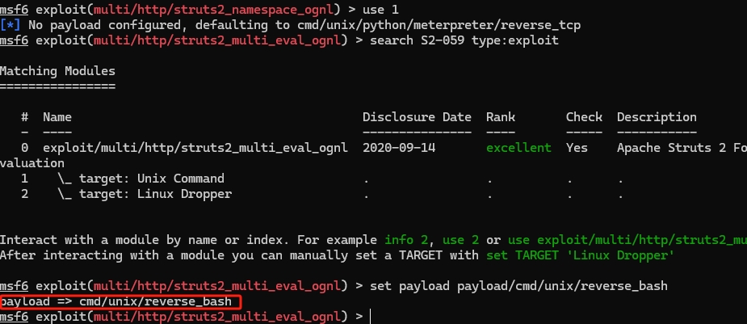
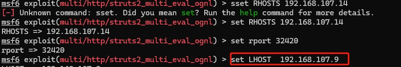
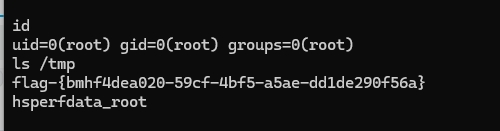
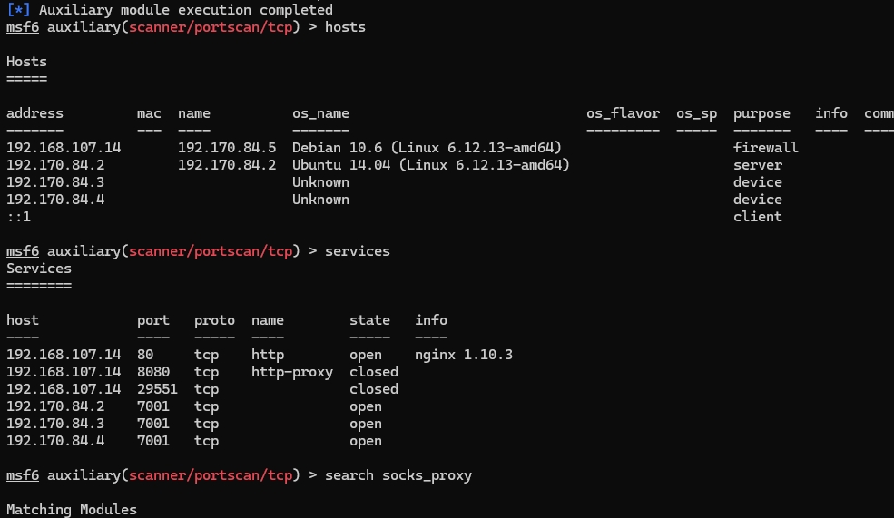
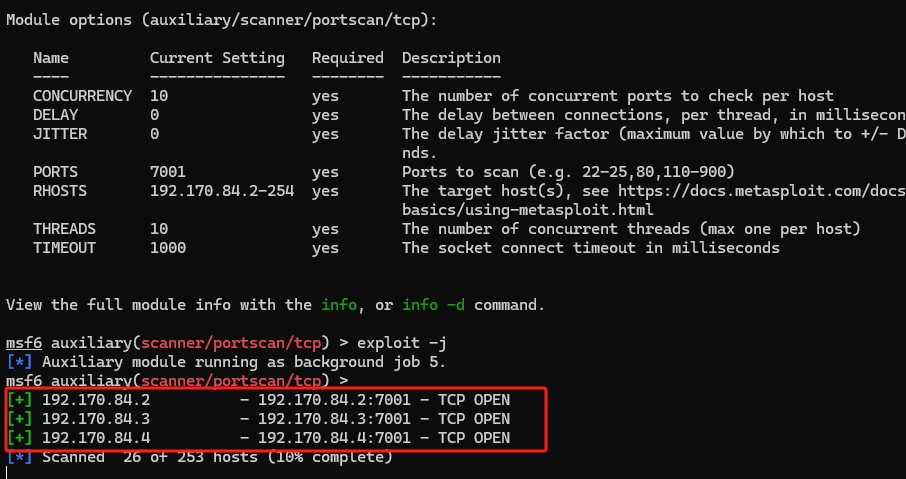

# DMZ
## 实验环境
1.两个kali虚拟机，一个作为靶机，一个作为攻击者
2.vulfocus靶场

## 实验步骤
1 打开metasploit，并建立对应的工作区
```
sudo apt install -y metasploit-framework
# 初始化 metasploit 本地工作数据库
sudo msfdb init

# 启动 msfconsole
msfconsole
# 确认已连接 pgsql
db_status
# 建立工作区
workspace -a demo
```

2. 寻找到漏洞并进行攻击
```
search struts2 

```


由于准备中我们可以得知对应的漏洞


寻找对应的payload



调整参数


攻击后得到flag



在二级界面寻找存活主机


找到内网主机



## 心得体会
通过本次 DMZ 漏洞利用实验，我深入了解了 DMZ在网络安全中的作用以及其在实际部署中的潜在风险。实验中，我首次使用了 Vulfocus 靶场平台和 Metasploit 渗透测试工具，掌握了漏洞环境的搭建与基础的漏洞利用流程。并完成了对第一个和第二个靶标的攻破。通过对目标系统的渗透测试，我认识到攻击者可以利用 DMZ 区域配置不当或服务漏洞作为跳板，进一步威胁内网安全。本次实验不仅提升了我对网络分区、防御架构和攻防思维的理解，也为后续深入学习渗透测试与防御技术打下了基础。