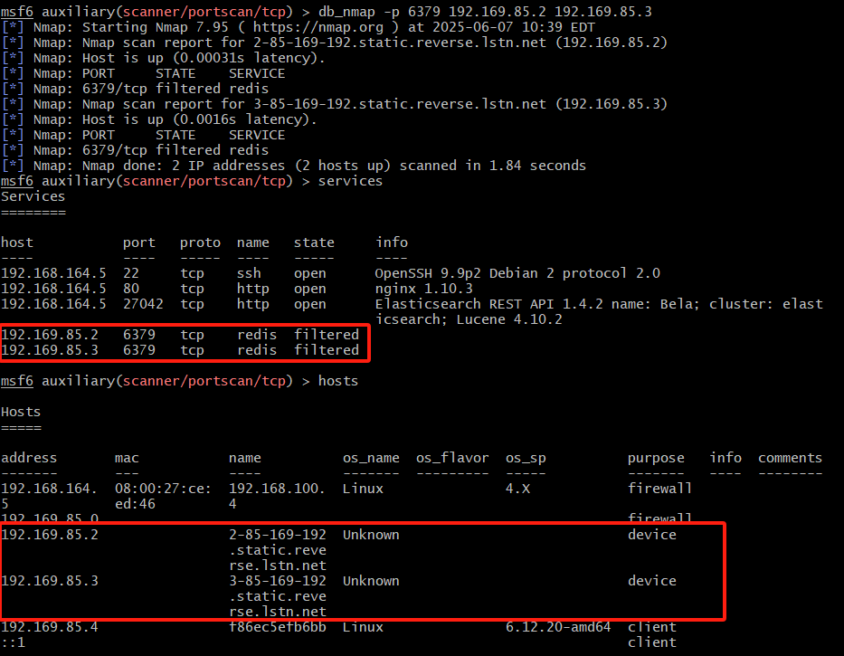

# DMZ进阶实验：入口靶标的检测以及第一层内网渗透

## 本次实验靶场环境如下：


## 入口靶标的检测与漏洞攻击
1.Elasticsearch 代码执行漏洞存在于 Elasticsearch 1.4.0 到 1.4.3 和 1.5.0 到 1.5.2 版本中，可以通过特定的 HTTP 请求导致远程代码执行。在成功启动靶场后访问映射的端口得到漏洞版本信息：

漏洞版本为1.4.2符合远程代码执行的攻击手段。

2.使用Metasploit查询该漏洞的利用模块：


3.使用```show options```指令查看当前模块需要配置的参数，对```RHOST,RPORT,payload,LHOST```参数进行配置，配置完成后通过```exploit```指令进行攻击


4.执行完攻击之后会发现Metasploit 会建立与目标主机的反向连接。现在已经能够访问目标容器并执行命令，执行```getuid```发现输出的用户的确是靶机的用户root
利用ls /tmp指令尝试发现漏洞单flag


入口靶标成功攻破,场景进度来到20%


## 第一层内网渗透攻击
1.首先尝试升级入口靶标检测的shell为meterpreter shell(便于后面建立代理等系列工作)


这里发现原本的shell就是meterpreter shell，但是影响不大。接下来通过hosts查看主机信息时发现报了一个错误：数据库没有成功连接：


另开一个终端尝试通过超级用户连接到PostgreSQL数据库：
```
sudo -u postgres psql  #postgres为超级用户的用户名，psql为密码
```
进入数据库之后更改数据库用户管理文件
```
nano /usr/share/metasploit-framework/config/database.yml
```


重启数据库服务之后再次查看数据库运行状态，发现数据库成功连接


2.成功连接数据库之后尝试进入先前升级后的session中查看容器ip地址情况


发现真正的内网地址是192.169.85.4，于是通过```arp```和```route```指令查看网络拓扑情况，发现入口靶标主机还与192.169.85.0存在通信


3.接下来进入到先前升级过的会话中为```192.169.85.0/24```这个目标网段设置代理


通过```run autoroute -p```查看session是否建立


确认虚拟路由成功建立起来了，现在攻击机可以通过session 5来直接访问目标网段，也就是第一层内网了。正向代理完成。

4.得到内网目标网段后通过portscan端口扫描模块来对内网主机存在的漏洞进行端口扫描


依旧利用```show options```来查看模块需要配置的参数情况，对"required"为"yes"的参数进行配置：


接下来通过exploit指令运行端口扫描，成功发现内网中存活的两台主机：


接下来通过db_nmap对两台主机进行扫描，也能成功扫描到


5.通过socks_proxy模块进行代理，对攻击机1080端口进行监听，通过exploit运行


在攻击机上另开终端查看1080端口监听情况,发现1080端口成功开启代理


编辑```/etc/proxychains.conf```文件添加一个socks5的代理


之后开启一个通过代理服务之后的端口扫描,会发现漏洞段口```6379```是成功开放的，虽然这里的端口状态是"filtered"，但是是可以成功访问的。


6.验证完内网主机端口开放之后，通过metasploit对search功能查找相关漏洞单利用模块，这里我使用的是```exploit/linux/redis/redis debian sandbox_escape```模块


完成该模块的配置参数的编写，其中RHOST为目标主机的ip地址，由于第一层内网有两台主机，于是这里分别进行两次攻击：


同时场景的进度完成40%

接下来对第二台主机进行参数配置和攻击


同时场景进度来到60%，完成第一层内网的渗透

