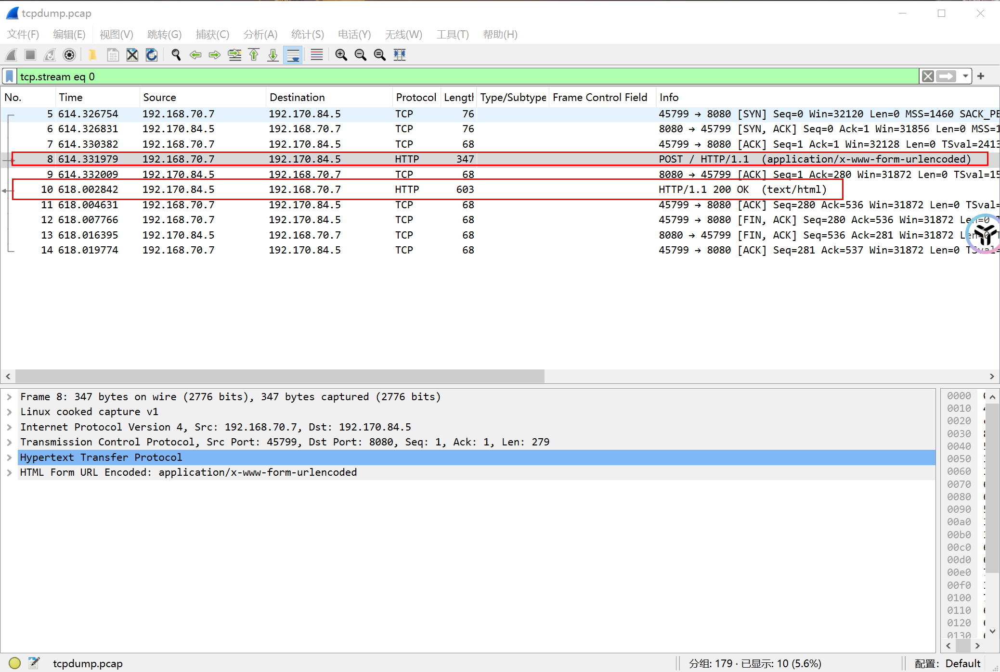
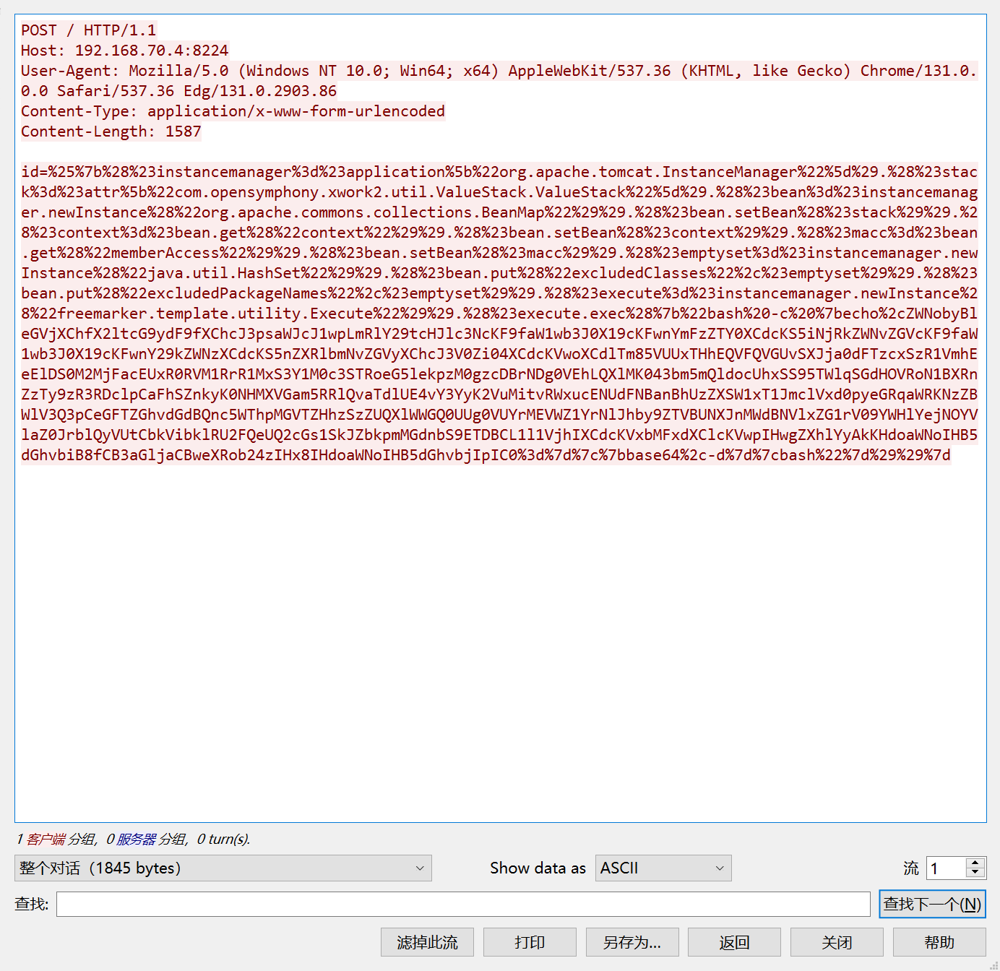
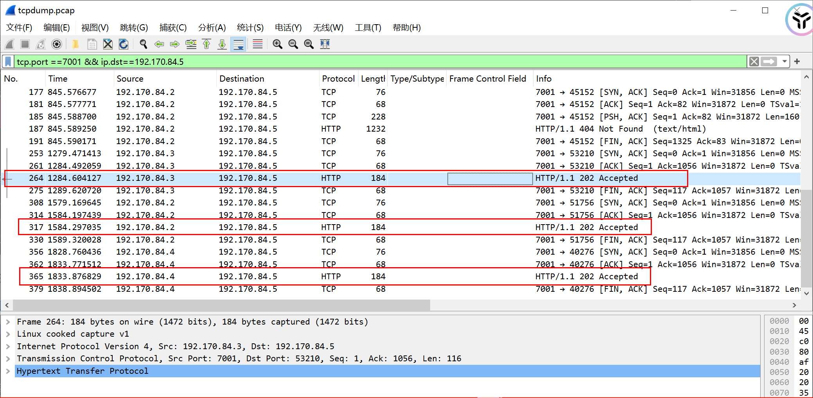
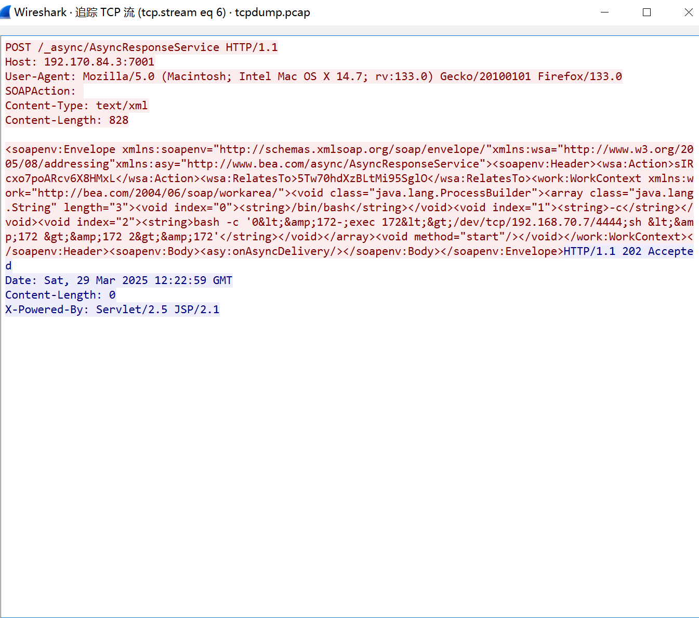
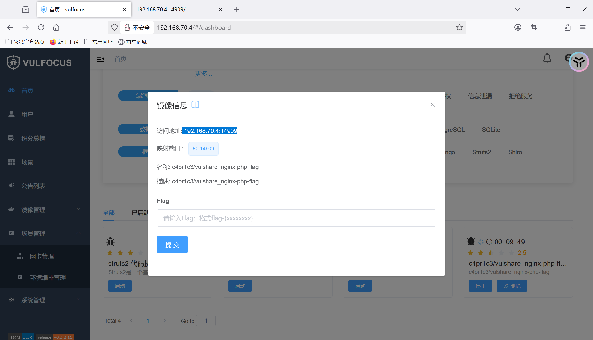
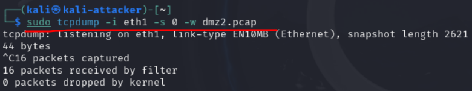
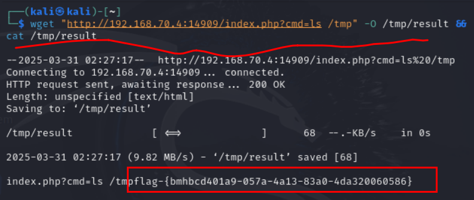
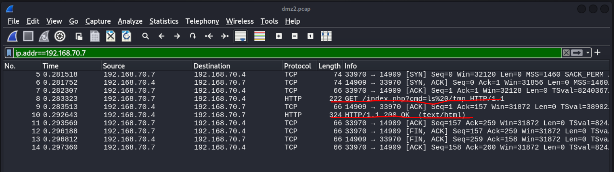
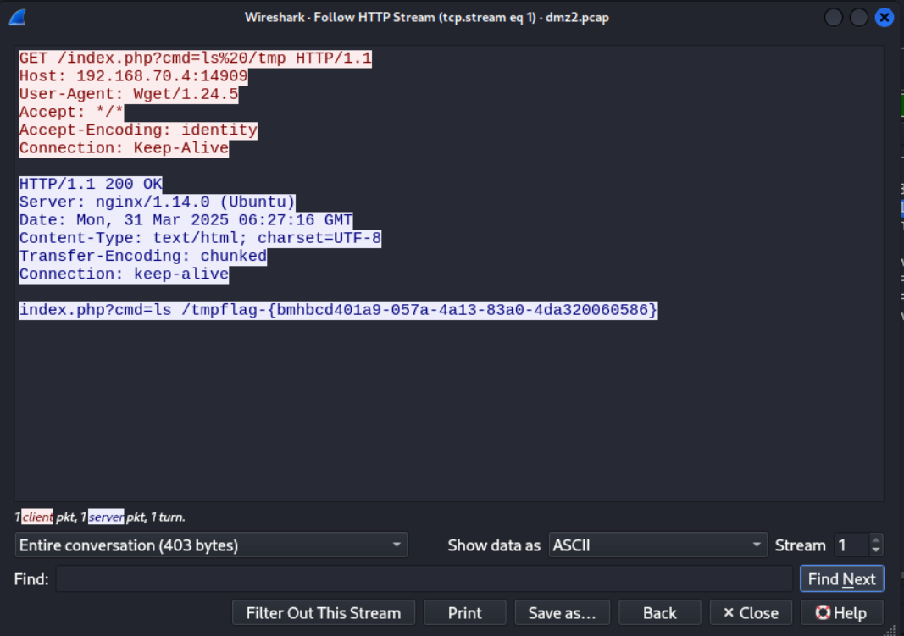

# 漏洞攻防场景初体验dlc之漏洞利用检测

## 第一层靶机漏洞利用检测
* 将在受害者主机中抓的网络包进行wirshark分析
* 查找对入口靶标的http请求

**可以发现攻击者发送了http请求，让靶机漏斗利用成功**

* 追踪tcp流


* 分析这个tcp流：


1. *请求方法*：POST请求，参数通过application/x-www-form-urlencoded传递。

2. *关键参数*：```id=%25%7b2991%2a1863%7d```（URL解码后为id=%{2991*1863}）。

3. *攻击载荷*：```%{...}```是Struts2 OGNL表达式语法，2991*1863是测试表达式。

4. 服务器响应特征

- 响应内容：HTML中显示```<a id="5572233" ...>```，其中5572233是2991*1863的计算结果。

- 页面提示：明确提到输入内容在id属性中被二次评估

**攻击成功原因**
* 双重OGNL解析漏洞（CVE-2019-17530）

1. Struts2某些标签（如```<s:a>```、```<s:url>```）在处理id等属性时，若未正确过滤用户输入，会进行两次OGNL表达式解析。

2. 攻击者通过注入```%{...}```包裹的OGNL表达式（如```%{2991*1863}```），触发表达式在服务端执行。

* 漏洞触发过程

1. 第一次解析：框架将```%{...}``视为普通字符串（因%被编码为%25），未立即执行。

2. 第二次解析：当标签属性（如id）渲染时，框架再次解析未转义的```%{...}```，执行其中的OGNL表达式。

3. 表达式```2991*1863```被计算为```5572233```，并写入响应页面的```<a>``` 标签id属性，验证漏洞存在。

## 第一层内网靶标漏洞利用检测

* tcp流分析

- 数据流关键特征分析
1. 请求特征
* 请求路径：```POST /_async/AsyncResponseService HTTP/1.1```
* 直接命中漏洞暴露的异步服务接口。

* **Content-Type**：```text/xml```
* 符合SOAP请求格式，用于触发XML解析。

* **SOAPAction**：空值
* 攻击者刻意留空以绕过某些过滤规则。

2. 漏洞利用原理
- 漏洞触发点：WebLogic在解析```WorkContext```标签内的XML数据时，使用```XMLDecoder```进行反序列化，未对用户输入进行有效过滤。

* 攻击链构造：daoao
攻击者构造包含```ProcessBuilder```类的恶意XML，通过SOAP请求提交至漏洞接口。
WebLogic解析```WorkContext```时，触发```XMLDecoder```反序列化操作，加载并执行攻击者指定的命令。
命令执行后，建立反向Shell连接至攻击者控制的服务器（```192.168.70.7:4444```）。

- 绕过防护：
使用```void、array```等标签绕过WebLogic黑名单过滤。
通过Bash命令编码混淆，规避基础的关键字检测。

**攻击成功证据**
* 载荷有效性：
成功调用```ProcessBuilder```执行系统命令。
反向Shell命令符合典型攻击模式（```/dev/tcp为```Bash特有功能）。

* 响应特征：
HTTP 202状态码与漏洞利用场景吻合（无详细错误，静默执行）。

* 环境关联：
攻击目标IP（```192.168.70.7```）与漏洞主机（```192.170.84.3```）处于同一内网段，符合横向渗透逻辑。

## 第二层内网靶标漏洞利用检测
**在攻击完成后，我始终找不到第一层内网到第二层内网的http报文，所以我直接选择了分析自己起的镜像**

* 在受害者主机中进行抓包
```sudo tcpdump -i eth1  -s 0 -w dmz.pcap```

* 在攻击者主机中进行wget命令行注入
```wget "http://192.168.70.4:14909/index.php?cmd=ls /tmp" -O /tmp/result && cat /tmp/result```

* 在受害者主机中进行wireshark抓包分析，过滤条件为```ip.addr==192.168.70.7```

**可以看到攻击过程**
* 对这个攻击报文进行http流分析

### 漏洞利用分析
1. 请求中的 ```cmd=ls%20/tmp``` 参数被直接传递给PHP的命令执行函数
2. 服务器后台直接执行```/bin/sh -c "ls /tmp"```  用户提供的命令，直接拿到了flag