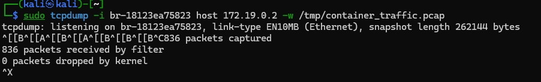
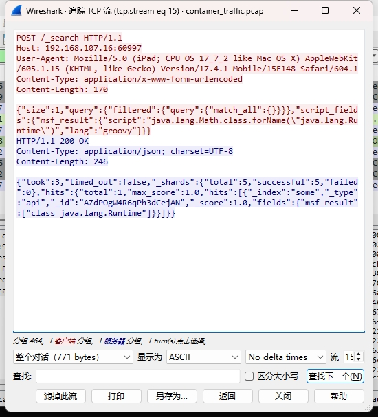
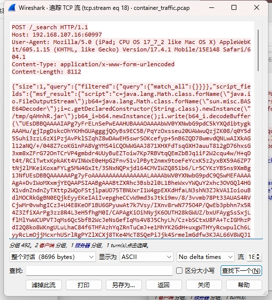

# Elasticsearch 远程代码执行漏洞（CVE-2015-1427） 利用检测与修复缓解报告


## 一、漏洞概述
**漏洞编号：** CVE-2015-1427

**影响版本：** Elasticsearch 1.3.0 ≤ 版本 ≤ 1.3.8，1.4.0 ≤ 版本 ≤ 1.4.2

**漏洞类型：** 远程代码执行（RCE）

**漏洞描述：** 在受影响版本中，Elasticsearch 默认支持 Groovy 脚本执行。如果攻击者通过 REST 接口注入恶意脚本，可在服务器上执行任意 Java 代码，进而远程获取主机控制权。


## 二、实验环境


**平台：** Vulfocus 靶场环境

**镜像：** vulfocus/elasticsearch-cve_2015_1427:latest

**攻击机：**Kali + Metasploit

**目标IP：**192.168.107.16

**攻击机IP：** 192.168.107.9


## 三.漏洞检测
**抓容器流量并保存**
```
sudo tcpdump -i br-18123ea75823 host 172.19.0.2 -w /tmp/container_traffic.pcap

```


### **将文件导出并进行分析** 
```
scp kali@192.168.107.16:/tmp/container_traffic.pcap .
```


由于我们知道该攻击是在9200端口进行攻击我们通过筛选
```
tcp.port == 9200 && http.request.method == "POST"
```
得到


选择可疑的http包找到追踪流


#### **通过追踪流可得到**
**请求部分：** script_fields：用于执行自定义 Groovy 脚本，这是该漏洞的利用点

**script内容：** 使用 java.lang.Math.class.forName("java.lang.Runtime") 反射方式访问 Runtime 类，为后续执行 exec() 铺垫

**lang: groovy：**	指定脚本语言为 Groovy

**检测**：这段请求内容看起来像是 Elasticsearch 的一个利用示例，涉及通过脚本字段（script_fields）执行Java反射类的调用，从而写入恶意文件到服务器临时目录（/tmp/qAHnhR.jar），属于典型的Elasticsearch远程代码执行（RCE）漏洞利用场景。


#### **通过响应部分可得到**
服务端返回了 class java.lang.Runtime，说明攻击者成功访问了 Runtime 类


**由此可得到完成攻击**


## 四，漏洞修复
根据上述内容和网上查阅的资料可得知该漏洞是通过执行 Groovy 动态脚本进行攻击，所以可以通过修改配置禁用 Groovy来阻止这个攻击从而完成修复

**我们打开容器并修改其配置文件**


**重新执行攻击**

攻击失败，漏洞修复成功


## 心得体会
通在本次大作业中，我的主要贡献是完成了入口靶标的漏洞利用检测与修复。在检测和利用阶段，我掌握了如何分析 Elasticsearch 暴露的端口与 API 接口，并利用 curl 工具精确发送攻击请求。技术上，我认为构造脚本执行的请求体与理解 Groovy 沙箱机制的绕过方式具有较高挑战性，这是我此次实验中提升最大的部分。在修复环节，我查阅官方文档并成功通过配置文件禁用了脚本动态执行（script.inline: false），并进一步探究了升级方案与访问控制策略，为系统部署提供了多层防护建议。过程中遇到的一个印象深刻的 bug 是：初期利用过程中返回提示为“script compilation disabled”，一度误以为漏洞不可用。经过查阅资料并对比多个版本配置，最终确认是由于默认安全策略限制导致脚本未启用，在配置中手动开启后才能验证漏洞。这一问题锻炼了我排查配置与日志信息的能力，也让我认识到环境细节对漏洞复现的重要性。