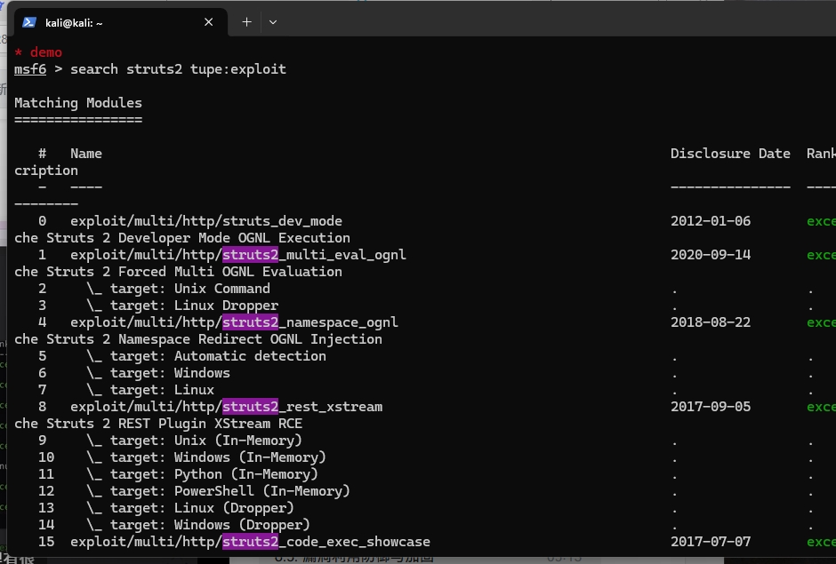
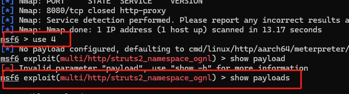

# 整体报告

## 实验目标
### 完成dmz前两个靶标的攻破

### 完成入口靶标的漏洞利用检测和修复

## 实验内容
### dmz
1 打开metasploit，并建立对应的工作区
```
sudo apt install -y metasploit-framework
# 初始化 metasploit 本地工作数据库
sudo msfdb init

# 启动 msfconsole
msfconsole
# 确认已连接 pgsql
db_status
# 建立工作区
workspace -a demo
```

2. 寻找到漏洞并进行攻击
```
search struts2 

```


由于准备中我们可以得知对应的漏洞


寻找对应的payload



调整参数


攻击后得到flag


在二级界面寻找存活主机


找到内网主机


### 下半学期
#### 一、漏洞概述
**漏洞编号：** CVE-2015-1427

**影响版本：** Elasticsearch 1.3.0 ≤ 版本 ≤ 1.3.8，1.4.0 ≤ 版本 ≤ 1.4.2

**漏洞类型：** 远程代码执行（RCE）

**漏洞描述：** 在受影响版本中，Elasticsearch 默认支持 Groovy 脚本执行。如果攻击者通过 REST 接口注入恶意脚本，可在服务器上执行任意 Java 代码，进而远程获取主机控制权。


#### 二、实验环境


**平台：** Vulfocus 靶场环境

**镜像：** vulfocus/elasticsearch-cve_2015_1427:latest

**攻击机：**Kali + Metasploit

**目标IP：**192.168.107.16

**攻击机IP：** 192.168.107.9


#### 三.漏洞检测
**抓容器流量并保存**
```
sudo tcpdump -i br-18123ea75823 host 172.19.0.2 -w /tmp/container_traffic.pcap

```


##### **将文件导出并进行分析** 
```
scp kali@192.168.107.16:/tmp/container_traffic.pcap .
```


由于我们知道该攻击是在9200端口进行攻击我们通过筛选
```
tcp.port == 9200 && http.request.method == "POST"
```
得到


选择可疑的http包找到追踪流


###### **通过追踪流可得到**
**请求部分：** script_fields：用于执行自定义 Groovy 脚本，这是该漏洞的利用点

**script内容：** 使用 java.lang.Math.class.forName("java.lang.Runtime") 反射方式访问 Runtime 类，为后续执行 exec() 铺垫

**lang: groovy：**	指定脚本语言为 Groovy

**检测**：这段请求内容看起来像是 Elasticsearch 的一个利用示例，涉及通过脚本字段（script_fields）执行Java反射类的调用，从而写入恶意文件到服务器临时目录（/tmp/qAHnhR.jar），属于典型的Elasticsearch远程代码执行（RCE）漏洞利用场景。


#### **通过响应部分可得到**
服务端返回了 class java.lang.Runtime，说明攻击者成功访问了 Runtime 类


**由此可得到完成攻击**


## 四，漏洞修复
根据上述内容和网上查阅的资料可得知该漏洞是通过执行 Groovy 动态脚本进行攻击，所以可以通过修改配置禁用 Groovy来阻止这个攻击从而完成修复

**我们打开容器并修改其配置文件**


**重新执行攻击**

攻击失败，漏洞修复成功


#### 心得体会
通过本次对 Elasticsearch 远程代码执行漏洞（CVE-2015-1427）的利用与检测实验，我深入理解了该漏洞产生的根本原因，即 Elasticsearch 在早期版本中默认允许动态脚本执行，攻击者可以利用 Groovy 脚本执行任意代码，进而远程控制服务器。在实际操作中，我使用了 Vulfocus 靶场构建了易受攻击的环境，并借助工具实现了漏洞的验证与利用。同时，我学习并通过关闭脚本动态执行、升级至安全版本以及加强访问控制等方式进行修复和缓解。此次实验不仅提升了我对漏洞原理与攻击链条的理解，也增强了我在实际工作中识别和修复此类高危漏洞的能力。

通过本次 DMZ 漏洞利用实验，我深入了解了 DMZ在网络安全中的作用以及其在实际部署中的潜在风险。实验中，我首次使用了 Vulfocus 靶场平台和 Metasploit 渗透测试工具，掌握了漏洞环境的搭建与基础的漏洞利用流程。并完成了对第一个和第二个靶标的攻破。通过对目标系统的渗透测试，我认识到攻击者可以利用 DMZ 区域配置不当或服务漏洞作为跳板，进一步威胁内网安全。本次实验不仅提升了我对网络分区、防御架构和攻防思维的理解，也为后续深入学习渗透测试与防御技术打下了基础。